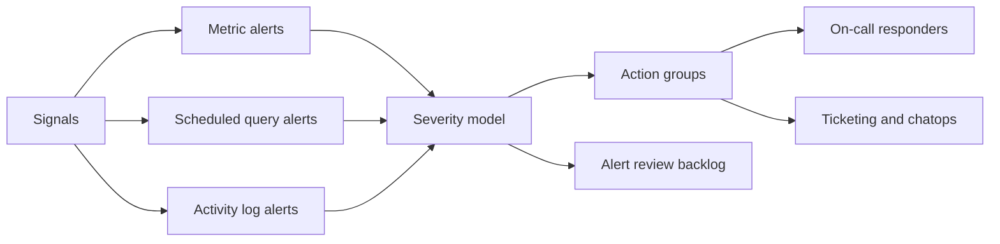

---
content_sources:
  diagrams:
    - id: alert-strategy
      type: flowchart
      source: mslearn-adapted
      based_on:
        - https://learn.microsoft.com/en-us/azure/azure-monitor/alerts/alerts-overview
        - https://learn.microsoft.com/en-us/azure/azure-monitor/alerts/alerts-best-practices
        - https://learn.microsoft.com/en-us/azure/azure-monitor/alerts/alerts-processing-rules
        - https://learn.microsoft.com/en-us/azure/azure-monitor/alerts/action-groups
---

# Alert Strategy

An alert strategy should help responders act faster, not create more noise. Use this guide to define alert rules, severities, and routing patterns that stay usable as your Azure Monitor footprint grows.

<!-- diagram-id: alert-strategy -->


## Why This Matters

Bad alerting is expensive in two ways.

- Too many alerts burn responder attention and train teams to ignore real incidents.
- Too few alerts delay detection and increase customer-visible impact.

Microsoft Learn guidance for Azure Monitor alerts consistently points to tuning signal selection, severity standards, and action groups together. An alert rule by itself is not a strategy. Strategy is the combination of signal, threshold, scope, routing, suppression, and review process.

Teams usually need this guidance when they see:

- Repeated low-value alerts firing every day.
- Different teams using severity levels inconsistently.
- Metric alerts, log alerts, and activity log alerts all routed to the same mailbox.
- No clear mapping from alert to responder action.

## Prerequisites

- Azure subscription with permission to create alert rules and action groups.
- Target Azure resources, Log Analytics workspace, or Application Insights resource.
- Agreed service ownership map for platform, application, and security teams.
- Notification endpoints for email, webhook, ITSM, SMS, or automation.
- Variables set before running examples:
    - `RG`
    - `ACTION_GROUP_NAME`
    - `ALERT_RULE_NAME`
    - `WORKSPACE_NAME`
    - `RESOURCE_ID`
    - `LOCATION`

## Recommended Practices

### Practice 1: Define alert severity by business impact, not by technical preference

**Why**: Microsoft Learn recommends using severity consistently across alert types. A severity model only works when teams can infer urgency and response expectations immediately. If one team uses Sev0 for CPU spikes and another uses Sev2 for outage-level symptoms, the entire operating model breaks.

**How**: Encode severity and response audience in the alert rule name and description, then create rules only after documenting the customer impact condition.

```bash
az monitor metrics alert create \
    --resource-group $RG \
    --name $ALERT_RULE_NAME \
    --scopes $RESOURCE_ID \
    --condition "avg Percentage CPU > 90" \
    --description "Sev2 when sustained CPU pressure threatens request latency for production web tier" \
    --severity 2 \
    --window-size 5m \
    --evaluation-frequency 1m \
    --action $ACTION_GROUP_ID \
    --output json

az monitor metrics alert show \
    --resource-group $RG \
    --name $ALERT_RULE_NAME \
    --query "{name:name,severity:severity,windowSize:windowSize,evaluationFrequency:evaluationFrequency,enabled:enabled}" \
    --output json
```

Sample output:

```json
{
  "name": "alert-web-cpu-sev2",
  "severity": 2,
  "windowSize": "PT5M",
  "evaluationFrequency": "PT1M",
  "enabled": true
}
```

Suggested severity model:

- Sev0: customer outage or compliance/security event with immediate escalation.
- Sev1: major degradation or imminent outage.
- Sev2: service degradation with operator action required during business or on-call window.
- Sev3: actionable warning for capacity or trend management.
- Sev4: informational, usually not paged.

**Validation**: Review a recent week of fired alerts and confirm responders can explain why each fired severity matched customer impact and expected urgency.

### Practice 2: Use action groups that match the owning team and escalation path

**Why**: Microsoft Learn positions action groups as reusable routing objects. Reusing them is only helpful when the grouping reflects an operating team. One global action group usually creates over-notification and weak accountability.

**How**: Create action groups per responder audience and keep paging, chat, and ticket actions together only when the same team owns triage.

```bash
az monitor action-group create \
    --resource-group $RG \
    --name $ACTION_GROUP_NAME \
    --short-name AGPLAT \
    --action email platform-oncall platform-oncall@contoso.example \
    --action webhook incident-router https://example.contoso.invalid/alerts \
    --output json

az monitor action-group show \
    --resource-group $RG \
    --name $ACTION_GROUP_NAME \
    --query "{name:name,groupShortName:groupShortName,emailReceivers:emailReceivers[].name,webhookReceivers:webhookReceivers[].name}" \
    --output json
```

Sample output:

```json
{
  "name": "ag-platform-oncall",
  "groupShortName": "AGPLAT",
  "emailReceivers": [
    "platform-oncall"
  ],
  "webhookReceivers": [
    "incident-router"
  ]
}
```

Good action-group boundaries include:

- Platform operations.
- Application team on-call.
- Security operations.
- Business-hours notification only.

**Validation**: Pick any critical alert rule and verify the action group points to one accountable team, not to a catch-all distribution list with unclear ownership.

### Practice 3: Prefer signal-specific rules and use dynamic thresholds or scheduled queries deliberately

**Why**: Microsoft Learn distinguishes between metric alerts for fast platform signals and log alerts for richer context. Mixing them casually leads to slower detection or excessive cost. Dynamic thresholds are useful when normal baselines move, but only after you have stable telemetry.

**How**: Use metric alerts for known real-time indicators and scheduled query rules for correlated symptoms that require KQL.

```bash
az monitor scheduled-query create \
    --name "alert-app-failures-sev2" \
    --resource-group "$RG" \
    --scopes "$WORKSPACE_ID" \
    --condition "count 'FailedRequests' > 20" \
    --condition-query "FailedRequests=requests | where timestamp > ago(5m) | where success == false" \
    --evaluation-frequency "5m" \
    --window-size "5m" \
    --severity 2 \
    --skip-query-validation true \
    --description "Trigger when failed request volume exceeds the expected five-minute burst threshold." \
    --action-groups $ACTION_GROUP_ID \
    --output json

az monitor scheduled-query show \
    --resource-group $RG \
    --name "alert-app-failures-sev2" \
    --query "{name:name,severity:severity,enabled:enabled,scopes:scopes}" \
    --output json
```

Sample output:

```json
{
  "name": "alert-app-failures-sev2",
  "severity": 2,
  "enabled": true,
  "scopes": [
    "/subscriptions/<subscription-id>/resourceGroups/rg-monitoring/providers/Microsoft.OperationalInsights/workspaces/law-prod-shared"
  ]
}
```

Selection guidance:

- Use metric alerts for low-latency platform metrics.
- Use log alerts for correlation across tables or richer business filters.
- Use dynamic thresholds when seasonality or workload cycles invalidate fixed thresholds and the signal has enough history for baseline learning.
- Re-test rules after major application or scaling changes.

**Validation**: Compare mean time to detect for top incidents. If log alerts are used where metric alerts would detect earlier, refactor the rule set.

### Practice 4: Use suppression and maintenance controls instead of disabling rules ad hoc

**Why**: Microsoft Learn recommends alert processing rules to suppress or reroute alerts during maintenance windows and known events. Disabling rules manually during change windows often leaves gaps after the change ends.

**How**: Create a processing rule for maintenance scope and time range rather than editing every alert.

```bash
az monitor alert-processing-rule create \
    --resource-group $RG \
    --name "apr-maintenance-window" \
    --rule-type RemoveAllActionGroups \
    --scopes $RESOURCE_ID \
    --schedule-start-datetime "2026-04-05T21:00:00Z" \
    --schedule-end-datetime "2026-04-05T23:00:00Z" \
    --description "Suppress notifications during approved maintenance while preserving fired alert records" \
    --output json

az monitor alert-processing-rule show \
    --resource-group $RG \
    --name "apr-maintenance-window" \
    --query "{name:name,enabled:enabled,scopes:scopes,description:description}" \
    --output json
```

Sample output:

```json
{
  "name": "apr-maintenance-window",
  "enabled": true,
  "scopes": [
    "/subscriptions/<subscription-id>/resourceGroups/rg-app/providers/Microsoft.Web/sites/app-prod"
  ],
  "description": "Suppress notifications during approved maintenance while preserving fired alert records"
}
```

Operational benefits:

- You preserve rule definitions.
- You keep auditability of when suppression applied.
- You reduce the chance of forgetting to re-enable notifications.
- You can scope suppression to only the affected resources.

**Validation**: For each planned change window, confirm that suppression is time-bound, scoped, and removed automatically after the maintenance period.

## Common Mistakes / Anti-Patterns

### Anti-Pattern 1: One alert per metric with no response plan

**What happens**: Teams enable many default-sounding alerts without deciding what action follows.

**Why it's wrong**: Alert count grows, paging credibility falls, and responders learn that most alerts are non-actionable.

**Correct approach**: Inventory current rules, then keep only alerts that map to a real operational action.

```bash
az monitor metrics alert list \
    --resource-group $RG \
    --query "[].{name:name,severity:severity,enabled:enabled,scopes:scopes}" \
    --output table
```

### Anti-Pattern 2: Shared action groups for every team and every severity

**What happens**: Platform, app, and security teams all receive the same notifications regardless of ownership.

**Why it's wrong**: Response is slower, duplication increases, and nobody trusts the paging stream.

**Correct approach**: Split action groups by ownership and verify rule-to-team alignment.

```bash
az monitor action-group list \
    --resource-group $RG \
    --query "[].{name:name,shortName:groupShortName}" \
    --output table
```

## Validation Checklist

- [ ] A documented severity model exists and is used consistently.
- [ ] Every production alert maps to one owning team and one intended response.
- [ ] Metric, log, and activity log alerts are chosen for the right signal type.
- [ ] Action groups are segmented by responder audience.
- [ ] Processing rules are used for maintenance and expected suppression windows.
- [ ] Fired alert history is reviewed regularly for noisy rules.
- [ ] Alert descriptions explain impact and expected operator action.

## Cost Impact

Well-designed alerts reduce hidden cost by lowering wasted incident effort and avoiding unnecessary log query evaluations. Overly broad scheduled query rules can also increase query execution volume, so moving real-time symptoms to metric alerts can improve both signal quality and efficiency.

## See Also

- [Best Practices](./index.md)
- [Cost Optimization](./cost-optimization.md)
- [Operations - Alert Rule Management](../operations/alert-rule-management.md)
- [Platform - Alerts Architecture](../platform/alerts-architecture.md)

## Sources

- [Azure Monitor alerts overview](https://learn.microsoft.com/azure/azure-monitor/alerts/alerts-overview)
- [Types of Azure Monitor alerts](https://learn.microsoft.com/azure/azure-monitor/alerts/alerts-types)
- [Action groups in Azure Monitor](https://learn.microsoft.com/azure/azure-monitor/alerts/action-groups)
- [Create and manage metric alerts](https://learn.microsoft.com/azure/azure-monitor/alerts/alerts-create-metric-alert-rule)
- [Create and manage log search alerts](https://learn.microsoft.com/azure/azure-monitor/alerts/alerts-create-log-alert-rule)
- [Dynamic thresholds in Azure Monitor alerts](https://learn.microsoft.com/azure/azure-monitor/alerts/alerts-dynamic-thresholds)
- [Alert processing rules](https://learn.microsoft.com/azure/azure-monitor/alerts/alerts-processing-rules)
- [Azure Well-Architected Framework](https://learn.microsoft.com/azure/well-architected/framework/)
