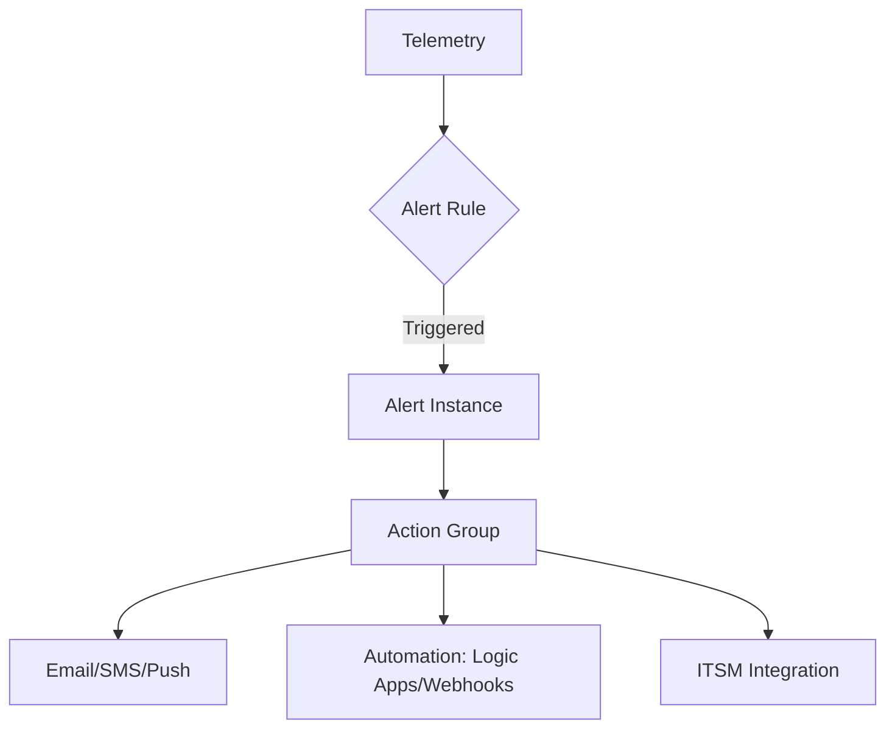

# Alerting

Alerting is the critical bridge between telemetry and response, ensuring issues are detected quickly and remediated with minimal impact.

## Why This Matters
Alerts are the primary mechanism to detect conditions in near real time. Well-designed alerts reduce noise (alert fatigue), ensure timely notification to the right teams, and support automated remediation where appropriate.

## Recommended Practices
- **Define Severity Levels:** Use standard severities (0-4) consistently to indicate business impact.
    - **Sev 0 (Critical):** Outages or critical service disruption.
    - **Sev 1 (Warning):** High-impact performance or impending failure.
    - **Sev 2-4:** Lower impact or informational events.
- **Reduce Noise:** Use dynamic thresholds instead of static values where workloads vary, and implement alert processing rules to suppress known issues (e.g., during maintenance).
- **Use At-Scale Alerting:** Monitor multiple resources with a single rule whenever possible to simplify management.
- **Strategize Action Groups:** Route notifications to the teams responsible for specific resources and automate common incident response steps via Logic Apps or Webhooks.
- **Prioritize Free Alerts:** Always enable service health and resource health alerts—they are free and critical for identifying platform-level issues.

## Common Mistakes
- **Alert Overload:** Creating too many redundant alert rules, leading to alert fatigue and ignored notifications.
- **Static Thresholds:** Relying on fixed values that don't account for seasonality or workload spikes, causing false positives.
- **Broad Action Groups:** Sending all alerts to a single large distribution list, resulting in lack of accountability.
- **Ignoring Health Alerts:** Overlooking built-in service health alerts in favor of complex custom log queries.

## Validation Checklist
- [ ] Critical health alerts (Service/Resource Health) are enabled and routed.
- [ ] Alert rules use standard severity levels aligned with business impact.
- [ ] Dynamic thresholds are used for seasonal metric-based workloads.
- [ ] Alert processing rules are configured to suppress alerts during maintenance windows.
- [ ] Action groups are verified to reach the correct on-call teams or automation triggers.

## See Also
- [Monitoring Baseline](monitoring-baseline.md)
- [Workspace Design](workspace-design.md)
- [Cost Optimization](cost-optimization.md)

## Sources
- https://learn.microsoft.com/azure/azure-monitor/alerts/best-practices-alerts
- https://learn.microsoft.com/azure/azure-monitor/alerts/alerts-overview
