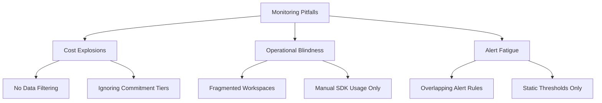

# Common Anti-patterns

Recognizing and avoiding common monitoring misconfigurations prevents runaway costs, data sprawl, and poor operational visibility.

## Why This Matters
Anti-patterns are often the result of "lifting and shifting" legacy monitoring practices into a cloud-native environment like Azure. Avoiding these pitfalls ensures that your monitoring is scalable, cost-effective, and actionable, preventing common frustration among platform teams.

## Recommended Practices
- **Implement Data Governance:** Adopt Data Collection Rules (DCRs) to filter telemetry at the source, preventing unnecessary ingestion and lowering costs.
- **Consolidate for Savings:** Where possible, use fewer, larger Log Analytics workspaces to benefit from higher commitment tiers and consolidated cross-resource analysis.
- **Use Alert Processing Rules:** Instead of deleting alert rules, use processing rules to suppress or modify alerts during maintenance or known events.
- **Modernize Instrumentation:** Move from legacy SDKs to the Azure Monitor OpenTelemetry Distro to ensure broad coverage with less custom code.
- **Strategize Retention:** Use table-level retention to apply different storage periods for security logs versus low-value diagnostic data.

## Common Mistakes
- **Over-Alerting (Noise):** Creating excessive alerts without proper scoping or processing rules, causing on-call engineers to ignore critical notifications.
- **Ingestion Sprawl:** Collecting all possible logs from every production resource without filtering, leading to significant budget overruns.
- **Siloed Monitoring:** Fragmenting telemetry across many disconnected workspaces, making it difficult for teams to see a unified view of system health.
- **Ignoring Cost Advisories:** Overlooking Azure Advisor cost-optimization signals for right-sizing ingestion tiers or removing unused telemetry.

## Validation Checklist
- [ ] A governance review has been performed on the data collection strategy (DCRs, filtering).
- [ ] Alert noise is actively tracked and managed with alert processing rules.
- [ ] Cost dashboards are reviewed regularly to identify data ingestion spikes.
- [ ] Workspace architecture matches documented data residency and residency needs.
- [ ] Instrumentation uses modern, supported libraries (OpenTelemetry) where possible.

## See Also
- [Monitoring Baseline](monitoring-baseline.md)
- [Cost Optimization](cost-optimization.md)
- [Workspace Design](workspace-design.md)

## Sources
- https://learn.microsoft.com/azure/azure-monitor/best-practices
- https://learn.microsoft.com/azure/azure-monitor/logs/best-practices-logs
- https://learn.microsoft.com/azure/azure-monitor/alerts/best-practices-alerts
