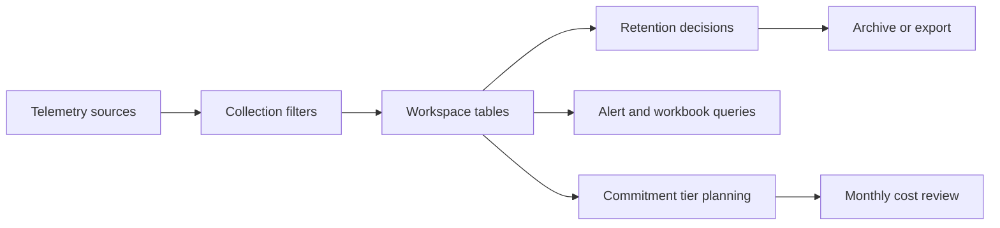

# Cost Optimization

Azure Monitor cost optimization is mostly a design discipline, not a cleanup exercise. Use this guide to control ingestion, retention, and query habits before observability growth turns into billing surprises.



## Why This Matters

Azure Monitor charges are usually driven by the same patterns that make operations harder:

- collecting too much low-value data,
- keeping hot retention longer than needed,
- duplicating telemetry across tools,
- and using expensive queries because data was never normalized.

Microsoft Learn guidance for Azure Monitor cost management consistently recommends tuning at collection time first. Once noisy data lands in a workspace, you pay to ingest it even if nobody uses it. The fastest cost win is usually reducing data before it is stored.

The highest-risk scenarios are:

- verbose platform or container logs enabled everywhere with no review,
- Application Insights sampling disabled in busy production services,
- multiple workspaces receiving duplicate diagnostics from the same resource,
- tables held in analytics retention when archive or export would meet the requirement.

## Prerequisites

- Azure subscription with permission to update workspaces, Application Insights, DCRs, and diagnostic settings.
- Access to Azure Cost Management or internal billing reports.
- Existing Log Analytics workspace and workspace-based Application Insights resources.
- Agreed definitions for critical, useful, optional, and disposable telemetry.
- Variables set before running examples:
    - `RG`
    - `WORKSPACE_NAME`
    - `APP_INSIGHTS_NAME`
    - `DCR_NAME`
    - `RESOURCE_ID`
    - `LOCATION`

## Recommended Practices

### Practice 1: Measure ingestion by table before changing anything

**Why**: Microsoft Learn recommends understanding which tables drive ingestion cost before tuning retention or collection. Teams often guess wrong and spend time optimizing a table that contributes very little.

**How**: Review table-level workspace usage and rank by billable volume.

```bash
az monitor log-analytics workspace table list \
    --resource-group $RG \
    --workspace-name $WORKSPACE_NAME \
    --output table

az monitor log-analytics workspace show \
    --resource-group $RG \
    --workspace-name $WORKSPACE_NAME \
    --query "{name:name,sku:sku.name,retentionInDays:retentionInDays,dailyQuotaGb:workspaceCapping.dailyQuotaGb}" \
    --output json
```

Sample output:

```json
{
  "name": "law-prod-shared",
  "sku": "PerGB2018",
  "retentionInDays": 30,
  "dailyQuotaGb": -1
}
```

Use table review to answer these questions:

- Which tables grow fastest week over week?
- Which tables are required for incidents or compliance?
- Which tables are noisy because of duplicate pipelines?
- Which tables should move to Basic Logs, archive, or export?

**Validation**: Document the top five billable tables and a specific action for each one. If there is no table-level plan, the cost review is incomplete.

### Practice 2: Filter and transform data before ingestion with DCRs

**Why**: Microsoft Learn guidance on data collection rules emphasizes using transformations to drop or reshape low-value records. This is the most direct way to avoid paying for data you never use.

**How**: Update DCRs so only actionable streams and records reach the workspace.

```bash
az monitor data-collection rule show \
    --resource-group $RG \
    --name $DCR_NAME \
    --output json

az monitor data-collection rule update \
    --resource-group $RG \
    --name $DCR_NAME \
    --set properties.dataFlows[0].transformKql="source | where Level != 'Verbose'" \
    --output json
```

Sample output:

```json
{
  "name": "dcr-prod-platform",
  "provisioningState": "Succeeded",
  "transformKql": "source | where Level != 'Verbose'"
}
```

High-value filtering candidates:

- verbose container or application traces,
- duplicate performance counters,
- rarely used security events outside the approved baseline,
- platform categories enabled only for curiosity instead of a defined need.

**Validation**: Re-check ingestion after the next billing window or workload cycle. The expected table should drop without breaking incident response or alert coverage.

### Practice 3: Use Application Insights sampling intentionally

**Why**: Microsoft Learn recommends sampling for high-volume applications so traces and request telemetry remain useful without ingesting every event. Running unsampled production telemetry at scale usually becomes expensive long before it becomes helpful.

**How**: Inspect the current Application Insights component with Azure CLI, then configure sampling in the application SDK or OpenTelemetry pipeline according to the instrumentation method in use. Azure CLI can confirm the component and workspace relationship, but sampling policy itself should be configured in the telemetry pipeline rather than by changing workspace retention.

```bash
az monitor app-insights component show \
    --app $APP_INSIGHTS_NAME \
    --resource-group $RG \
    --query "{name:name,workspaceResourceId:workspaceResourceId,applicationType:applicationType}" \
    --output json
```

Sample output:

```json
{
  "name": "appi-checkout-prod",
  "workspaceResourceId": "/subscriptions/<subscription-id>/resourceGroups/rg-monitoring/providers/Microsoft.OperationalInsights/workspaces/law-prod-shared",
  "applicationType": "web"
}
```

Sampling review questions:

- Are success traces more numerous than the team actually queries?
- Do failures remain unsampled or preferentially retained?
- Does the sampling rate preserve useful percentile and dependency trends?
- Has the rate been re-validated after major traffic growth?

**Validation**: Verify that top operational dashboards still show stable trends and that failure investigations still retain enough detail for common incidents.

### Practice 4: Move the right tables to Basic Logs or shorter analytics retention

**Why**: Microsoft Learn guidance on Basic Logs and table plans explains that not every table needs full analytics capabilities. Operationally useful but rarely queried tables often belong on a cheaper plan or shorter analytics window.

**How**: Review table plan and retention settings, then update specific tables instead of applying a workspace-wide compromise.

```bash
az monitor log-analytics workspace table show \
    --resource-group $RG \
    --workspace-name $WORKSPACE_NAME \
    --name AppTraces \
    --query "{name:name,plan:plan,retentionInDays:retentionInDays,totalRetentionInDays:totalRetentionInDays}" \
    --output json

az monitor log-analytics workspace table update \
    --resource-group $RG \
    --workspace-name $WORKSPACE_NAME \
    --name AppTraces \
    --plan Basic \
    --retention-time 8 \
    --total-retention-time 30 \
    --output json
```

Sample output:

```json
{
  "name": "AppTraces",
  "plan": "Basic",
  "retentionInDays": 8,
  "totalRetentionInDays": 30
}
```

Good candidates for cheaper plans:

- verbose troubleshooting traces,
- low-frequency audit data already exported elsewhere,
- operational tables needed for short-term triage only,
- high-volume logs not used in cross-table analytic correlations.

**Validation**: Test the exact alert rules and workbook queries that depend on the table before and after the plan change.

### Practice 5: Use workspace caps, commitment tiers, and export only after collection is disciplined

**Why**: Microsoft Learn recommends commitment tiers for predictable high-volume ingestion and workspace caps as protective controls. These are useful after you control noise; they are not substitutes for good collection design.

**How**: Apply a daily cap for guardrails and review commitment tier suitability against stable observed volume.

```bash
az monitor log-analytics workspace update \
    --resource-group $RG \
    --workspace-name $WORKSPACE_NAME \
    --quota 50 \
    --output json

az monitor log-analytics workspace update \
    --resource-group $RG \
    --workspace-name $WORKSPACE_NAME \
    --sku CapacityReservation \
    --output json
```

Sample output:

```json
{
  "name": "law-prod-shared",
  "sku": {
    "name": "CapacityReservation"
  },
  "workspaceCapping": {
    "dailyQuotaGb": 50
  }
}
```

Use this sequence:

1. Reduce noisy ingestion.
2. Right-size table plans and retention.
3. Stabilize monthly volume.
4. Evaluate whether commitment pricing lowers cost.

Microsoft Learn explicitly positions the daily cap as a safeguard for unexpected spikes, not as the primary cost-optimization mechanism for normal operations.

**Validation**: Check that the cap is high enough to avoid cutting off essential diagnostics during incidents and that commitment volume is supported by several billing cycles of evidence.

## Common Mistakes / Anti-Patterns

### Anti-Pattern 1: Retaining everything because storage seems cheaper than review effort

**What happens**: Teams keep all tables in analytics retention for long periods because they are unsure what can be reduced.

**Why it's wrong**: Retention cost grows silently, and old data is rarely queried enough to justify premium access.

**Correct approach**: Review table settings directly and move low-value data to shorter analytics retention, Basic Logs, archive, or export.

```bash
az monitor log-analytics workspace table list \
    --resource-group $RG \
    --workspace-name $WORKSPACE_NAME \
    --output table
```

### Anti-Pattern 2: Using commitment tiers to mask noisy ingestion

**What happens**: A team moves to a commitment tier without first fixing verbose telemetry.

**Why it's wrong**: The bill may become more predictable, but waste remains and future growth starts from a bad baseline.

**Correct approach**: Tune collection and table plans first, then re-evaluate pricing model.

```bash
az monitor data-collection rule show \
    --resource-group $RG \
    --name $DCR_NAME \
    --output json
```

## Validation Checklist

- [ ] The top billable tables are identified and reviewed regularly.
- [ ] DCR filters or transformations remove known low-value records.
- [ ] Application Insights sampling is intentional for high-volume apps.
- [ ] Table plan and retention settings match actual usage patterns.
- [ ] Workspace caps are configured as guardrails where appropriate.
- [ ] Commitment tier decisions are based on stable observed ingestion, not guesswork.
- [ ] Duplicate diagnostic pipelines have been removed.

## Cost Impact

These practices directly affect billing. Pre-ingestion filtering and sampling reduce ingestion charges. Table-level plan and retention tuning reduce storage cost. Commitment tiers can lower unit price for steady high-volume environments, but only when noise is already under control. Workspace caps do not reduce normal cost by themselves, but they limit runaway scenarios.

## See Also

- [Best Practices](./index.md)
- [Workspace Design](./workspace-design.md)
- [Data Retention](./data-retention.md)
- [Reference - Platform Limits](../reference/platform-limits.md)

## Sources

- [Cost optimization for Azure Monitor Logs](https://learn.microsoft.com/azure/azure-monitor/logs/cost-logs)
- [Manage usage and costs with Azure Monitor Logs](https://learn.microsoft.com/azure/azure-monitor/logs/cost-logs)
- [Data collection rules in Azure Monitor](https://learn.microsoft.com/azure/azure-monitor/data-collection/data-collection-rule-overview)
- [Basic Logs in Azure Monitor Logs](https://learn.microsoft.com/azure/azure-monitor/logs/basic-logs-configure)
- [Manage table plans and retention in a Log Analytics workspace](https://learn.microsoft.com/azure/azure-monitor/logs/data-retention-configure)
- [Set daily cap on a Log Analytics workspace](https://learn.microsoft.com/azure/azure-monitor/logs/daily-cap)
- [OpenTelemetry configuration for Application Insights](https://learn.microsoft.com/azure/azure-monitor/app/opentelemetry-configuration)
- [Azure Well-Architected Framework - Cost Optimization](https://learn.microsoft.com/azure/well-architected/cost-optimization/)
