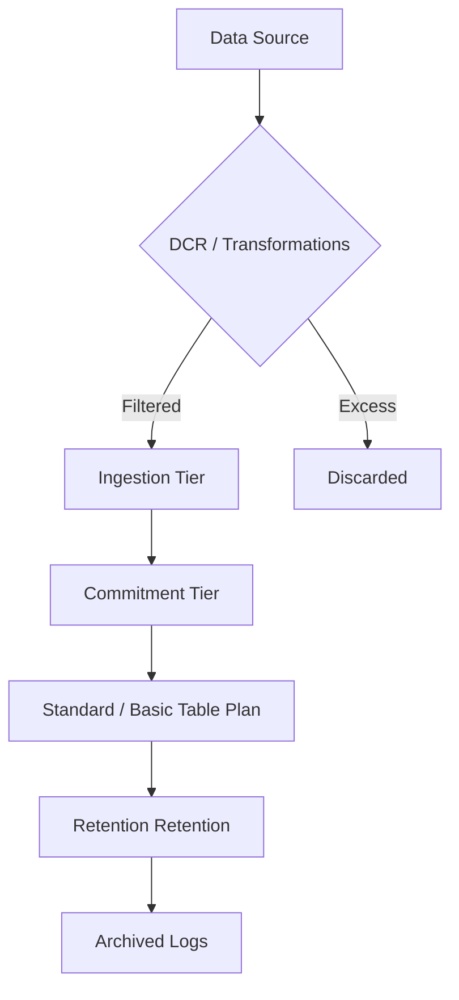

# Cost Optimization

Cost management is essential to ensure monitoring remains sustainable and provides maximum value for every dollar spent on telemetry ingestion and retention.

## Why This Matters
Telemetry costs can quickly escalate as workloads scale. Optimizing ingestion and retention reduces waste, enables broader monitoring coverage within budget, and aligns monitoring spend with the business value of the data.

## Recommended Practices
- **Adopt Commitment Tiers:** If you ingest more than 100 GB/day, commit to a tier to receive significant discounts over Pay-As-You-Go pricing.
- **Filter at Ingestion:** Use Data Collection Rules (DCRs) and transformations to filter or aggregate logs before they reach the workspace, preventing the ingestion of low-value data.
- **Set Retention Granularity:** Configure different retention periods for different data tables; for example, keep security logs for 365 days and low-value debugging logs for only 30 days.
- **Utilize Basic Logs:** For high-volume logs that are only used for occasional debugging (e.g., IIS logs), use the "Basic" table plan to significantly lower ingestion costs.
- **Automate Cost Monitoring:** Set up Azure budget alerts and review workspace insights daily to identify and respond to unexpected data growth.

## Common Mistakes
- **Pay-As-You-Go Overspending:** Failing to move to a commitment tier when daily ingestion consistently exceeds the 100 GB threshold.
- **Ingesting Everything:** Collecting all telemetry from every production resource without filtering out noisy or irrelevant events.
- **Uniform Retention:** Applying a single long retention period across all tables in a workspace, resulting in high storage costs for low-value data.
- **Ignoring Azure Advisor:** Overlooking cost-saving recommendations for right-sizing commitment tiers or removing unused data streams.

## Validation Checklist
- [ ] Daily ingestion volume is tracked and matched to an appropriate commitment tier.
- [ ] DCR transformations are active for the highest-volume log streams.
- [ ] Table-level retention is configured based on the business value of the data.
- [ ] Basic log plans are assigned to debugging or audit-heavy tables where appropriate.
- [ ] Cost alerts are configured for the primary Log Analytics workspace.

## See Also
- [Workspace Design](workspace-design.md)
- [Monitoring Baseline](monitoring-baseline.md)
- [Common Anti-patterns](common-anti-patterns.md)

## Sources
- https://learn.microsoft.com/azure/azure-monitor/best-practices-cost
- https://learn.microsoft.com/azure/azure-monitor/logs/best-practices-logs
