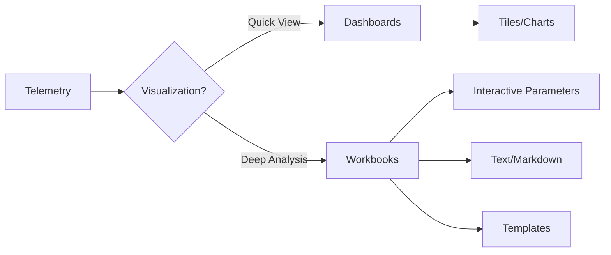

# Dashboards and Workbooks

Visualizing monitoring data effectively is key to identifying trends, outages, and performance bottlenecks across your environment.

## Why This Matters
Dashboards and Workbooks serve different visualization needs. Understanding when to use which ensures that stakeholders receive actionable insights at the right level of detail—from high-level operational status to deep, interactive root-cause analysis.

## Recommended Practices
- **Use Workbooks for Analysis:** Prefer Azure Workbooks for end-to-end monitoring views across multiple resources, combining logs, metrics, and text into a flexible, interactive canvas.
- **Use Dashboards for At-a-Glance Status:** Utilize Azure Dashboards for quick, shareable overviews by pinning specific charts and tiles from Log Analytics or Metrics Explorer.
- **Leverage Built-in Templates:** Start with the Workbooks Gallery templates for common scenarios (e.g., App Service, VM, and Container health) and customize them as needed.
- **Apply Interactive Parameters:** In Workbooks, use parameters to allow users to filter views by subscription, resource, time range, or custom properties without editing the underlying KQL queries.
- **Manage Visibility with RBAC:** Publish dashboards and workbooks to suitable resource groups and use Azure RBAC to control who can view or modify them.

## Common Mistakes
- **Complex Dashboards:** Creating over-complicated, slow-loading dashboards for deep analysis where a Workbook would be more efficient.
- **Static Workbooks:** Failing to use parameters in Workbooks, leading to rigid reports that cannot be easily filtered or reused by different teams.
- **Neglecting Templates:** Building every visualization from scratch instead of leveraging the rich set of pre-built templates in the Workbooks Gallery.
- **Inadequate Sharing:** Forgetting to publish or share dashboards and workbooks correctly, resulting in "silos" of monitoring visibility.

## Validation Checklist
- [ ] Dashboards are used for quick, shareable, at-a-glance operational status.
- [ ] Workbooks are the primary tool for deep, cross-resource analysis and troubleshooting.
- [ ] Workbooks include interactive parameters for flexible filtering.
- [ ] Gallery templates have been evaluated before creating custom visualizations.
- [ ] Role-based access control (RBAC) is correctly applied to shared visualization resources.

## See Also
- [Monitoring Baseline](monitoring-baseline.md)
- [Alerting](alerting.md)
- [Instrumentation](instrumentation.md)

## Sources
- https://learn.microsoft.com/azure/azure-monitor/visualize/workbooks-overview
- https://learn.microsoft.com/azure/azure-monitor/visualize/tutorial-logs-dashboards
- https://learn.microsoft.com/azure/azure-monitor/visualize/best-practices-visualize
