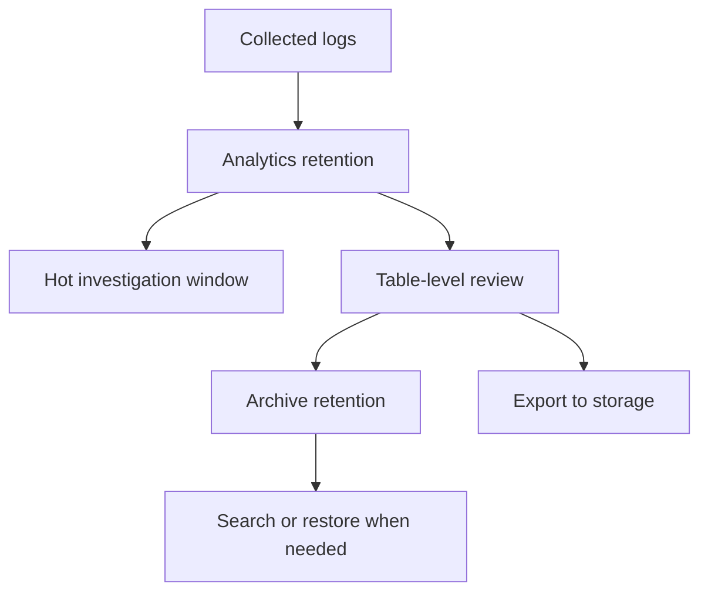

---
content_sources:
  diagrams:
    - id: data-retention
      type: flowchart
      source: mslearn-adapted
      based_on:
        - https://learn.microsoft.com/en-us/azure/azure-monitor/logs/log-analytics-workspace-overview
        - https://learn.microsoft.com/en-us/azure/azure-monitor/logs/data-retention-archive
        - https://learn.microsoft.com/en-us/azure/azure-monitor/logs/manage-cost-storage
---

# Data Retention

Retention strategy should preserve useful evidence without paying premium analytics cost forever. Use this guide to separate short-term troubleshooting needs from audit, legal, and historical requirements.

<!-- diagram-id: data-retention -->


## Why This Matters

Retention decisions affect investigation speed, compliance posture, and total observability cost. Microsoft Learn guidance for Azure Monitor Logs distinguishes between analytics retention, total retention, archive access, and export patterns because each serves a different purpose.

Common failure modes include:

- keeping every table in analytics retention for months or years,
- using one workspace-wide retention value for tables with very different access patterns,
- reducing retention with no export or archive plan for audit data,
- assuming old data must stay instantly queryable even though it is rarely accessed.

A good retention model answers three questions clearly:

- How far back do responders need interactive analytics?
- How long must the business or regulator preserve the records?
- Which tables justify premium hot retention versus cheaper long-term storage?

## Prerequisites

- Azure subscription with permission to manage Log Analytics workspaces and tables.
- Inventory of critical tables, compliance requirements, and incident review windows.
- Agreement on which teams can approve retention changes.
- Optional storage account if long-term export is part of the design.
- Variables set before running examples:
    - `RG`
    - `WORKSPACE_NAME`
    - `STORAGE_ACCOUNT_ID`
    - `TABLE_NAME`

## Recommended Practices

### Practice 1: Set a workspace default that reflects the normal investigation window

**Why**: Microsoft Learn recommends setting workspace retention intentionally instead of accepting a vague default forever. The default should match the analytics window most teams actually use, then table-level overrides can handle exceptions.

**How**: Configure a sensible workspace retention baseline such as 30 or 60 days for operational analytics.

```bash
az monitor log-analytics workspace update \
    --resource-group $RG \
    --workspace-name $WORKSPACE_NAME \
    --retention-time 30 \
    --output json

az monitor log-analytics workspace show \
    --resource-group $RG \
    --workspace-name $WORKSPACE_NAME \
    --query "{name:name,retentionInDays:retentionInDays,features:features}" \
    --output json
```

Sample output:

```json
{
  "name": "law-prod-shared",
  "retentionInDays": 30,
  "features": {
    "enableLogAccessUsingOnlyResourcePermissions": true
  }
}
```

Choose the baseline by asking:

- How far back do most investigations go?
- How quickly are incidents usually detected?
- How often do workbooks and alert rules query older data?

**Validation**: Confirm the baseline retention covers the incident review period for the last several major incidents without requiring archive restore for ordinary work.

### Practice 2: Use table-level retention and total retention for exceptions

**Why**: Microsoft Learn guidance on table management allows shorter or longer settings for specific tables. This prevents one high-volume table from forcing an expensive workspace-wide retention compromise.

Microsoft Learn documents that Analytics tables can keep analytics retention up to 730 days, while total retention can extend to 4383 days (12 years) when longer preservation is required.

**How**: Apply table-specific analytics and total retention values to match operational need.

```bash
az monitor log-analytics workspace table show \
    --resource-group $RG \
    --workspace-name $WORKSPACE_NAME \
    --name $TABLE_NAME \
    --query "{name:name,plan:plan,retentionInDays:retentionInDays,totalRetentionInDays:totalRetentionInDays}" \
    --output json

az monitor log-analytics workspace table update \
    --resource-group $RG \
    --workspace-name $WORKSPACE_NAME \
    --name $TABLE_NAME \
    --retention-time 14 \
    --total-retention-time 365 \
    --output json
```

Sample output:

```json
{
  "name": "AppRequests",
  "plan": "Analytics",
  "retentionInDays": 14,
  "totalRetentionInDays": 365
}
```

Good override candidates:

- high-volume traces needed for short-term troubleshooting,
- audit or security tables requiring longer preservation,
- low-value tables that can move quickly out of analytics retention,
- compliance tables that need long total retention but rare interactive access.

**Validation**: Check that the tables with the longest total retention have a named compliance or audit owner and a documented reason.

### Practice 3: Use archive or export for long-term evidence instead of keeping everything hot

**Why**: Microsoft Learn explains that archive retention and data export provide cheaper ways to preserve older telemetry. Interactive analytics is valuable for live operations, but long-term evidence often only needs durable retention and occasional retrieval.

**How**: Export selected tables or streams to a storage account, or rely on archive settings where the access pattern fits.

```bash
az monitor log-analytics workspace data-export create \
    --resource-group $RG \
    --workspace-name $WORKSPACE_NAME \
    --name "export-audit-logs" \
    --destination $STORAGE_ACCOUNT_ID \
    --enable true \
    --tables AzureActivity SecurityEvent \
    --output json

az monitor log-analytics workspace data-export list \
    --resource-group $RG \
    --workspace-name $WORKSPACE_NAME \
    --query "[].{name:name,destination:destinationResourceId,enabled:enable,tables:tableNames}" \
    --output json
```

Sample output:

```json
[
  {
    "name": "export-audit-logs",
    "destination": "/subscriptions/<subscription-id>/resourceGroups/rg-archive/providers/Microsoft.Storage/storageAccounts/starchiveprod",
    "enabled": true,
    "tables": [
      "AzureActivity",
      "SecurityEvent"
    ]
  }
]
```

Use export or archive when:

- retention requirement exceeds the common analytics window,
- the data is rarely queried interactively,
- legal or forensic teams need durable storage outside the workspace,
- the workspace is not the right system of record for years of history.

**Validation**: Confirm exported or archived datasets can actually be retrieved by the teams that need them. Retention is not valid if access exists only on paper.

### Practice 4: Test restore or search workflows before you need them

**Why**: Microsoft Learn notes that archived data is cheaper partly because access is different. If teams never test restore or search jobs, they discover retrieval friction only during an audit or major incident.

**How**: Periodically review table settings and rehearse how archived data would be recovered or queried.

```bash
az monitor log-analytics workspace table list \
    --resource-group $RG \
    --workspace-name $WORKSPACE_NAME \
    --query "[].{name:name,plan:plan,retentionInDays:retentionInDays,totalRetentionInDays:totalRetentionInDays}" \
    --output table

az monitor log-analytics workspace show \
    --resource-group $RG \
    --workspace-name $WORKSPACE_NAME \
    --query "{name:name,customerId:customerId,retentionInDays:retentionInDays}" \
    --output json
```

Sample output:

```text
Name           Plan       RetentionInDays    TotalRetentionInDays
-------------  ---------  -----------------  --------------------
AppRequests    Analytics  14                 365
AppTraces      Basic      8                  30
SecurityEvent  Analytics  30                 730
```

Runbook expectations to document:

- who can approve retrieval,
- how long retrieval is expected to take,
- where restored data becomes visible,
- how responders distinguish restored data from live analytics data.

**Validation**: Complete at least one quarterly retrieval rehearsal and record the elapsed time, access dependencies, and any approval bottlenecks.

## Common Mistakes / Anti-Patterns

### Anti-Pattern 1: One retention value for every table forever

**What happens**: A workspace default is set once and never reviewed.

**Why it's wrong**: High-volume tables stay expensive, low-volume audit tables may be under-protected, and nobody can explain the actual business rationale.

**Correct approach**: Review table settings and align them to usage.

```bash
az monitor log-analytics workspace table list \
    --resource-group $RG \
    --workspace-name $WORKSPACE_NAME \
    --output table
```

### Anti-Pattern 2: Reducing retention without a preservation alternative

**What happens**: A cost-cutting change shortens retention, but audit or investigation teams still expect the old access window.

**Why it's wrong**: The organization loses evidence coverage and finds out only during an audit, dispute, or security review.

**Correct approach**: Pair shorter analytics retention with archive or export where required.

```bash
az monitor log-analytics workspace data-export list \
    --resource-group $RG \
    --workspace-name $WORKSPACE_NAME \
    --output table
```

## Validation Checklist

- [ ] The workspace default retention matches the normal operational analytics window.
- [ ] Table-level overrides exist where volume or compliance requirements differ.
- [ ] Long-term evidence has an archive or export strategy where needed.
- [ ] Retrieval steps for archived or exported data are documented and tested.
- [ ] Table owners can explain why each long-retention table exists.
- [ ] Retention decisions are reviewed after major workload or compliance changes.

## Cost Impact

Retention settings directly affect storage cost. Shorter analytics retention reduces premium hot storage. Table-level overrides keep a few expensive tables from inflating the whole workspace. Archive and export preserve required history more cheaply, but they add retrieval workflow and sometimes extra storage cost outside Azure Monitor.

## See Also

- [Best Practices](./index.md)
- [Cost Optimization](./cost-optimization.md)
- [Security and Access](./security-and-access.md)
- [Operations - Workspace Management](../operations/workspace-management.md)

## Sources

- [Manage data retention in a Log Analytics workspace](https://learn.microsoft.com/azure/azure-monitor/logs/data-retention-configure)
- [Manage usage and costs with Azure Monitor Logs](https://learn.microsoft.com/azure/azure-monitor/logs/cost-logs)
- [Data export in Azure Monitor Logs](https://learn.microsoft.com/azure/azure-monitor/logs/logs-data-export)
- [Azure Monitor Logs overview](https://learn.microsoft.com/azure/azure-monitor/logs/data-platform-logs)
