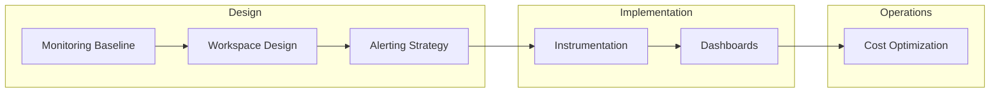

# Best Practices

Production patterns for Azure Monitor — what to do, what to avoid.

## In This Section

| Page | Description |
|------|-------------|
| [Monitoring Baseline](monitoring-baseline.md) | Minimum production monitoring standard for every workload |
| [Workspace Design](workspace-design.md) | Single vs multiple workspace patterns, access boundaries |
| [Alerting Strategy](alerting.md) | Alert fatigue prevention, severity conventions, escalation |
| [Cost Optimization](cost-optimization.md) | Ingestion control, commitment tiers, retention tuning |
| [Application Instrumentation](instrumentation.md) | OpenTelemetry vs auto-instrumentation, sampling strategies |
| [Dashboards and Workbooks](dashboards-and-workbooks.md) | When to use which, reusable patterns, sharing |
| [Common Anti-Patterns](common-anti-patterns.md) | Over-alerting, log verbosity explosion, cost surprises |

## See Also

- [Platform](../platform/index.md)
- [Operations](../operations/index.md)

## Sources

- [Azure Monitor best practices](https://learn.microsoft.com/azure/azure-monitor/best-practices)
- [Cost optimization in Azure Monitor](https://learn.microsoft.com/azure/azure-monitor/best-practices-cost)
