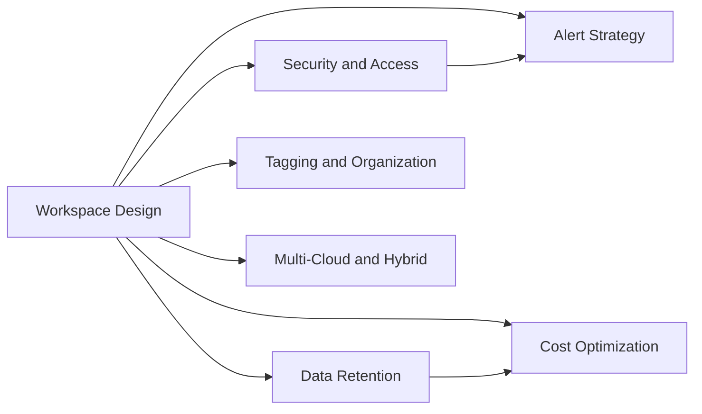

---
content_sources:
  diagrams:
    - id: best-practices
      type: flowchart
      source: self-generated
      based_on:
        - https://learn.microsoft.com/en-us/azure/azure-monitor/fundamentals/overview
        - https://learn.microsoft.com/en-us/azure/azure-monitor/logs/design-logs-deployment
        - https://learn.microsoft.com/en-us/azure/azure-monitor/alerts/alerts-best-practices
        - https://learn.microsoft.com/en-us/azure/azure-monitor/logs/manage-cost-storage
---

# Best Practices

Production patterns for Azure Monitor — what to do, why it matters, and how to validate the result in real environments.

<!-- diagram-id: best-practices -->

## In This Section

| Page | Description |
|------|-------------|
| [Workspace Design](workspace-design.md) | Design workspace boundaries around ownership, compliance, and operational model |
| [Alert Strategy](alert-strategy.md) | Build severity, routing, and suppression patterns that reduce noise |
| [Cost Optimization](cost-optimization.md) | Control ingestion, retention, and workspace pricing decisions |
| [Data Retention](data-retention.md) | Separate hot analytics windows from long-term evidence preservation |
| [Tagging and Organization](tagging-and-organization.md) | Standardize naming, tags, and ownership metadata for monitoring assets |
| [Security and Access](security-and-access.md) | Apply least privilege, private access, and security controls to telemetry |
| [Multi-Cloud and Hybrid Monitoring](multi-cloud-hybrid.md) | Standardize collection and ownership across Azure, Arc, and hybrid estates |

## See Also

- [Platform](../platform/index.md)
- [Operations](../operations/index.md)
- [Reference](../reference/index.md)

## Sources

- [Azure Monitor best practices](https://learn.microsoft.com/azure/azure-monitor/best-practices)
- [Cost optimization in Azure Monitor](https://learn.microsoft.com/azure/azure-monitor/best-practices-cost)
