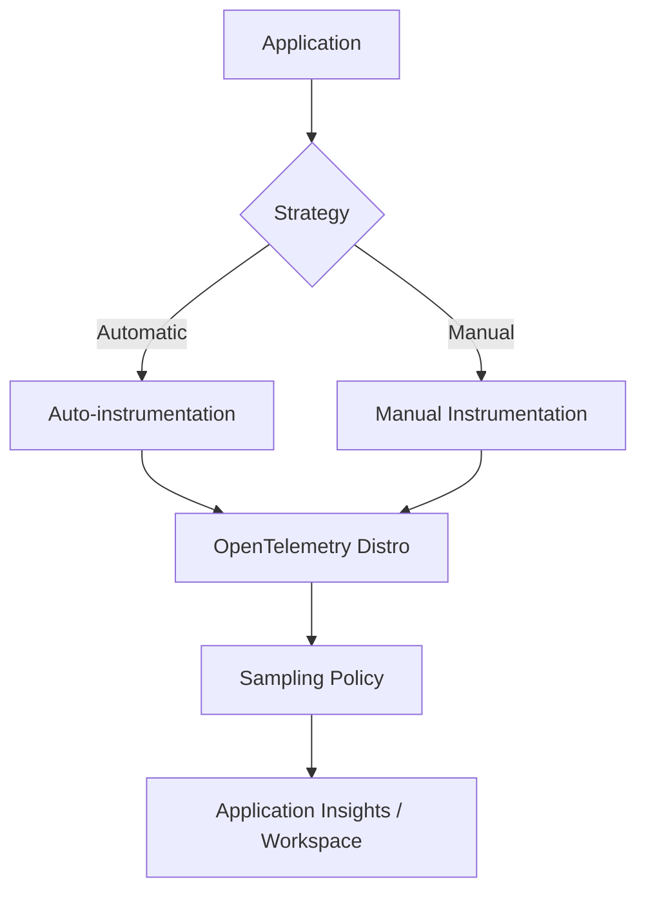

# Instrumentation

Quality instrumentation is the foundation of high-fidelity monitoring, determining the depth and clarity of the signals you receive from your applications.

## Why This Matters
Instrumentation quality and volume directly determine the value of monitoring data. Proper instrumentation enables meaningful signals for performance, reliability, and business insights while controlling costs through strategic sampling and data filtering.

## Recommended Practices
- **Adopt OpenTelemetry:** Use the Azure Monitor OpenTelemetry Distro for automatic instrumentation of traces, metrics, and logs across supported languages (.NET, Java, Node.js, Python).
- **Prioritize Auto-instrumentation:** Enable zero-code or low-code instrumentation where possible (e.g., for App Service or Functions) to reduce development effort and ensure consistent coverage.
- **Implement Strategic Sampling:** Apply sampling to reduce telemetry volume with minimal impact on analytics quality; use fixed-rate or adaptive sampling based on workload volume.
- **Use Workspace-based Application Insights:** Transition to workspace-based Application Insights to enable modern cost-saving features (Basic Logs, commitment tiers, and long-term retention).
- **Language-Specific Optimization:**
    - **.NET:** Use the Azure Monitor OpenTelemetry libraries for modern ASP.NET Core apps.
    - **Java:** Use the Java auto-instrumentation agent for comprehensive monitoring with zero code changes.
- **Limit Non-essential Telemetry:** For high-volume applications, disable or reduce the frequency of low-value signals like Ajax calls or high-frequency heartbeats.

## Common Mistakes
- **Using Legacy SDKs:** Staying on older Application Insights SDKs when modern OpenTelemetry distributions provide better support and features.
- **Zero Sampling:** Sending 100% of telemetry for high-traffic production workloads, resulting in massive, unnecessary ingestion costs.
- **Redundant Instrumentation:** Manually instrumenting common libraries (HTTP, SQL) that are already covered by auto-instrumentation agents.
- **Inconsistent Tagging:** Failing to add meaningful custom properties (tags) to traces and logs, making correlation difficult across microservices.

## Validation Checklist
- [ ] Application telemetry is flowing into a Workspace-based Application Insights resource.
- [ ] OpenTelemetry Distro is configured and active for the application runtime.
- [ ] Sampling rate is verified and aligned with cost and analysis requirements.
- [ ] SDKs are updated to the latest supported versions.
- [ ] Critical business transactions are identified and correctly instrumented for end-to-end tracing.

## See Also
- [Monitoring Baseline](monitoring-baseline.md)
- [Cost Optimization](cost-optimization.md)
- [Dashboards and Workbooks](dashboards-and-workbooks.md)

## Sources
- https://learn.microsoft.com/azure/azure-monitor/app/opentelemetry-enable
- https://learn.microsoft.com/azure/azure-monitor/best-practices
