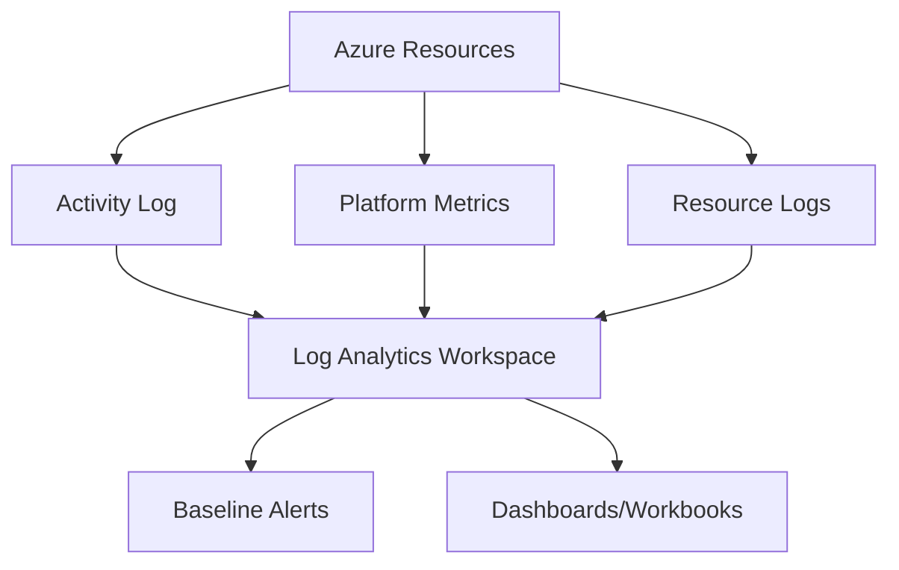

# Monitoring Baseline

Establish the minimum telemetry standards for production Azure workloads to ensure visibility and operational reliability.

## Why This Matters
Establishing a baseline helps track performance, security, and necessary data collection. It establishes the minimal, reproducible set of telemetry that allows you to detect operational issues quickly, align on expected performance, and support compliance and forensic needs.

## Recommended Practices
- **Collect Activity Logs:** Ensure subscription-level events (create, start, stop) are captured and routed to a central workspace.
- **Enable Resource Logs:** Configure diagnostic settings for all production resources to capture resource-level operations.
- **Gather Platform Metrics:** Use Metrics Explorer to understand performance trends and establish "normal" ranges for your workload.
- **Centralize Telemetry:** Route logs from multiple resources to a single (or primary) Log Analytics workspace to enable cross-resource correlation.
- **Establish Health Alerts:** Create alerts on data ingestion gaps or abnormal growth to ensure the monitoring system itself is healthy.

## Common Mistakes
- **Incomplete Coverage:** Failing to enable resource logs via diagnostic settings for critical resources.
- **Data Silos:** Scattering telemetry across many disconnected workspaces, complicating troubleshooting.
- **Over-Collection:** Collecting excessive telemetry without filtering, leading to unnecessary costs.
- **Lack of Baselines:** Not establishing what "normal" performance looks like, making anomaly detection difficult.

## Validation Checklist
- [ ] Activity Log is accessible and routed to a Log Analytics workspace.
- [ ] Diagnostic settings are enabled for all production-critical resources.
- [ ] Core platform metrics are visible in Metrics Explorer.
- [ ] At least one baseline alert exists for monitoring data ingestion health.
- [ ] Workspace Insights show data volume trends for the last 30 days.

## See Also
- [Workspace Design](workspace-design.md)
- [Alerting](alerting.md)
- [Cost Optimization](cost-optimization.md)

## Sources
- https://learn.microsoft.com/azure/azure-monitor/best-practices
- https://learn.microsoft.com/azure/azure-monitor/logs/best-practices-logs
