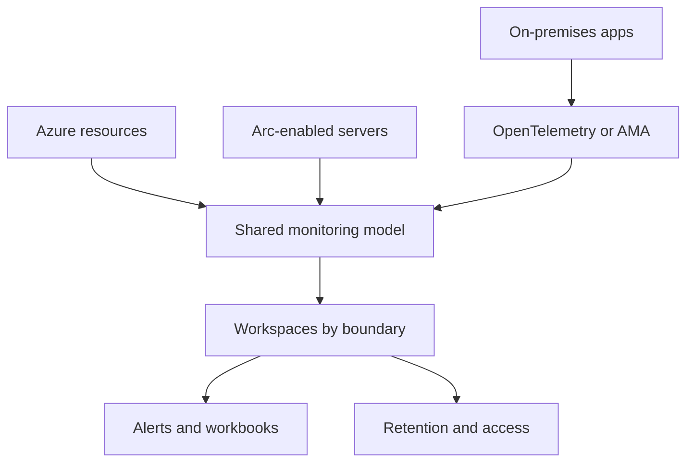

---
content_sources:
  diagrams:
    - id: multi-cloud-and-hybrid-monitoring
      type: flowchart
      source: mslearn-adapted
      based_on:
        - https://learn.microsoft.com/en-us/azure/azure-monitor/fundamentals/overview
        - https://learn.microsoft.com/en-us/azure/azure-monitor/agents/azure-monitor-agent-overview
        - https://learn.microsoft.com/en-us/azure/azure-monitor/data-collection/data-collection-rule-overview
---

# Multi-Cloud and Hybrid Monitoring

Hybrid and multi-cloud monitoring succeeds when collection, identity, and data ownership are standardized before teams connect more environments. Use this guide to make Azure Monitor workable across Azure, Azure Arc, private datacenters, and workloads running outside Azure.

<!-- diagram-id: multi-cloud-and-hybrid-monitoring -->


## Why This Matters

Microsoft Learn guidance across Azure Monitor Agent, Azure Arc, and Application Insights emphasizes consistency. The platform can collect telemetry from many places, but scattered onboarding patterns create the same operational problems everywhere:

- different teams send similar workloads to different workspaces,
- hybrid machines collect different counters and logs than Azure-native machines,
- metadata is inconsistent so cross-environment reporting is weak,
- alert routing is tied to cloud location instead of service ownership.

A good hybrid strategy makes environment differences explicit while keeping core collection, access, and response patterns as uniform as possible.

## Prerequisites

- Azure subscription with permission to manage Arc-connected resources, workspaces, and DCRs.
- Existing Azure Arc onboarding process for servers or Kubernetes clusters where applicable.
- Standard naming and tagging model for environment, owner, and service.
- Network path for agents or OpenTelemetry exporters to reach Azure Monitor endpoints.
- Variables set before running examples:
    - `RG`
    - `WORKSPACE_NAME`
    - `WORKSPACE_ID`
    - `DCR_NAME`
    - `ARC_MACHINE_ID`
    - `LOCATION`

## Recommended Practices

### Practice 1: Use one collection standard for equivalent server classes across Azure and Arc

**Why**: Microsoft Learn recommends Azure Monitor Agent and data collection rules as the standard pipeline for modern collection. If Azure VMs and Arc servers in the same service collect different counters or event logs, comparison and alerting become unreliable.

**How**: Define one DCR for each server profile and associate both Azure and Arc resources to it.

```bash
az monitor data-collection rule create \
    --resource-group $RG \
    --location $LOCATION \
    --name $DCR_NAME \
    --data-flows '[{"streams":["Microsoft-Perf"],"destinations":["la-workspace"]}]' \
    --destinations "{\"logAnalytics\":[{\"workspaceResourceId\":\"$WORKSPACE_ID\",\"name\":\"la-workspace\"}]}" \
    --output json

az monitor data-collection rule association create \
    --name "assoc-hybrid-server" \
    --rule-id $(az monitor data-collection rule show --resource-group $RG --name $DCR_NAME --query id --output tsv) \
    --resource $ARC_MACHINE_ID \
    --output json
```

Sample output:

```json
{
  "associationName": "assoc-hybrid-server",
  "ruleName": "dcr-hybrid-server-baseline",
  "resource": "/subscriptions/<subscription-id>/resourceGroups/rg-arc/providers/Microsoft.HybridCompute/machines/server-01"
}
```

Keep server profiles consistent for:

- performance counters,
- Windows event or syslog selection,
- update cadence for DCR changes,
- table destinations and transformations.

**Validation**: Compare one Azure VM and one Arc server from the same service. They should land in the same workspace or in intentionally different workspaces with the same collection logic.

### Practice 2: Normalize environment metadata across clouds and datacenters

**Why**: Microsoft Learn governance guidance matters even more in hybrid estates because cloud provider, region, and connectivity model differ. Without shared metadata, cross-environment alerting, workbook filtering, and cost attribution become guesswork.

**How**: Apply the same required tags to Arc resources and shared monitoring resources.

```bash
az tag create \
    --resource-id $ARC_MACHINE_ID \
    --tags Environment=Production Owner=platform-team Service=payments Hosting=Hybrid \
    --output json

az resource show \
    --ids $ARC_MACHINE_ID \
    --query "{name:name,type:type,tags:tags}" \
    --output json
```

Sample output:

```json
{
  "name": "server-01",
  "type": "Microsoft.HybridCompute/machines",
  "tags": {
    "Environment": "Production",
    "Owner": "platform-team",
    "Service": "payments",
    "Hosting": "Hybrid"
  }
}
```

Normalization fields that help most:

- environment,
- service or application name,
- owner,
- hosting model such as Azure, Hybrid, AWS, or GCP,
- criticality or tier for alert routing.

**Validation**: Confirm workbooks and inventory queries can filter resources by the shared tags regardless of where the workload runs.

### Practice 3: Keep alert routing based on service ownership, not cloud location

**Why**: Microsoft Learn alerting guidance focuses on action groups and severity, not cloud boundaries. In hybrid environments, the same service may run partly in Azure and partly elsewhere. Routing alerts by platform type alone produces split ownership and slower triage.

**How**: Scope alert rules to the correct workspace or resource set, but send them to the owning service team.

```bash
az monitor action-group create \
    --resource-group $RG \
    --name "ag-payments-prod-oncall" \
    --short-name AGPAY \
    --action email payments-oncall payments-oncall@contoso.example \
    --output json

az monitor scheduled-query create \
    --name "alert-hybrid-heartbeat-sev2" \
    --resource-group "$RG" \
    --scopes "$WORKSPACE_ID" \
    --condition "count 'HybridHeartbeatMissing' > 0" \
    --condition-query "HybridHeartbeatMissing=Heartbeat | summarize LastSeen=max(TimeGenerated) by Computer, _ResourceId | where LastSeen < ago(5m)" \
    --evaluation-frequency "5m" \
    --window-size "5m" \
    --severity 2 \
    --skip-query-validation true \
    --description "Trigger when a hybrid service heartbeat stops updating inside the shared monitoring boundary." \
    --action-groups $(az monitor action-group show --resource-group $RG --name "ag-payments-prod-oncall" --query id --output tsv) \
    --output json
```

Sample output:

```json
{
  "actionGroup": "ag-payments-prod-oncall",
  "alert": "alert-hybrid-heartbeat-sev2",
  "severity": 2
}
```

Routing principles:

- alerts follow service ownership,
- platform teams get alerted only for shared platform failure modes,
- hybrid hosting tags should enrich triage, not redefine ownership,
- escalation paths should remain consistent across environments.

**Validation**: Check recent alerts from hybrid workloads. Responders should not need to know the hosting platform before they know who owns the incident.

### Practice 4: Prefer open standards for application telemetry where workloads move between environments

**Why**: Microsoft Learn recommends OpenTelemetry for many Application Insights scenarios because it reduces lock-in to one hosting environment and creates a more portable instrumentation strategy. This matters when services can run in Azure, on-premises, or another cloud at different lifecycle stages.

**How**: Keep application telemetry landing in workspace-based Application Insights resources and verify workspace association.

```bash
az monitor app-insights component create \
    --app "appi-payments-shared" \
    --location $LOCATION \
    --resource-group $RG \
    --workspace $WORKSPACE_ID \
    --application-type web \
    --kind web \
    --output json

az monitor app-insights component show \
    --app "appi-payments-shared" \
    --resource-group $RG \
    --query "{name:name,workspaceResourceId:workspaceResourceId,applicationType:applicationType}" \
    --output json
```

Sample output:

```json
{
  "name": "appi-payments-shared",
  "workspaceResourceId": "/subscriptions/<subscription-id>/resourceGroups/rg-monitoring/providers/Microsoft.OperationalInsights/workspaces/law-hybrid-prod",
  "applicationType": "web"
}
```

Portability benefits:

- one instrumentation approach across hosting platforms,
- easier service-level dashboards and alerts,
- simpler migration between environments,
- clearer ownership of app traces versus host metrics.

**Validation**: Review one service that spans more than one environment and confirm its traces, dependencies, and alerts follow a common telemetry model.

## Common Mistakes / Anti-Patterns

### Anti-Pattern 1: Separate every hosting platform into a different operating model

**What happens**: Azure-native, Arc, and on-premises resources all use different collection patterns and workspace destinations.

**Why it's wrong**: Operators cannot compare like-for-like systems, and every new alert or workbook needs environment-specific logic.

**Correct approach**: Standardize DCR profiles and workspace boundaries by ownership and compliance, not by platform label alone.

```bash
az monitor data-collection rule association list-by-resource \
    --resource $ARC_MACHINE_ID \
    --output table
```

### Anti-Pattern 2: Using cloud location as the primary alert ownership boundary

**What happens**: The same service pages different teams depending on where the failing component runs.

**Why it's wrong**: Incidents fragment, handoffs increase, and responders lose the end-to-end service view.

**Correct approach**: Route alerts by service ownership and use tags to enrich context.

```bash
az monitor action-group list \
    --resource-group $RG \
    --query "[].{name:name,shortName:groupShortName}" \
    --output table
```

## Validation Checklist

- [ ] Equivalent Azure and Arc server classes use standardized DCR profiles.
- [ ] Shared metadata exists for environment, owner, service, and hosting model.
- [ ] Hybrid alerts route to the owning service team.
- [ ] Workspaces are separated only when governance or compliance requires it.
- [ ] Application telemetry uses a portable instrumentation model where services move between environments.
- [ ] Retrieval, retention, and access controls are documented for hybrid datasets.

## Cost Impact

Hybrid monitoring can increase cost if teams duplicate workspaces and collect different telemetry sets for the same service. Standardized DCRs, shared tag taxonomies, and portable application telemetry reduce duplication and make cost review possible across environments.

## See Also

- [Best Practices](./index.md)
- [Workspace Design](./workspace-design.md)
- [Security and Access](./security-and-access.md)
- [Service Guides - Virtual Machines](../service-guides/vm/observability.md)

## Sources

- [Azure Monitor Agent overview](https://learn.microsoft.com/azure/azure-monitor/agents/azure-monitor-agent-overview)
- [Data collection rules in Azure Monitor](https://learn.microsoft.com/azure/azure-monitor/data-collection/data-collection-rule-overview)
- [Azure Arc-enabled servers overview](https://learn.microsoft.com/azure/azure-arc/servers/overview)
- [OpenTelemetry configuration for Application Insights](https://learn.microsoft.com/azure/azure-monitor/app/opentelemetry-configuration)
