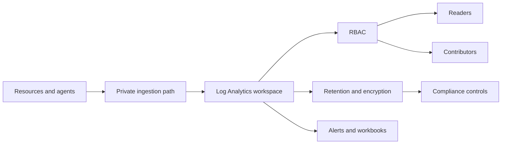

# Security and Access

Azure Monitor security is about controlling who can read telemetry, who can change collection and alerts, and how data moves over the network. Use this guide to protect monitoring data without making operational access unusable.



## Why This Matters

Monitoring data often contains resource names, request paths, IP information, deployment details, and other sensitive operational context. Microsoft Learn guidance for Azure Monitor access management stresses least privilege, explicit workspace access, and private connectivity when required.

Security mistakes in Azure Monitor tend to hide behind convenience:

- broad Reader access used instead of targeted monitor roles,
- public query and ingestion left enabled for sensitive workspaces,
- shared workspaces mixing unrelated compliance scopes,
- no review of who can modify alert rules, DCRs, or exports.

The risk is not only data exposure. Uncontrolled monitor configuration changes also create silent detection gaps.

Security and operability have to stay balanced. Incident responders still need rapid access, auditors need a clear trail of who can read or change telemetry, and network controls must not block critical ingestion during incidents.

## Prerequisites

- Azure subscription with permission to manage role assignments and workspace settings.
- A defined access model for platform operators, application responders, auditors, and security teams.
- Network team support if private endpoints or AMPLS are in scope.
- Optional Key Vault and customer-managed key process for encryption requirements.
- Variables set before running examples:
    - `RG`
    - `WORKSPACE_NAME`
    - `WORKSPACE_ID`
    - `USER_OBJECT_ID`
    - `PRIVATE_LINK_SCOPE_NAME`
    - `LOCATION`

## Recommended Practices

### Practice 1: Use least-privilege monitor roles instead of broad subscription access

**Why**: Microsoft Learn documents built-in monitoring roles for readers, contributors, and specialists. Using subscription-wide Reader or Contributor for troubleshooting is convenient, but it grants much more than many operators need.

**How**: Assign monitor-specific roles at the smallest scope that matches the operational task.

```bash
az role assignment create \
    --assignee-object-id $USER_OBJECT_ID \
    --assignee-principal-type User \
    --role "Log Analytics Reader" \
    --scope $WORKSPACE_ID \
    --output json

az role assignment list \
    --scope $WORKSPACE_ID \
    --query "[].{principalId:principalId,role:roleDefinitionName,scope:scope}" \
    --output table
```

Sample output:

```text
PrincipalId                            Role                  Scope
-------------------------------------  --------------------  ------------------------------------------------------------------------
xxxxxxxx-xxxx-xxxx-xxxx-xxxxxxxxxxxx   Log Analytics Reader  /subscriptions/<subscription-id>/resourceGroups/rg-monitoring/.../law
```

- query-only users need reader roles, not contributor roles,
- alert maintainers may need monitor contributor at a limited scope,
- automation identities should receive only the role required for the exact workflow.

**Validation**: Sample several human and service principals. Each one should have a clear justification for its role and scope.

### Practice 2: Disable public ingestion and query when private access is required

**Why**: Microsoft Learn recommends private link for Azure Monitor when organizational policy requires private network access to workspaces and connected monitor endpoints. Leaving public access enabled on sensitive workspaces increases exposure and weakens network controls.

**How**: Update the workspace network settings and connect it through Azure Monitor Private Link Scope.

```bash
az monitor log-analytics workspace update \
    --resource-group $RG \
    --workspace-name $WORKSPACE_NAME \
    --public-network-access-for-ingestion Disabled \
    --public-network-access-for-query Disabled \
    --output json

az monitor private-link-scope create \
    --resource-group $RG \
    --name $PRIVATE_LINK_SCOPE_NAME \
    --location $LOCATION \
    --output json
```

Sample output:

```json
{
  "workspace": "law-prod-secure",
  "publicNetworkAccessForIngestion": "Disabled",
  "publicNetworkAccessForQuery": "Disabled",
  "privateLinkScope": "ampls-prod-monitoring"
}
```

Use private access especially when:

- regulated workloads prohibit public telemetry paths,
- workspaces serve highly sensitive operational or security data,
- hybrid or private-only environments already require controlled egress.

**Validation**: Confirm network design documents, DNS, and endpoint mappings are complete before disabling public access for production ingestion.

### Practice 3: Separate configuration permissions from data reading where possible

**Why**: Microsoft Learn access guidance distinguishes between reading logs and managing workspace configuration. These are different risk profiles. People who can read incidents do not automatically need to change retention, export, DCR routing, or alert actions.

**How**: Review who can modify workspace and alert configuration, then scope contributor-level permissions narrowly.

```bash
az role assignment create \
    --assignee-object-id $USER_OBJECT_ID \
    --assignee-principal-type User \
    --role "Monitoring Contributor" \
    --scope "/subscriptions/<subscription-id>/resourceGroups/rg-monitoring-prod-shared" \
    --output json

az role assignment list \
    --scope "/subscriptions/<subscription-id>/resourceGroups/rg-monitoring-prod-shared" \
    --query "[].{principalId:principalId,role:roleDefinitionName}" \
    --output table
```

Sample output:

```text
PrincipalId                            Role
-------------------------------------  ----------------------
xxxxxxxx-xxxx-xxxx-xxxx-xxxxxxxxxxxx   Monitoring Contributor
```

Permissions that deserve extra review:

- changing diagnostic settings,
- updating DCR transforms,
- modifying alert rules and action groups,
- enabling export or changing retention,
- linking sensitive resources to shared workspaces.

**Validation**: Run a quarterly access review that separately inventories readers, contributors, and automation identities.

### Practice 4: Protect retained data with explicit encryption and key-management decisions

**Why**: Microsoft Learn documents customer-managed keys for Log Analytics when policy requires stronger control over encryption material. Not every workspace needs CMK, but every regulated workspace needs a documented decision.

**How**: Inspect workspace properties and confirm whether the environment requires Microsoft-managed keys or customer-managed keys. Do not treat retention updates as an encryption control; CMK must be configured with the supported Azure Monitor Logs CMK procedure.

```bash
az monitor log-analytics workspace show \
    --resource-group $RG \
    --workspace-name $WORKSPACE_NAME \
    --query "{name:name,retentionInDays:retentionInDays,sku:sku.name,features:features}" \
    --output json
```

Sample output:

```json
{
  "name": "law-prod-secure",
  "retentionInDays": 30,
  "sku": "PerGB2018",
  "features": {
    "enableLogAccessUsingOnlyResourcePermissions": true
  }
}
```

Decision prompts:

- Does policy require customer-managed keys?
- Does the workspace contain regulated security or customer data?
- Is key rotation owned and tested by the platform team?
- Are recovery procedures documented if key access changes?

**Validation**: The security design record should state the encryption model, key owner, and recovery implications for each sensitive workspace.

### Practice 5: Use resource-context access and scoped workspaces to reduce unnecessary broad visibility

**Why**: Microsoft Learn describes resource-context access as a way to query logs for a specific resource without exposing everything in the workspace to every operator. This is useful when application teams need their own resource data but should not automatically browse unrelated datasets.

**How**: Enable resource-context access and verify that teams can use resource-scoped permissions for day-to-day investigations.

```bash
az monitor log-analytics workspace update \
    --resource-group $RG \
    --workspace-name $WORKSPACE_NAME \
    --enable-log-access-using-only-resource-permissions true \
    --output json

az monitor log-analytics workspace show \
    --resource-group $RG \
    --workspace-name $WORKSPACE_NAME \
    --query "{name:name,resourcePermissions:features.enableLogAccessUsingOnlyResourcePermissions}" \
    --output json
```

Sample output:

```json
{
  "name": "law-prod-secure",
  "resourcePermissions": true
}
```

**Validation**: Confirm application operators can investigate their own resources without receiving broad workspace reader assignments unless their role genuinely requires that wider access.

### Practice 6: Review automation identities that can change monitoring configuration

**Why**: Human access reviews often happen, but automation identities are easier to forget. Microsoft Learn RBAC guidance applies equally to service principals and managed identities that manage diagnostic settings, DCRs, alerts, or exports.

**How**: Inventory role assignments at monitoring scopes and verify that each nonhuman identity still has a valid owner and purpose.

```bash
az role assignment list \
    --scope $WORKSPACE_ID \
    --query "[].{principalId:principalId,principalType:principalType,role:roleDefinitionName}" \
    --output table

az role assignment list \
    --scope "/subscriptions/<subscription-id>/resourceGroups/rg-monitoring-prod-shared" \
    --query "[].{principalId:principalId,principalType:principalType,role:roleDefinitionName}" \
    --output table
```

```text
PrincipalId                            PrincipalType      Role
-------------------------------------  -----------------  ----------------------
xxxxxxxx-xxxx-xxxx-xxxx-xxxxxxxxxxxx   ServicePrincipal   Monitoring Contributor
xxxxxxxx-xxxx-xxxx-xxxx-xxxxxxxxxxxx   User               Log Analytics Reader
```

**Validation**: Every automation identity should map to an owned workflow such as IaC deployment, policy remediation, or approved incident automation.

## Common Mistakes / Anti-Patterns

### Anti-Pattern 1: Giving broad Reader or Contributor access at subscription scope for convenience

**What happens**: Troubleshooting access is solved by assigning generic roles broadly.

**Why it's wrong**: Users inherit far more visibility and change capability than needed, and least-privilege review becomes nearly impossible.

**Correct approach**: Replace broad assignments with monitor-specific roles at workspace or monitoring resource-group scope.

```bash
az role assignment list \
    --scope "/subscriptions/<subscription-id>" \
    --query "[?roleDefinitionName=='Reader' || roleDefinitionName=='Contributor'].{principalId:principalId,role:roleDefinitionName}" \
    --output table
```

### Anti-Pattern 2: Private access mandated by policy but public query left enabled

**What happens**: A private-link project is deployed, but the workspace still accepts public query or ingestion.

**Why it's wrong**: Security assumptions no longer match the actual access path.

**Correct approach**: Verify network flags explicitly on every sensitive workspace.

```bash
az monitor log-analytics workspace show \
    --resource-group $RG \
    --workspace-name $WORKSPACE_NAME \
    --query "{queryAccess:publicNetworkAccessForQuery,ingestionAccess:publicNetworkAccessForIngestion}" \
    --output json
```

## Validation Checklist

- [ ] Monitor-specific roles are used instead of broad generic roles where possible.
- [ ] Workspace readers and contributors are reviewed separately.
- [ ] Sensitive workspaces have explicit public access settings that match policy.
- [ ] Private Link design is documented where private query or ingestion is required.
- [ ] Resource-context access is enabled where teams should investigate only their own resources.
- [ ] Encryption and key-management decisions are documented for sensitive workspaces.
- [ ] Alert, DCR, and diagnostic-setting change permissions are limited to approved operators.
- [ ] Automation identities with monitor change rights have an owner and review date.

## Cost Impact
Security controls can add cost through private endpoints, private DNS, or CMK-related operational work, but they reduce the far greater risk of uncontrolled data exposure or unapproved configuration changes. Scope-limited RBAC also lowers operational review cost by making access audits smaller and clearer.

## See Also
- [Best Practices](./index.md)
- [Workspace Design](./workspace-design.md)
- [Data Retention](./data-retention.md)
- [Platform - Networking and Security](../platform/networking-and-security.md)

## Sources
- [Manage access to Log Analytics workspaces](https://learn.microsoft.com/azure/azure-monitor/logs/manage-access)
- [Private Link for Azure Monitor](https://learn.microsoft.com/azure/azure-monitor/logs/private-link-security)
- [Customer-managed keys for Azure Monitor Logs](https://learn.microsoft.com/azure/azure-monitor/logs/customer-managed-keys)
- [Azure Monitor built-in roles](https://learn.microsoft.com/azure/role-based-access-control/built-in-roles/monitor)
- [Manage access to Azure Monitor workspaces](https://learn.microsoft.com/azure/azure-monitor/metrics/azure-monitor-workspace-manage-access)
