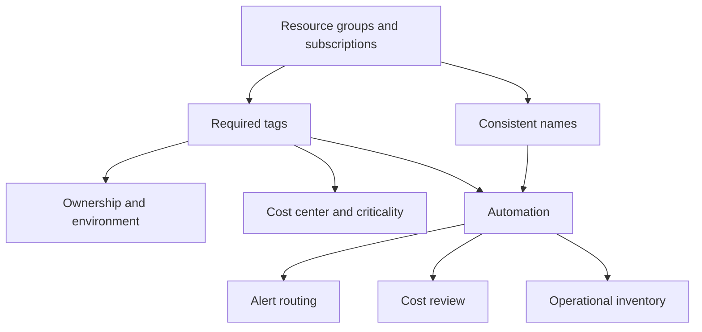

# Tagging and Organization

Azure Monitor gets harder to operate when resources are easy to deploy but hard to classify. Use this guide to make workspaces, Application Insights resources, action groups, and diagnostic pipelines discoverable, automatable, and accountable.



## Why This Matters

Microsoft Learn guidance on Azure resource organization and tagging treats metadata as an operational control, not just a billing convenience. In Azure Monitor, tags and naming conventions help teams answer basic but critical questions quickly:

- Who owns this workspace or alert rule?
- Is this resource production or non-production?
- Which business service does this data belong to?
- Which resources should a policy, workbook, or automation target?

Without that structure, teams compensate with tribal knowledge and manual spreadsheets. That breaks as soon as the platform spans multiple subscriptions, regions, or business units.

## Prerequisites

- Azure subscription with permission to create and update resource groups and tags.
- Agreed naming standard for monitoring resources.
- Defined required tags such as `Environment`, `Owner`, `CostCenter`, and `Service`.
- Optional Azure Policy initiative if enforcement is needed at scale.
- Variables set before running examples:
    - `RG`
    - `WORKSPACE_NAME`
    - `ACTION_GROUP_NAME`
    - `APP_INSIGHTS_NAME`
    - `RESOURCE_ID`

## Recommended Practices

### Practice 1: Apply a small required tag set to every monitoring resource

**Why**: Microsoft Learn and Azure governance guidance recommend a minimal required tag set instead of an uncontrolled taxonomy. Too few tags limit automation, but too many guarantee drift. Start with tags that affect ownership, environment, service alignment, and cost reporting.

**How**: Apply the same required tags to Log Analytics workspaces, Application Insights resources, action groups, and central resource groups.

```bash
az tag create \
    --resource-id $RESOURCE_ID \
    --tags Environment=Production Owner=platform-team CostCenter=CC1001 Service=shared-monitoring \
    --output json

az resource show \
    --ids $RESOURCE_ID \
    --query "{name:name,type:type,tags:tags}" \
    --output json
```

Sample output:

```json
{
  "name": "law-prod-shared",
  "type": "Microsoft.OperationalInsights/workspaces",
  "tags": {
    "Environment": "Production",
    "Owner": "platform-team",
    "CostCenter": "CC1001",
    "Service": "shared-monitoring"
  }
}
```

Recommended required tags:

- `Environment`
- `Owner`
- `Service`
- `CostCenter`
- `Criticality` when paging or escalation depends on it

**Validation**: Export a list of monitoring resources and confirm the required tag set is complete on each one.

### Practice 2: Use names that reveal scope, purpose, and environment

**Why**: Tags help automation, but names are still how humans scan the portal, CLI output, and incident records. Microsoft Learn governance guidance emphasizes consistent naming because operators rely on names first under pressure.

**How**: Adopt a naming convention that encodes resource type, environment, and service or boundary.

```bash
az monitor log-analytics workspace create \
    --resource-group $RG \
    --workspace-name "law-prod-shared" \
    --location koreacentral \
    --sku PerGB2018 \
    --retention-time 30 \
    --output json

az monitor action-group create \
    --resource-group $RG \
    --name "ag-platform-prod-oncall" \
    --short-name AGPROD \
    --action email platform-oncall platform-oncall@contoso.example \
    --output json
```

Sample output:

```json
{
  "workspace": "law-prod-shared",
  "actionGroup": "ag-platform-prod-oncall"
}
```

Good naming characteristics:

- type prefix such as `law`, `appi`, or `ag`,
- environment indicator such as `prod` or `nonprod`,
- service or boundary indicator such as `shared`, `payments`, or `security`,
- optional region only when the environment actually spans multiple regions.

**Validation**: Pick five monitoring resources from different subscriptions. An operator should infer function and environment from the name without opening the portal.

### Practice 3: Organize monitoring resources by lifecycle and ownership, not by convenience alone

**Why**: Microsoft Learn recommends resource groups and subscriptions reflect management boundaries. If workspaces, action groups, and alert rules are scattered across unrelated application groups, governance becomes fragile and discovery slows down.

**How**: Place shared monitoring resources in resource groups that align to platform ownership or landing-zone boundaries.

```bash
az group create \
    --name "rg-monitoring-prod-shared" \
    --location koreacentral \
    --tags Environment=Production Owner=platform-team Service=shared-monitoring \
    --output json

az group show \
    --name "rg-monitoring-prod-shared" \
    --query "{name:name,location:location,tags:tags}" \
    --output json
```

Sample output:

```json
{
  "name": "rg-monitoring-prod-shared",
  "location": "koreacentral",
  "tags": {
    "Environment": "Production",
    "Owner": "platform-team",
    "Service": "shared-monitoring"
  }
}
```

Organizational patterns that work well:

- one shared monitoring resource group per environment,
- separate security-owned monitoring resources where access boundaries require it,
- separate non-production groups to avoid accidental coupling with production changes.

**Validation**: Review each monitoring resource group and confirm one owner can approve changes, lifecycle actions, and incident follow-up for the resources inside it.

### Practice 4: Use tags and names as automation selectors for policy, reporting, and cleanup

**Why**: Metadata matters only when automation uses it. Microsoft Learn governance patterns encourage using tags to scope policy, reporting, and remediation. Azure Monitor benefits immediately because policy, scripts, and reporting can identify resources that should have diagnostics, retention reviews, or alert coverage.

**How**: Query resources by tags and use the result set for policy audits, scripts, or scheduled governance reviews.

```bash
az resource list \
    --tag Environment=Production \
    --query "[?contains(type, 'Microsoft.OperationalInsights/workspaces') || contains(type, 'Microsoft.Insights/components')].{name:name,type:type,group:resourceGroup}" \
    --output table

az resource list \
    --tag Owner=platform-team \
    --query "[].{name:name,type:type,tags:tags}" \
    --output json
```

Sample output:

```text
Name                Type                                      Group
------------------  ----------------------------------------  --------------------------
law-prod-shared     Microsoft.OperationalInsights/workspaces  rg-monitoring-prod-shared
appi-checkout-prod  Microsoft.Insights/components             rg-monitoring-prod-shared
```

Useful automation scenarios:

- detect untagged workspaces,
- inventory production monitoring assets by owner,
- target cleanup of test monitoring resources,
- verify every critical service has alert destinations and approved ownership.

At scale, enforce the required tag set with Azure Policy so monitoring resources do not drift out of reporting and automation scope.

**Validation**: Confirm at least one policy, script, or reporting workflow depends on the standard tags and would fail if the taxonomy drifted.

## Common Mistakes / Anti-Patterns

### Anti-Pattern 1: Tag sprawl with no mandatory core set

**What happens**: Every team invents slightly different tags such as `Env`, `environment`, `prod`, and `ProductionEnv`.

**Why it's wrong**: Automation breaks, governance reporting becomes unreliable, and cost rollups need manual cleanup.

**Correct approach**: Keep a minimal required taxonomy and normalize resources to it.

```bash
az resource list \
    --query "[?contains(type, 'Microsoft.OperationalInsights/workspaces')].{name:name,tags:tags}" \
    --output json
```

### Anti-Pattern 2: Monitoring resources hidden inside unrelated application groups

**What happens**: Shared action groups and workspaces are created wherever the first application team happened to deploy them.

**Why it's wrong**: Ownership is unclear, changes bypass platform review, and resource discovery during incidents is slow.

**Correct approach**: Move future deployments to dedicated monitoring groups aligned to ownership and update naming to reflect scope.

```bash
az group list \
    --query "[?contains(name, 'monitoring')].{name:name,location:location}" \
    --output table
```

## Validation Checklist

- [ ] Every monitoring resource has the required core tag set.
- [ ] Names encode type, environment, and scope consistently.
- [ ] Shared monitoring resources live in ownership-aligned resource groups.
- [ ] Automation or reporting uses the approved tags.
- [ ] Production and non-production monitoring resources are easy to distinguish.
- [ ] Tag values are normalized and not duplicated under alternate spellings.

## Cost Impact

Tags and organization do not change ingestion charges directly, but they make cost control possible. Accurate ownership and cost-center tags let teams review spend, identify abandoned workspaces, and assign remediation to the right owner faster.

## See Also

- [Best Practices](./index.md)
- [Workspace Design](./workspace-design.md)
- [Cost Optimization](./cost-optimization.md)
- [Start Here - Repository Map](../start-here/repository-map.md)

## Sources

- [Use tags to organize your Azure resources](https://learn.microsoft.com/azure/azure-resource-manager/management/tag-resources)
- [Define your Azure resource naming convention](https://learn.microsoft.com/azure/cloud-adoption-framework/ready/azure-best-practices/resource-naming)
- [Define your Azure tagging strategy](https://learn.microsoft.com/azure/cloud-adoption-framework/ready/azure-best-practices/resource-tagging)
- [Tag support for Azure resources](https://learn.microsoft.com/azure/azure-resource-manager/management/tag-support)
- [Assign Azure Policy definitions for tag governance](https://learn.microsoft.com/azure/governance/policy/assign-policy-portal)
- [Azure Monitor Logs best practices](https://learn.microsoft.com/azure/azure-monitor/logs/best-practices-logs)
