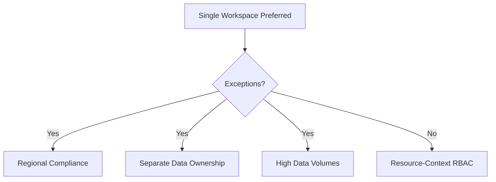

# Workspace Design

Optimal Log Analytics workspace architecture is key to efficient data residency, access control, and cost management.

## Why This Matters
Workspace architecture affects data residency, costs, performance, and data ownership. A well-designed architecture simplifies governance and ensures teams can access necessary telemetry without violating security policies.

## Recommended Practices
- **Start Small:** Use a single Log Analytics workspace where possible to reduce management overhead and enable unified queries.
- **Use Region-Specific Workspaces:** Place workspaces in the same regions as your resources to minimize data transfer costs and meet residency requirements.
- **Implement Resource-Context RBAC:** Configure your workspace to use "Resource-context" permissions, allowing users to access data for specific resources they own without seeing data for other resources.
- **Optimize for Commitment Tiers:** Consolidate data into fewer workspaces to reach higher commitment tiers, which yield substantial cost discounts for daily ingestion.
- **Plan for Retention:** Separate data streams or use table-level retention if different data types (e.g., security vs. application) require different storage periods.

## Common Mistakes
- **Over-Splitting Workspaces:** Creating too many workspaces without valid business needs (e.g., one per app), making cross-app analysis difficult.
- **Ignoring Residency:** Sending data across regions unnecessarily, resulting in unexpected egress charges.
- **Poor RBAC Alignment:** Failing to align data access with resource ownership, leading to security gaps or access denials.
- **Inconsistent Retention:** Applying the same retention period to high-volume diagnostic logs and critical security events, wasting storage budget.

## Validation Checklist
- [ ] Number of workspaces aligns with documented governance and residency requirements.
- [ ] Regional placement of workspaces matches data location policy.
- [ ] Resource-context RBAC is the default access mode.
- [ ] Commitment tiers are regularly reviewed based on average daily ingestion.
- [ ] Retention settings for each workspace (and per-table) are documented and verified.

## See Also
- [Monitoring Baseline](monitoring-baseline.md)
- [Cost Optimization](cost-optimization.md)
- [Dashboards and Workbooks](dashboards-and-workbooks.md)

## Sources
- https://learn.microsoft.com/azure/azure-monitor/logs/workspace-design
- https://learn.microsoft.com/azure/azure-monitor/logs/best-practices-logs
