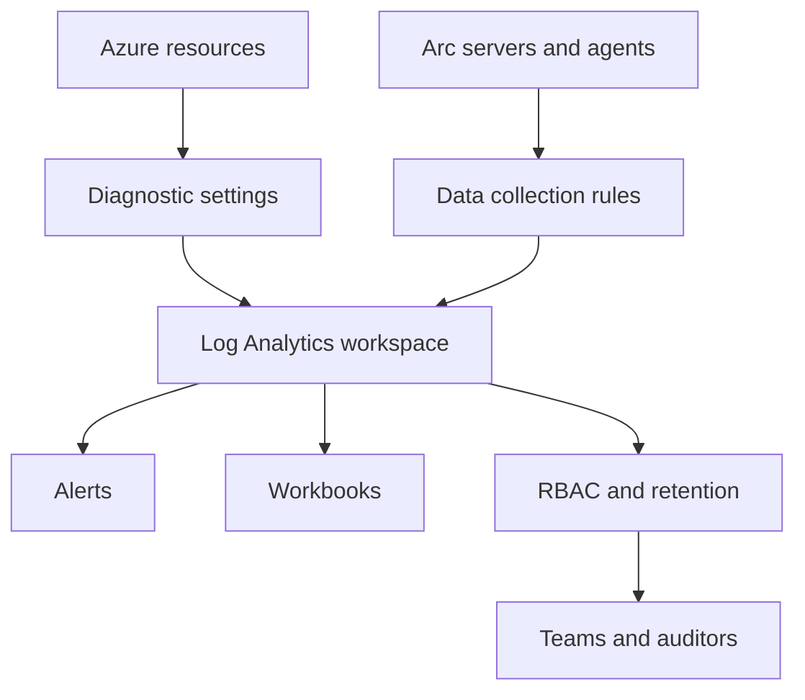

---
content_sources:
  diagrams:
    - id: workspace-design
      type: flowchart
      source: mslearn-adapted
      based_on:
        - https://learn.microsoft.com/en-us/azure/azure-monitor/logs/log-analytics-workspace-overview
        - https://learn.microsoft.com/en-us/azure/azure-monitor/logs/design-logs-deployment
        - https://learn.microsoft.com/en-us/azure/azure-monitor/logs/manage-access
---

# Workspace Design

Use this guide to design Azure Monitor workspaces that stay governable as environments, teams, and regulatory boundaries grow. The goal is to avoid rebuilding your logging topology after alerting, retention, and access patterns are already in production.

<!-- diagram-id: workspace-design -->


## Why This Matters

Workspace design drives three outcomes that are expensive to fix later.

- It defines who can query which logs.
- It determines how much duplication or cross-workspace query complexity you accept.
- It influences data residency, ingestion cost, and operational ownership.

Poor workspace design usually shows up as one of these late-stage problems:

- Security teams can see too much or too little.
- Application teams cannot troubleshoot because telemetry is split inconsistently.
- Finance cannot explain why one workspace contains every environment and every verbose table.
- Regulated workloads need separation after alert rules and workbooks already depend on a shared workspace.

Microsoft Learn guidance for Azure Monitor emphasizes designing around access boundaries, data residency, and operational model first, then attaching resources consistently. Treat the workspace as a data platform boundary, not as a random container for logs.

## Prerequisites

- Azure subscription with permission to create and update Log Analytics workspaces.
- Existing resource groups for platform, shared services, or landing zones.
- Permission to manage data collection rules and diagnostic settings.
- Agreement on environment naming, tag taxonomy, and subscription ownership.
- Variables set before running examples:
    - `RG`
    - `WORKSPACE_NAME`
    - `SECONDARY_WORKSPACE_NAME`
    - `LOCATION`
    - `DCR_NAME`
    - `RESOURCE_ID`

## Recommended Practices

### Practice 1: Design workspaces around security and operational boundaries

**Why**: Microsoft Learn recommends separating workspaces when you have different data residency requirements, different administrators, or different legal boundaries. Splitting only by application name usually creates excessive operational overhead, while using one global workspace for everything makes delegated access harder.

**How**: Create a workspace per clear boundary such as production vs non-production, sovereign region, or separate platform administration domain.

```bash
az monitor log-analytics workspace create \
    --resource-group $RG \
    --workspace-name $WORKSPACE_NAME \
    --location $LOCATION \
    --sku PerGB2018 \
    --retention-time 30 \
    --output json

az monitor log-analytics workspace show \
    --resource-group $RG \
    --workspace-name $WORKSPACE_NAME \
    --query "{name:name,location:location,sku:sku.name,retentionInDays:retentionInDays,publicNetworkAccessForQuery:publicNetworkAccessForQuery}" \
    --output json
```

Sample output:

```json
{
  "name": "law-prod-shared",
  "location": "koreacentral",
  "sku": "PerGB2018",
  "retentionInDays": 30,
  "publicNetworkAccessForQuery": "Enabled"
}
```

Use a decision table before creating more workspaces:

- Separate when access owners differ.
- Separate when residency or compliance boundaries differ.
- Separate when one tenant or business unit funds and governs its own observability.
- Share when teams collaborate on incidents and require common queries and common alerts.

**Validation**: Confirm each workspace has a documented owner, approved data boundary, and named consumer groups. If you cannot explain why a workspace exists in one sentence, the topology is probably too granular.

### Practice 2: Standardize ingestion paths with data collection rules

**Why**: Microsoft Learn guidance for Azure Monitor Agent recommends routing log collection through data collection rules so that collection scope, table destinations, and transformations remain explicit. Direct agent onboarding without DCR discipline leads to inconsistent tables and surprise ingestion cost.

**How**: Create DCRs per workload profile and associate them deliberately with the correct workspace.

```bash
az monitor data-collection rule create \
    --resource-group $RG \
    --location $LOCATION \
    --name $DCR_NAME \
    --data-flows '[{"streams":["Microsoft-Perf"],"destinations":["la-workspace"]}]' \
    --destinations "{\"logAnalytics\":[{\"workspaceResourceId\":\"$WORKSPACE_ID\",\"name\":\"la-workspace\"}]}" \
    --output json

az monitor data-collection rule show \
    --resource-group $RG \
    --name $DCR_NAME \
    --query "{name:name,location:location,streams:properties.dataFlows[0].streams,destination:properties.destinations.logAnalytics[0].workspaceResourceId}" \
    --output json
```

Sample output:

```json
{
  "name": "dcr-prod-platform",
  "location": "koreacentral",
  "streams": [
    "Microsoft-Perf"
  ],
  "destination": "/subscriptions/<subscription-id>/resourceGroups/rg-monitoring/providers/Microsoft.OperationalInsights/workspaces/law-prod-shared"
}
```

Operational rules to keep topology clean:

- One DCR for one collection intent.
- Name DCRs by boundary and stream type.
- Keep transformations reviewed by both platform and cost owners.
- Do not point equivalent server classes at different destinations unless there is a real governance reason.

**Validation**: List DCR associations for representative machines or Arc servers and confirm the destination workspace matches the documented landing zone pattern.

### Practice 3: Keep application telemetry and platform logs queryable together only when teams troubleshoot together

**Why**: Microsoft Learn describes workspace-based Application Insights as the preferred model because it aligns APM data with Log Analytics capabilities. That is useful only when the same operating team benefits from shared investigations. Otherwise, keep data boundaries aligned to ownership.

**How**: Create workspace-based Application Insights components against the workspace that owns the application lifecycle.

```bash
az monitor app-insights component create \
    --app $APP_INSIGHTS_NAME \
    --location $LOCATION \
    --resource-group $RG \
    --workspace $WORKSPACE_ID \
    --application-type web \
    --kind web \
    --output json

az monitor app-insights component show \
    --app $APP_INSIGHTS_NAME \
    --resource-group $RG \
    --query "{name:name,workspaceResourceId:workspaceResourceId,location:location,applicationType:applicationType}" \
    --output json
```

Sample output:

```json
{
  "name": "appi-checkout-prod",
  "workspaceResourceId": "/subscriptions/<subscription-id>/resourceGroups/rg-monitoring/providers/Microsoft.OperationalInsights/workspaces/law-prod-shared",
  "location": "koreacentral",
  "applicationType": "web"
}
```

Choose co-location when these are true:

- The same responders use both application traces and platform logs.
- Shared workbooks or alerts correlate across both datasets.
- The app follows the same retention and access model as its supporting infrastructure.

Choose separation when these are true:

- The app is operated by a different team.
- The data contains different sensitivity classifications.
- The app must live in a separate billing or compliance boundary.

**Validation**: Run a cross-resource investigation design review. If incident responders must jump across multiple workspaces for one common incident type, revisit the topology.

### Practice 4: Attach diagnostic settings with an explicit destination standard

**Why**: Workspace design fails when platform resources send logs to random destinations. Microsoft Learn recommends using diagnostic settings consistently so teams know where metrics, resource logs, and exports land. Inconsistent destinations create broken alerts and fragmented retention.

**How**: Route supported Azure resources to the approved workspace and use a consistent diagnostic setting name.

```bash
az monitor diagnostic-settings create \
    --name "diag-to-$WORKSPACE_NAME" \
    --resource $RESOURCE_ID \
    --workspace $WORKSPACE_ID \
    --logs '[{"categoryGroup":"allLogs","enabled":true}]' \
    --metrics '[{"category":"AllMetrics","enabled":true}]' \
    --output json

az monitor diagnostic-settings list \
    --resource $RESOURCE_ID \
    --query "[].{name:name,workspace:workspaceId,logs:logs[0].enabled,metrics:metrics[0].enabled}" \
    --output table
```

Sample output:

```text
Name                     Workspace                                                                 Logs    Metrics
-----------------------  ------------------------------------------------------------------------  ------  -------
diag-to-law-prod-shared  /subscriptions/<subscription-id>/resourceGroups/rg-monitoring/.../law    True    True
```

Recommended destination standards:

- Use one approved workspace per boundary.
- Standardize diagnostic setting names for automation.
- Prefer category groups where supported to reduce drift.
- Review unsupported categories before assuming coverage.

For sensitive workspaces, Microsoft Learn recommends disabling public query and ingestion access when policy requires private access and using Azure Monitor Private Link Scope as part of the network design.

**Validation**: Check several high-value resources from different subscriptions. They should all land in the expected workspace, use the standard name, and expose the categories the team depends on.

## Common Mistakes / Anti-Patterns

### Anti-Pattern 1: One workspace per application with no governance reason

**What happens**: Every team creates its own workspace because it feels simple at deployment time.

**Why it's wrong**: Shared troubleshooting becomes harder, alert rules multiply, RBAC sprawl grows, and ingestion discounts or commitment planning become fragmented.

**Correct approach**: Consolidate around true boundaries, then verify whether application resources point to the right destination.

```bash
az monitor diagnostic-settings list \
    --resource $RESOURCE_ID \
    --output json

az monitor log-analytics workspace list \
    --query "[].{name:name,resourceGroup:resourceGroup,location:location}" \
    --output table
```

### Anti-Pattern 2: Shared workspace with unmanaged access and mixed compliance scope

**What happens**: A central workspace stores everything from every environment, including restricted datasets, while dozens of readers receive broad access.

**Why it's wrong**: A single access error exposes unrelated data, and later separation requires moving alerts, workbooks, exports, and DCR destinations.

**Correct approach**: Restrict access up front and disable public access where private ingestion and query are required.

```bash
az monitor log-analytics workspace update \
    --resource-group $RG \
    --workspace-name $WORKSPACE_NAME \
    --public-network-access-for-ingestion Disabled \
    --public-network-access-for-query Disabled \
    --output json
```

## Validation Checklist

- [ ] Every workspace has a documented purpose, owner, and supported data boundary.
- [ ] Production and non-production separation is intentional and explained.
- [ ] DCRs route equivalent workloads to the expected workspace.
- [ ] Workspace-based Application Insights components align with incident ownership.
- [ ] Diagnostic settings use a standard naming and destination pattern.
- [ ] Cross-workspace queries are the exception, not the default operating model.
- [ ] Public ingestion and query access settings match the network security design.

## Cost Impact

Good workspace design lowers cost by reducing duplicate ingestion, minimizing abandoned workspaces, and making commitment-tier planning realistic. Over-segmentation prevents shared optimization, while under-segmentation mixes noisy test data with critical production tables and inflates retention cost.

## See Also

- [Best Practices](./index.md)
- [Cost Optimization](./cost-optimization.md)
- [Security and Access](./security-and-access.md)
- [Data Collection Rules](../platform/data-collection-rules.md)

## Sources

- [Azure Monitor Logs best practices](https://learn.microsoft.com/azure/azure-monitor/logs/best-practices-logs)
- [Design a Log Analytics workspace deployment](https://learn.microsoft.com/azure/azure-monitor/logs/design-logs-deployment)
- [Data collection rules in Azure Monitor](https://learn.microsoft.com/azure/azure-monitor/data-collection/data-collection-rule-overview)
- [Manage access to Log Analytics workspaces](https://learn.microsoft.com/azure/azure-monitor/logs/manage-access)
- [Create and configure workspace-based Application Insights resources](https://learn.microsoft.com/azure/azure-monitor/app/create-workspace-resource)
- [Private Link for Azure Monitor](https://learn.microsoft.com/azure/azure-monitor/logs/private-link-security)
- [Azure Well-Architected Framework](https://learn.microsoft.com/azure/well-architected/framework/)
