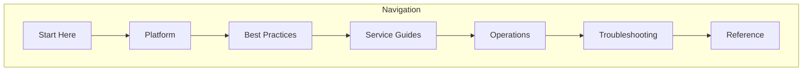

---
content_sources:
  diagrams:
    - id: azure-monitoring-practical-guide
      type: flowchart
      source: self-generated
      based_on:
        - https://learn.microsoft.com/en-us/azure/azure-monitor/fundamentals/overview
        - https://learn.microsoft.com/en-us/azure/azure-monitor/logs/log-analytics-overview
        - https://learn.microsoft.com/en-us/azure/azure-monitor/app/app-insights-overview
---

# Azure Monitoring Practical Guide

Comprehensive guide for monitoring Azure workloads — from Azure Monitor fundamentals to production operations with Log Analytics and Application Insights.

<!-- diagram-id: azure-monitoring-practical-guide -->

## What's Inside

| Section | Description | Pages |
|---------|-------------|-------|
| [Start Here](start-here/overview.md) | Overview, learning paths, repository map | 3 |
| [Platform](platform/index.md) | Azure Monitor architecture, data platform, Log Analytics, Application Insights | 9 |
| [Best Practices](best-practices/index.md) | Monitoring baseline, workspace design, alerting strategy, cost optimization | 8 |
| [Service Guides](service-guides/index.md) | Per-service monitoring for App Service, Container Apps, Functions, AKS, VMs | 13 |
| [Operations](operations/index.md) | Workspace management, diagnostic settings, alert rules, workbooks | 8 |
| [Troubleshooting](troubleshooting/index.md) | Decision tree, evidence map, playbooks, KQL query packs | 29 |
| [Reference](reference/index.md) | CLI cheatsheet, KQL quick reference, platform limits | 5 |

## Quick Start

Choose your path based on your role:

- **Developer** — Start with [Application Insights](platform/application-insights.md), then [Alert Strategy](best-practices/alert-strategy.md)
- **SRE/Operator** — Start with [How Azure Monitor Works](platform/how-azure-monitor-works.md), then [Workspace Design](best-practices/workspace-design.md)
- **Incident Responder** — Start with [Decision Tree](troubleshooting/decision-tree.md), then [KQL Query Packs](troubleshooting/kql/index.md)
- **Architect** — Start with [Data Platform](platform/data-platform.md), then [Workspace Design](best-practices/workspace-design.md)

## See Also

- [Learning Paths](start-here/learning-paths.md)
- [Repository Map](start-here/repository-map.md)

## Sources

- [Azure Monitor documentation](https://learn.microsoft.com/azure/azure-monitor/)
- [Log Analytics documentation](https://learn.microsoft.com/azure/azure-monitor/logs/)
- [Application Insights documentation](https://learn.microsoft.com/azure/azure-monitor/app/app-insights-overview)
