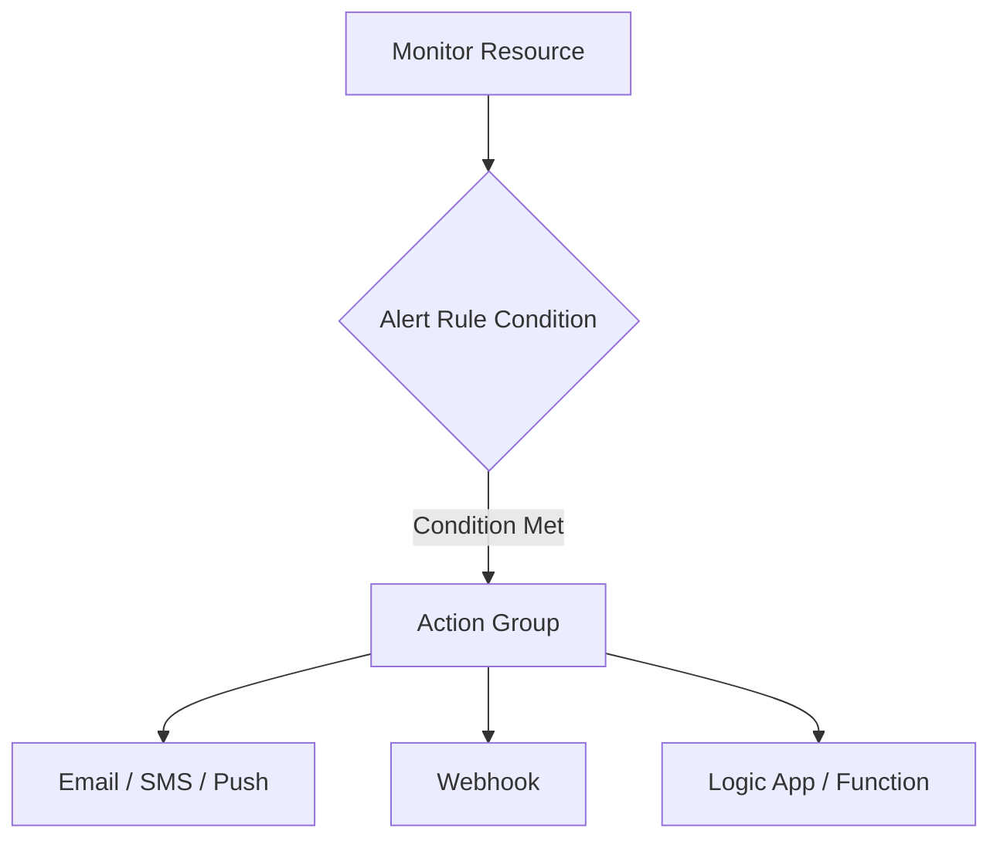

# Alert Rule Management

Alert rules actively monitor metrics and logs, triggering notifications or automation when specific conditions are met. Centralizing alert management ensures consistency across the environment.



## Prerequisites

- Target resources for monitoring.
- Destination Action Groups for notifications.
- Permissions: **Monitoring Contributor** or **Log Analytics Contributor**.

## When to Use

- When proactive monitoring is required to detect system failures or performance degradation.
- When automated responses (e.g., scaling or remediation) are needed.
- When notifying stakeholders about specific events (e.g., policy violations).

## Procedure

### Azure Portal
1. Navigate to **Monitor** > **Alerts**.
2. Select **Create** > **Alert rule**.
3. Select the **Scope** (the resource(s) to monitor).
4. Define the **Condition** (e.g., a specific metric threshold or log search query).
5. Select or create an **Action Group**.
6. Provide a **Name**, **Severity**, and **Description**.
7. Select **Review + create**, then **Create**.

### Azure CLI
Create a metric alert rule:

```bash
az monitor metrics alert create \
    --name "alert-vm-high-cpu" \
    --resource-group "rg-monitoring-prod" \
    --scopes "/subscriptions/00000000-0000-0000-0000-000000000000/resourceGroups/rg-prod/providers/Microsoft.Compute/virtualMachines/vm-prod" \
    --condition "avg Percentage CPU > 90" \
    --window-size "5m" \
    --evaluation-frequency "1m" \
    --action "/subscriptions/00000000-0000-0000-0000-000000000000/resourceGroups/rg-monitoring-prod/providers/microsoft.insights/actiongroups/ag-it-ops" \
    --description "CPU usage is above 90% for the last 5 minutes"
```

Update an existing alert rule to disable it:

```bash
az monitor metrics alert update \
    --name "alert-vm-high-cpu" \
    --resource-group "rg-monitoring-prod" \
    --enabled false
```

## Verification

List all alert rules in a resource group:

```bash
az monitor metrics alert list \
    --resource-group "rg-monitoring-prod"
```

View the status of a specific alert rule:

```bash
az monitor metrics alert show \
    --name "alert-vm-high-cpu" \
    --resource-group "rg-monitoring-prod"
```

## Rollback / Troubleshooting

- **False Positives:** Adjust the threshold or evaluation frequency.
- **Alert Not Triggered:** Verify the window size is long enough to capture data points.
- **Notification Not Received:** Check the Action Group configuration and any suppressions or "Mute" settings.

## See Also

- [Create, view, and manage metric alerts](https://learn.microsoft.com/azure/azure-monitor/alerts/alerts-create-new-alert-rule)
- [Log search alerts in Azure Monitor](https://learn.microsoft.com/azure/azure-monitor/alerts/alerts-unified-log)

## Sources

- [MS Learn: Create, view, and manage metric alerts](https://learn.microsoft.com/azure/azure-monitor/alerts/alerts-create-new-alert-rule)
- [MS Learn: Manage action groups in the Azure Portal](https://learn.microsoft.com/azure/azure-monitor/alerts/action-groups)
