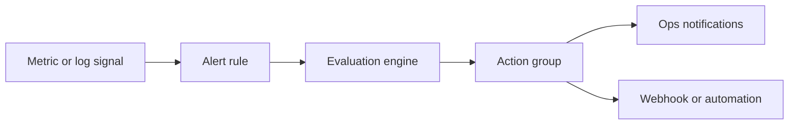

# Alert Rule Management
Azure Monitor alert rules only help when they are consistent, actionable, and easy to verify after every change. This runbook covers day-2 operations for metric alerts, scheduled query alerts, and their action groups.

## Prerequisites
- Azure CLI authenticated with `az login`.
- A target resource that already emits metrics or logs.
- At least one action group for notifications.
- Permissions:
    - `Monitoring Contributor` for alert changes.
    - `Log Analytics Reader` or better for log-query testing.
- Variables used below:
```bash
RG="rg-monitoring-prod"
VM_ID="/subscriptions/<subscription-id>/resourceGroups/rg-prod/providers/Microsoft.Compute/virtualMachines/vm-prod-01"
WORKSPACE_ID="/subscriptions/<subscription-id>/resourceGroups/rg-monitoring-prod/providers/Microsoft.OperationalInsights/workspaces/law-ops-central"
ACTION_GROUP_ID="/subscriptions/<subscription-id>/resourceGroups/rg-monitoring-prod/providers/microsoft.insights/actionGroups/ag-oncall-team"
ALERT_RULE_NAME="alert-vm-high-cpu"
```
## When to Use
- A new workload needs baseline monitoring.
- Alert noise is increasing and thresholds need tuning.
- Notifications must be rerouted to a different action group.
- A rule must be disabled during planned maintenance.
- A production incident requires confirming whether the rule really evaluates as expected.
## Procedure
### Step 1: Inventory existing alert rules and action groups
List current metric alerts in the resource group before creating or changing anything.
```bash
az monitor metrics alert list \
    --resource-group $RG \
    --query "[].{name:name,enabled:enabled,severity:severity,scopes:scopes}" \
    --output table
```
Expected output:
```text
Name                    Enabled    Severity    Scopes
----------------------  ---------  ----------  ------------------------------------------------------
alert-vm-high-cpu       True       2           ['/subscriptions/<subscription-id>/.../virtualMachines/vm-prod-01']
alert-vm-heartbeat      True       1           ['/subscriptions/<subscription-id>/.../virtualMachines/vm-prod-01']
```
Then confirm the action group that the rule should call.
```bash
az monitor action-group show \
    --ids $ACTION_GROUP_ID \
    --query "{name:name,shortName:groupShortName,enabled:enabled}" \
    --output json
```
Expected output:
```json
{
  "enabled": true,
  "name": "ag-oncall-team",
  "shortName": "oncall"
}
```
### Step 2: Create a metric alert with explicit evaluation settings
Create the rule with an explicit window size, frequency, severity, and action group.
```bash
az monitor metrics alert create \
    --name $ALERT_RULE_NAME \
    --resource-group $RG \
    --scopes $VM_ID \
    --condition "avg Percentage CPU > 85" \
    --window-size 5m \
    --evaluation-frequency 1m \
    --severity 2 \
    --action $ACTION_GROUP_ID \
    --description "CPU is above 85 percent for 5 minutes on vm-prod-01" \
    --output json
```
Expected output:
```json
{
  "enabled": true,
  "evaluationFrequency": "PT1M",
  "name": "alert-vm-high-cpu",
  "scopes": [
    "/subscriptions/<subscription-id>/resourceGroups/rg-prod/providers/Microsoft.Compute/virtualMachines/vm-prod-01"
  ],
  "severity": 2,
  "windowSize": "PT5M"
}
```
This baseline matches Microsoft Learn guidance: a clear signal, tight scope, and an explicit action path.
### Step 3: Add or update a scheduled query alert for log-based detection
Use scheduled query alerts for conditions that cannot be expressed as a single Azure Monitor metric.
```bash
az monitor scheduled-query create \
    --name "alert-heartbeat-missing-sev2" \
    --resource-group "$RG" \
    --scopes "$WORKSPACE_ID" \
    --condition "count 'HeartbeatMissing' > 0" \
    --condition-query "HeartbeatMissing=Heartbeat | where Computer == \"vm-prod-01\" | where TimeGenerated < ago(5m)" \
    --evaluation-frequency "5m" \
    --window-size "5m" \
    --severity 2 \
    --skip-query-validation true \
    --action-groups $ACTION_GROUP_ID \
    --description "Trigger when vm-prod-01 has no fresh heartbeat data for five minutes." \
    --output json
```
Expected output:
```json
{
  "actions": {
    "actionGroups": [
      "/subscriptions/<subscription-id>/resourceGroups/rg-monitoring-prod/providers/microsoft.insights/actionGroups/ag-oncall-team"
    ]
  },
  "enabled": true,
  "evaluationFrequency": "PT5M",
  "name": "alert-heartbeat-missing-sev2",
  "severity": 2,
  "windowSize": "PT5M"
}
```
Test the same query manually before trusting the alert in production.
```bash
az monitor log-analytics query \
    --workspace $WORKSPACE_ID \
    --analytics-query "Heartbeat | where Computer == 'vm-prod-01' and TimeGenerated > ago(5m) | count" \
    --output table
```
Expected output:
```text
Count
-----
10
```
### Step 4: Tune or disable rules during maintenance and noise reduction
Update rules instead of deleting them when you want to preserve history and configuration intent.
```bash
az monitor metrics alert update \
    --name $ALERT_RULE_NAME \
    --resource-group $RG \
    --description "CPU is above 90 percent for 10 minutes on vm-prod-01" \
    --enabled false \
    --output json
```
Expected output:
```json
{
  "description": "CPU is above 90 percent for 10 minutes on vm-prod-01",
  "enabled": false,
  "name": "alert-vm-high-cpu"
}
```
Re-enable the rule after the maintenance window.
```bash
az monitor metrics alert update \
    --name $ALERT_RULE_NAME \
    --resource-group $RG \
    --enabled true \
    --output json
```
Expected output:
```json
{
  "enabled": true,
  "name": "alert-vm-high-cpu"
}
```
Temporary disablement is safer than permanent deletion because it keeps the alert definition available for immediate rollback.
### Step 5: Review rule state and recent firing history
Validate the final state of both metric and scheduled query alerts.
```bash
az monitor metrics alert show \
    --name $ALERT_RULE_NAME \
    --resource-group $RG \
    --query "{name:name,enabled:enabled,severity:severity,windowSize:windowSize,evaluationFrequency:evaluationFrequency}" \
    --output json
```
Expected output:
```json
{
  "enabled": true,
  "evaluationFrequency": "PT1M",
  "name": "alert-vm-high-cpu",
  "severity": 2,
  "windowSize": "PT5M"
}
```
Check recent activity log events related to alert administration.
```bash
az monitor activity-log list \
    --resource-group $RG \
    --offset 1d \
    --query "[?contains(operationName.localizedValue, 'alert')].{time:eventTimestamp,status:status.value,operation:operationName.localizedValue}" \
    --output table
```
Expected output:
```text
Time                         Status     Operation
---------------------------  ---------  ------------------------------------
2026-04-05T08:42:09.000000Z  Succeeded  Create or Update Metric Alert Rule
2026-04-05T08:44:31.000000Z  Succeeded  Create or Update Scheduled Query Rule
```
## Verification
List rules again and confirm state, severity, and naming conventions.
```bash
az monitor metrics alert list \
    --resource-group $RG \
    --query "[].{name:name,enabled:enabled,severity:severity}" \
    --output table
```
Expected output:
```text
Name                    Enabled    Severity
----------------------  ---------  ----------
alert-vm-high-cpu       True       2
alert-vm-heartbeat      True       1
```
Verify the scheduled query rule separately.
```bash
az monitor scheduled-query show \
    --name "alert-heartbeat-missing-sev2" \
    --resource-group $RG \
    --query "{name:name,enabled:enabled,windowSize:windowSize,evaluationFrequency:evaluationFrequency}" \
    --output json
```
Expected output:
```json
{
  "enabled": true,
  "evaluationFrequency": "PT5M",
  "name": "alert-heartbeat-missing-sev2",
  "windowSize": "PT5M"
}
```
Verification succeeds when both rules are enabled as intended and their action group references remain intact.
## Rollback / Troubleshooting
Disable a noisy metric alert immediately:
```bash
az monitor metrics alert update \
    --name $ALERT_RULE_NAME \
    --resource-group $RG \
    --enabled false \
    --output json
```
Delete a faulty scheduled query rule if the definition itself is wrong:
```bash
az monitor scheduled-query delete \
    --name "alert-heartbeat-missing-sev2" \
    --resource-group $RG \
    --yes
```
Common problems:
- Alert never fires
    - Check whether the metric namespace and scope match the target resource.
- Log alert returns zero results
    - Run the KQL query manually and confirm the table exists in the workspace.
- Notifications not received
    - Validate the action group receivers and downstream email or webhook health.
- Too many false positives
    - Increase the threshold, widen the evaluation window, or reduce frequency.
## Automation
Alert rule hygiene should be scripted rather than handled only in the portal.
```bash
az monitor metrics alert list \
    --query "[].{name:name,resourceGroup:resourceGroup,enabled:enabled,severity:severity}" \
    --output json
```
Useful automation patterns:
- Export alert definitions nightly and store them in source control.
- Run lint checks for naming, severity, and action group presence.
- Use scheduled jobs to flag disabled rules older than a maintenance window.
- Pair rule inventory with incident review to retire low-value alerts.
## See Also
- [Operations index](index.md)
- [Workbooks and Dashboards](workbooks-and-dashboards.md)
- [Cost Control](cost-control.md)
- [Reference CLI cheatsheet](../reference/cli-cheatsheet.md)
## Sources
- [Microsoft Learn: Create and manage metric alerts](https://learn.microsoft.com/azure/azure-monitor/alerts/alerts-create-metric-alert-rule)
- [Microsoft Learn: Create and manage log search alerts](https://learn.microsoft.com/azure/azure-monitor/alerts/alerts-create-log-alert-rule)
- [Microsoft Learn: Action groups in Azure Monitor](https://learn.microsoft.com/azure/azure-monitor/alerts/action-groups)
- [Microsoft Learn: Azure Monitor alerts overview](https://learn.microsoft.com/azure/azure-monitor/alerts/alerts-overview)
