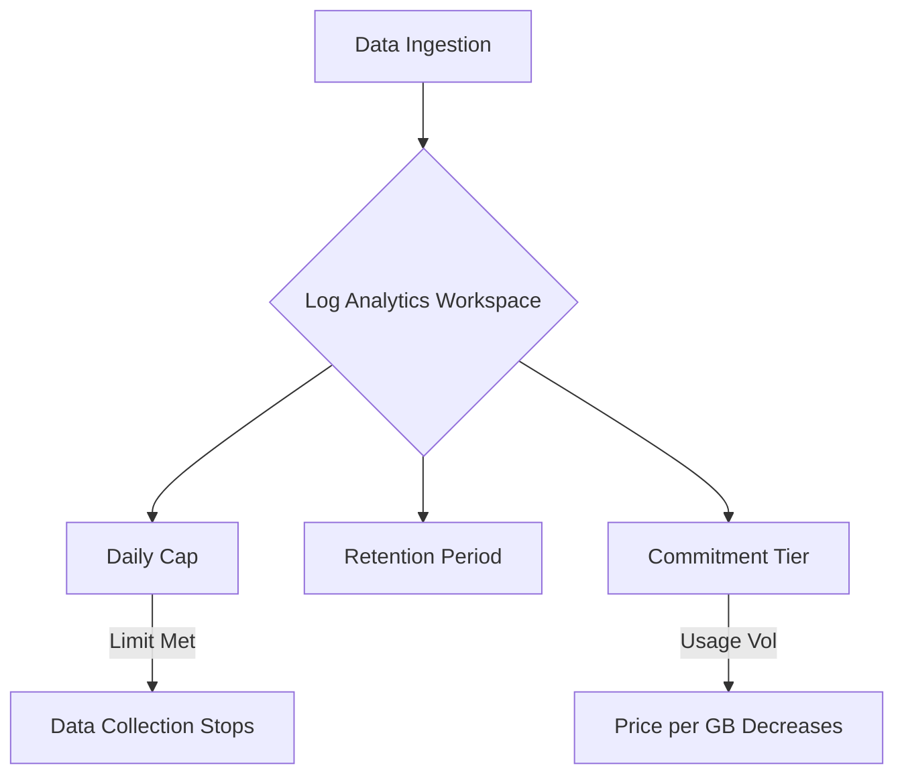

# Cost Control

Azure Monitor cost control involves monitoring data ingestion, setting daily caps, and optimizing pricing through commitment tiers to align with budgetary constraints.



## Prerequisites

- Active Log Analytics workspace.
- Permissions: **Log Analytics Contributor** or **Monitoring Contributor**.

## When to Use

- When unexpected data spikes cause billing overages.
- When predictable, high-volume ingestion warrants a flat-rate commitment tier.
- When strictly controlling the total monthly cost for non-critical environments.

## Procedure

### Azure Portal
1. Navigate to **Log Analytics workspaces** > **Usage and estimated costs**.
2. Select **Daily Cap**.
3. Enable the cap and set a **Daily GB Limit**.
4. Choose whether to **Send an email** when the cap is reached.
5. Select **OK**.
6. Select **Pricing tier** to choose between Pay-As-You-Go and Commitment Tiers (e.g., 100 GB/day).

### Azure CLI
Update the daily cap for a workspace:

```bash
az monitor log-analytics workspace update \
    --resource-group "rg-monitoring-prod" \
    --workspace-name "law-ops-central" \
    --quota 50
```

Set the retention period to optimize storage costs:

```bash
az monitor log-analytics workspace update \
    --resource-group "rg-monitoring-prod" \
    --workspace-name "law-ops-central" \
    --retention-time 31
```

## Verification

Check current ingestion and daily cap status:

```bash
az monitor log-analytics workspace show \
    --resource-group "rg-monitoring-prod" \
    --workspace-name "law-ops-central" \
    --query "{Name:name, Retention:retentionInDays, DailyCap:workspaceCapping.dailyQuotaGb}"
```

Run a KQL query to identify high-volume tables:
```kql
Usage
| where TimeGenerated > ago(24h)
| where IsBillable == true
| summarize IngestedGB = sum(Quantity) / 1024 by DataType
| sort by IngestedGB desc
```

## Rollback / Troubleshooting

- **Data stops unexpectedly:** Check if the daily cap has been reached.
- **High costs despite low volume:** Verify the retention period and any billable custom logs or solutions.
- **Commitment Tier savings:** It takes up to 24 hours for a new commitment tier to reflect in billing projections.

## See Also

- [Manage usage and costs with Azure Monitor Logs](https://learn.microsoft.com/azure/azure-monitor/logs/manage-cost-storage)
- [Azure Monitor pricing overview](https://learn.microsoft.com/azure/azure-monitor/cost-usage)

## Sources

- [MS Learn: Manage usage and costs with Azure Monitor Logs](https://learn.microsoft.com/azure/azure-monitor/logs/manage-cost-storage)
- [MS Learn: Optimize Azure Monitor Logs costs](https://learn.microsoft.com/azure/azure-monitor/logs/cost-logs)
- [MS Learn: Azure Monitor cost and usage](https://learn.microsoft.com/azure/azure-monitor/cost-usage)
