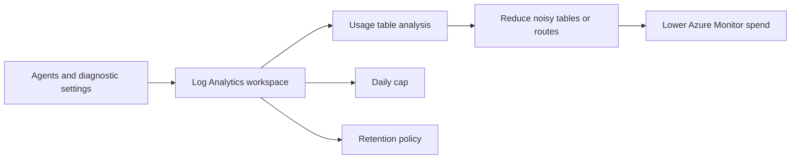

# Cost Control
Azure Monitor cost control depends on measuring ingestion, limiting unnecessary retention, and changing collection patterns before costs become billing surprises. This runbook focuses on operational controls for Log Analytics workspaces and Azure Monitor Logs usage.

## Prerequisites
- Azure CLI authenticated with `az login`.
- A Log Analytics workspace already ingesting data.
- Permissions:
    - `Log Analytics Contributor` for workspace changes.
    - `Reader` or better for subscription cost review.
- Agreement with application and platform owners on acceptable trade-offs.
- Variables used below:
```bash
RG="rg-monitoring-prod"
WORKSPACE_NAME="law-ops-central"
WORKSPACE_ID="/subscriptions/<subscription-id>/resourceGroups/rg-monitoring-prod/providers/Microsoft.OperationalInsights/workspaces/law-ops-central"
START_DATE="2026-04-01"
END_DATE="2026-04-30"
```
## When to Use
- Daily ingestion is trending above budget.
- A workspace suddenly shows unexpected cost growth.
- You need to set or review a daily cap for non-critical environments.
- Retention must be shortened after compliance review.
- DCR or diagnostic-setting changes need cost validation.
- A migration consolidated multiple workloads into one workspace and spend must be re-baselined.
- Finance or FinOps teams need evidence for why Azure Monitor costs changed month over month.
## Procedure
### Step 1: Inspect current workspace cost settings
Start by reading the workspace billing controls already in place.
```bash
az monitor log-analytics workspace show \
    --resource-group $RG \
    --workspace-name $WORKSPACE_NAME \
    --query "{name:name,retention:retentionInDays,dailyCap:workspaceCapping.dailyQuotaGb,ingestionStatus:workspaceCapping.dataIngestionStatus,sku:sku.name}" \
    --output json
```
Expected output:
```json
{
  "dailyCap": 25.0,
  "ingestionStatus": "RespectQuota",
  "name": "law-ops-central",
  "retention": 90,
  "sku": "PerGB2018"
}
```
This establishes whether cost growth is caused by configuration drift or by new data sources.
### Step 2: Identify the noisiest tables in the workspace
Use the `Usage` table first because it explains where billed ingestion is actually going.
```bash
az monitor log-analytics query \
    --workspace $WORKSPACE_ID \
    --analytics-query "Usage | where TimeGenerated > ago(7d) | where IsBillable == true | summarize IngestedGB=sum(Quantity)/1024 by DataType | top 10 by IngestedGB desc" \
    --output table
```
Expected output:
```text
DataType          IngestedGB
----------------  ----------
Perf              12.4
AzureDiagnostics   8.1
ContainerLogV2     5.8
Heartbeat          1.2
```
This tells you where to focus: DCR filtering, diagnostic category reduction, or table-specific retention review.
Use this output to separate ingestion problems from storage problems. High-volume tables usually indicate collection design issues, while long retention windows mostly affect how long data remains billable for storage.
To identify whether one table is trending upward each day, run a daily breakdown query.
```bash
az monitor log-analytics query \
    --workspace $WORKSPACE_ID \
    --analytics-query "Usage | where TimeGenerated > ago(7d) | where IsBillable == true | summarize IngestedGB=sum(Quantity)/1024 by DataType, bin(TimeGenerated, 1d) | sort by TimeGenerated asc" \
    --output table
```
Expected output:
```text
DataType          TimeGenerated           IngestedGB
----------------  ----------------------  ----------
Perf              2026-03-30T00:00:00Z    1.8
Perf              2026-03-31T00:00:00Z    1.7
AzureDiagnostics  2026-03-31T00:00:00Z    1.2
```
### Step 3: Adjust retention and daily cap to match policy
Change controls explicitly after you understand the ingestion pattern.
```bash
az monitor log-analytics workspace update \
    --resource-group $RG \
    --workspace-name $WORKSPACE_NAME \
    --retention-time 60 \
    --quota 20 \
    --output json
```
Expected output:
```json
{
  "name": "law-ops-central",
  "retentionInDays": 60,
  "workspaceCapping": {
    "dailyQuotaGb": 20.0,
    "dataIngestionStatus": "RespectQuota"
  }
}
```
Lower retention only when operational, audit, and incident-response teams agree that the new search window is still acceptable.
For strict environments, document whether daily cap is a last-resort safety control or an actively enforced budget mechanism. Microsoft Learn warns that cap-driven stoppage can interrupt log collection.
### Step 4: Re-check billable trends after the change window
Do not assume a workspace update solved the problem. Query recent usage again and compare the before and after pattern.
```bash
az monitor log-analytics query \
    --workspace $WORKSPACE_ID \
    --analytics-query "Usage | where TimeGenerated > ago(24h) | where IsBillable == true | summarize IngestedGB=sum(Quantity)/1024 by DataType | top 10 by IngestedGB desc" \
    --output table
```
Expected output:
```text
DataType          IngestedGB
----------------  ----------
Perf               1.7
AzureDiagnostics   1.0
ContainerLogV2     0.8
Heartbeat          0.2
```
Reduced values confirm that upstream collection changes or lower-volume periods are taking effect.
If the values did not change, the bill is likely driven by sources outside this workspace or by unchanged upstream collection rules.
### Step 5: Validate subscription cost evidence and operational safety
Use consumption data to confirm that Azure billing trends align with workspace-level improvements.
```bash
az consumption usage list \
    --start-date $START_DATE \
    --end-date $END_DATE \
    --query "[?contains(instanceName, 'law-ops-central')].{instanceName:instanceName,cost:pretaxCost,currency:currency}" \
    --output table
```
Expected output:
```text
InstanceName       Cost    Currency
-----------------  ------  --------
law-ops-central    214.63  USD
```
Then confirm the workspace is still ingesting data and not blocked by an overly strict cap.
```bash
az monitor log-analytics workspace show \
    --resource-group $RG \
    --workspace-name $WORKSPACE_NAME \
    --query "{dailyCap:workspaceCapping.dailyQuotaGb,ingestionStatus:workspaceCapping.dataIngestionStatus}" \
    --output json
```
Expected output:
```json
{
  "dailyCap": 20.0,
  "ingestionStatus": "RespectQuota"
}
```
Review whether the subscription contains other Azure Monitor cost contributors that sit outside the workspace itself.
```bash
az consumption usage list \
    --start-date $START_DATE \
    --end-date $END_DATE \
    --query "[?contains(instanceName, 'monitor')].{instanceName:instanceName,cost:pretaxCost,meter:meterDetails.meterName}" \
    --output table
```
Expected output:
```text
InstanceName        Cost    Meter
------------------  ------  -------------------------------
law-ops-central     214.63  Log Analytics Data Ingestion
appi-prod-central    41.27  Application Insights Data Ingest
```
## Verification
Verify the effective workspace settings:
```bash
az monitor log-analytics workspace show \
    --resource-group $RG \
    --workspace-name $WORKSPACE_NAME \
    --query "{retention:retentionInDays,dailyCap:workspaceCapping.dailyQuotaGb,sku:sku.name}" \
    --output json
```
Expected output:
```json
{
  "dailyCap": 20.0,
  "retention": 60,
  "sku": "PerGB2018"
}
```
Verify that billable ingestion remains visible and current:
```bash
az monitor log-analytics query \
    --workspace $WORKSPACE_ID \
    --analytics-query "Usage | where TimeGenerated > ago(1h) | summarize TotalMB=sum(Quantity) by IsBillable" \
    --output table
```
Expected output:
```text
IsBillable    TotalMB
------------  -------
True          182.4
False         12.1
```
Validate that high-volume tables are now within expected bounds:
```bash
az monitor log-analytics query \
    --workspace $WORKSPACE_ID \
    --analytics-query "Usage | where TimeGenerated > ago(1d) | where IsBillable == true | summarize IngestedGB=sum(Quantity)/1024 by DataType | top 5 by IngestedGB desc" \
    --output table
```
Expected output:
```text
DataType          IngestedGB
----------------  ----------
Perf               1.7
AzureDiagnostics   1.0
ContainerLogV2     0.8
```
Verification succeeds when the workspace reflects the new retention and cap values and continues ingesting the expected data types.
## Rollback / Troubleshooting
Restore a less restrictive policy if the cost change affected operations:
```bash
az monitor log-analytics workspace update \
    --resource-group $RG \
    --workspace-name $WORKSPACE_NAME \
    --retention-time 90 \
    --quota 25 \
    --output json
```
Expected output:
```json
{
  "retentionInDays": 90,
  "workspaceCapping": {
    "dailyQuotaGb": 25.0
  }
}
```
Common problems:
- Costs remain high after lowering retention
    - Retention affects storage, not the ingestion volume that likely drives the bill.
- Data stopped arriving unexpectedly
    - Check whether the daily cap was reached and whether critical tables should move to a different workspace.
- `AzureDiagnostics` dominates usage
    - Reduce diagnostic categories or split noisy resources into targeted pipelines.
- `Perf` or `ContainerLogV2` dominates usage
    - Revisit DCRs, sampling frequency, and table-level operational value.
- Daily cap has not reduced spend enough
    - Inspect whether noisy sources are still writing into the workspace and change the upstream route rather than only the cap.
- Costs dropped but investigations became harder
    - Restore a longer retention period or move selected tables to archive destinations for low-cost access.
- Cost anomaly is month-end only
    - Compare daily `Usage` trends against deployment windows, incident periods, and onboarding events.
## Automation
Cost control needs recurring review, not one-time tuning.
```bash
az monitor log-analytics query \
    --workspace $WORKSPACE_ID \
    --analytics-query "Usage | where TimeGenerated > ago(1d) | where IsBillable == true | summarize IngestedGB=sum(Quantity)/1024 by DataType" \
    --output json
```
Useful automation patterns:
- Schedule a daily ingestion report from the `Usage` table.
- Alert when one table grows beyond its normal baseline.
- Tie DCR and diagnostic-setting pull requests to post-change usage checks.
- Export workspace configuration weekly to detect cap or retention drift.
- Publish a FinOps summary that shows top billable tables and month-to-date trend.
- Open a review ticket automatically when one table exceeds its expected daily allocation.
- Run separate reports for production and non-production workspaces so caps are not managed uniformly by mistake.
- Track rollback thresholds so teams know when cost savings are harming investigations.
- Correlate ingestion spikes with deployment calendars to catch accidental monitoring rollouts.
- Keep one approved query pack for weekly cost reviews and reuse it across workspaces.
- Include monthly owner review for the top five billable tables.
- Generate separate views for ingestion cost, retention cost, and export-related cost signals.
- Mark exceptions where a higher-cost table is intentionally retained for audit or security reasons.
- Store the expected daily ingestion range for each workspace so anomalies are measurable.
- Review cost posture after every major diagnostic-setting rollout or AMA onboarding wave.
- Keep a documented list of tables that may justify premium spend during incidents.
## See Also
- [Operations index](index.md)
- [Workspace Management](workspace-management.md)
- [Data Collection Rules Operations](data-collection-rules-ops.md)
- [Diagnostic Settings](diagnostic-settings.md)
- [Export and Integration](export-and-integration.md)
- [Best Practices: Cost Optimization](../best-practices/cost-optimization.md)
- [Reference KQL quick reference](../reference/kql-quick-reference.md)
- [Reference platform limits](../reference/platform-limits.md)
- [Troubleshooting KQL query packs](../troubleshooting/kql/index.md)
- [Alert Rule Management](alert-rule-management.md)
## Sources
- [Microsoft Learn: Manage usage and costs with Azure Monitor Logs](https://learn.microsoft.com/azure/azure-monitor/logs/cost-logs)
- [Microsoft Learn: Azure Monitor cost and usage](https://learn.microsoft.com/azure/azure-monitor/cost-usage)
- [Microsoft Learn: Analyze usage in a Log Analytics workspace](https://learn.microsoft.com/azure/azure-monitor/logs/analyze-usage)
- [Microsoft Learn: Cost optimization for Azure Monitor Logs](https://learn.microsoft.com/azure/azure-monitor/logs/cost-logs)
- [Microsoft Learn: Azure Monitor Logs pricing model](https://learn.microsoft.com/azure/azure-monitor/logs/cost-logs#pricing-model)
- [Microsoft Learn: Configure workspace daily cap](https://learn.microsoft.com/azure/azure-monitor/logs/daily-cap)
