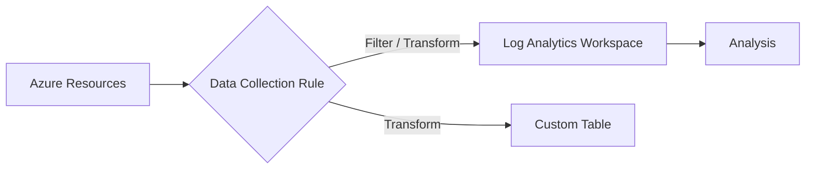

# Data Collection Rules (DCR)

Data Collection Rules (DCRs) define how data is collected, processed, and ingested into Azure Monitor. They provide granular control over data filtering and transformation.



## Prerequisites

- Target Log Analytics workspace.
- Azure Monitor Agent (AMA) installed on source resources.
- Permissions: **Monitoring Contributor** or **Log Analytics Contributor**.

## When to Use

- When filtering logs at the source to reduce ingestion costs.
- When transforming data before storage (e.g., masking PII or adding calculated columns).
- When centralizing collection across different subscriptions or regions.

## Procedure

### Azure Portal
1. Navigate to **Monitor** > **Data Collection Rules**.
2. Select **Create**.
3. Provide a **Rule Name**, **Subscription**, and **Resource Group**.
4. Define the **Resources** (e.g., specific VMs or Resource Groups).
5. Choose the **Data sources** (e.g., Performance counters, Windows Event Logs, Syslog).
6. Select the **Destination** (e.g., a Log Analytics workspace).
7. Select **Review + create**, then **Create**.

### Azure CLI
Create a DCR from a JSON configuration file:

```bash
az monitor data-collection rule create \
    --name "dcr-central-vms" \
    --resource-group "rg-monitoring-prod" \
    --location "eastus" \
    --rule-file "path/to/dcr-config.json"
```

Associate a DCR with a Virtual Machine:

```bash
az monitor data-collection rule association create \
    --name "dcr-assoc-vm-prod" \
    --resource "/subscriptions/00000000-0000-0000-0000-000000000000/resourceGroups/rg-prod/providers/Microsoft.Compute/virtualMachines/vm-prod" \
    --rule-id "/subscriptions/00000000-0000-0000-0000-000000000000/resourceGroups/rg-monitoring-prod/providers/Microsoft.Insights/dataCollectionRules/dcr-central-vms"
```

## Verification

List all associations for a specific DCR:

```bash
az monitor data-collection rule association list \
    --rule-name "dcr-central-vms" \
    --resource-group "rg-monitoring-prod"
```

Check the JSON configuration of a DCR:

```bash
az monitor data-collection rule show \
    --name "dcr-central-vms" \
    --resource-group "rg-monitoring-prod"
```

## Rollback / Troubleshooting

- **No data:** Verify the Azure Monitor Agent is running and the DCR association exists.
- **Filtering errors:** Ensure KQL transformations are syntactically correct in the JSON rule file.
- **Resource alignment:** Verify the DCR and its associated resources are in regions that support DCRs.

## See Also

- [Data collection rules in Azure Monitor](https://learn.microsoft.com/azure/azure-monitor/essentials/data-collection-rule-overview)
- [Structure of a data collection rule](https://learn.microsoft.com/azure/azure-monitor/essentials/data-collection-rule-structure)

## Sources

- [MS Learn: Data collection rules in Azure Monitor](https://learn.microsoft.com/azure/azure-monitor/essentials/data-collection-rule-overview)
- [MS Learn: Create data collection rules with Azure CLI](https://learn.microsoft.com/azure/azure-monitor/essentials/data-collection-rule-cli)
