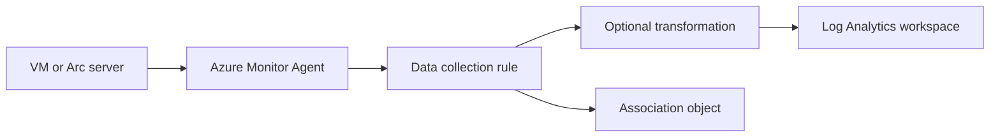

# Data Collection Rules Operations
Data collection rules (DCRs) control what Azure Monitor Agent collects, how streams are transformed, and where the data lands. This runbook focuses on operational changes that keep DCR-based collection predictable and auditable.

## Prerequisites
- Azure CLI authenticated with `az login`.
- Azure Monitor Agent installed on the target machine or scale set.
- A destination Log Analytics workspace already created.
- A DCR JSON file prepared for the intended streams.
- Permissions:
    - `Monitoring Contributor` for DCR and association changes.
    - `Virtual Machine Contributor` or equivalent when validating the target resource.
- Variables used below:
```bash
RG="rg-monitoring-prod"
DCR_NAME="dcr-vm-perf"
LOCATION="eastus"
VM_ID="/subscriptions/<subscription-id>/resourceGroups/rg-prod/providers/Microsoft.Compute/virtualMachines/vm-prod-01"
WORKSPACE_RESOURCE_ID="/subscriptions/<subscription-id>/resourceGroups/rg-monitoring-prod/providers/Microsoft.OperationalInsights/workspaces/law-ops-central"
DCR_FILE="./docs/examples/dcr-vm-perf.json"
```
## When to Use
- You need to onboard Azure Monitor Agent data collection to new servers.
- Performance counters, syslog, or event logs must change without redeploying the VM.
- A transformation is required to reduce ingestion volume or normalize records.
- Associations drifted after a rebuild or scale operation.
- Data stopped arriving and you need to validate the full DCR chain.
- You are splitting collection between production and non-production landing zones.
- You need to verify that only approved streams reach the shared workspace.
## Procedure
### Step 1: Inspect current DCR inventory and associations
List rules first so you know whether you are creating a new baseline or modifying an existing one.
```bash
az monitor data-collection rule list \
    --resource-group $RG \
    --query "[].{name:name,location:location,kind:kind,dataFlows:length(properties.dataFlows)}" \
    --output table
```
Expected output:
```text
Name         Location    Kind    DataFlows
-----------  ----------  ------  ---------
dcr-vm-perf  eastus              1
```
Check whether the target machine already has an association.
```bash
az monitor data-collection rule association list-by-resource \
    --resource $VM_ID \
    --query "[].{name:name,ruleId:properties.dataCollectionRuleId}" \
    --output table
```
Expected output:
```text
Name                    RuleId
----------------------  -----------------------------------------------------------------------------------------------
dcr-assoc-vm-prod-01    /subscriptions/<subscription-id>/resourceGroups/rg-monitoring-prod/providers/Microsoft.Insights/dataCollectionRules/dcr-vm-perf
```
### Step 2: Create or update the data collection rule from JSON
Create the rule from a checked-in JSON file so that the configuration stays reviewable and repeatable.
```bash
az monitor data-collection rule create \
    --name $DCR_NAME \
    --resource-group $RG \
    --location $LOCATION \
    --rule-file $DCR_FILE \
    --output json
```
Expected output:
```json
{
  "id": "/subscriptions/<subscription-id>/resourceGroups/rg-monitoring-prod/providers/Microsoft.Insights/dataCollectionRules/dcr-vm-perf",
  "location": "eastus",
  "name": "dcr-vm-perf",
  "provisioningState": "Succeeded"
}
```
If the DCR already exists, apply the updated JSON file.
```bash
az monitor data-collection rule update \
    --name $DCR_NAME \
    --resource-group $RG \
    --rule-file $DCR_FILE \
    --output json
```
Expected output:
```json
{
  "name": "dcr-vm-perf",
  "provisioningState": "Succeeded"
}
```
### Step 3: Review streams, destinations, and transformations
Read back the rule after creation so you confirm the intended streams rather than trusting the local file alone.
```bash
az monitor data-collection rule show \
    --name $DCR_NAME \
    --resource-group $RG \
    --query "{streams:properties.dataFlows[].streams,destinations:properties.destinations.logAnalytics[].workspaceResourceId,dataSources:keys(properties.dataSources)}" \
    --output json
```
Expected output:
```json
{
  "dataSources": [
    "performanceCounters"
  ],
  "destinations": [
    "/subscriptions/<subscription-id>/resourceGroups/rg-monitoring-prod/providers/Microsoft.OperationalInsights/workspaces/law-ops-central"
  ],
  "streams": [
    [
      "Microsoft-Perf"
    ]
  ]
}
```
If your rule uses transformations, validate that the relevant stream still maps to the intended table after the update.
### Step 4: Associate the DCR with the target resource
Association is a separate object. A valid DCR without an association will not collect anything from the VM.
```bash
az monitor data-collection rule association create \
    --name "dcr-assoc-vm-prod-01" \
    --resource $VM_ID \
    --rule-id "/subscriptions/<subscription-id>/resourceGroups/rg-monitoring-prod/providers/Microsoft.Insights/dataCollectionRules/dcr-vm-perf" \
    --output json
```
Expected output:
```json
{
  "id": "/subscriptions/<subscription-id>/resourceGroups/rg-prod/providers/Microsoft.Compute/virtualMachines/vm-prod-01/providers/Microsoft.Insights/dataCollectionRuleAssociations/dcr-assoc-vm-prod-01",
  "name": "dcr-assoc-vm-prod-01",
  "properties": {
    "dataCollectionRuleId": "/subscriptions/<subscription-id>/resourceGroups/rg-monitoring-prod/providers/Microsoft.Insights/dataCollectionRules/dcr-vm-perf"
  }
}
```
Re-read the association to verify there is no typo in the rule ID or resource scope.
```bash
az monitor data-collection rule association show \
    --name "dcr-assoc-vm-prod-01" \
    --resource $VM_ID \
    --query "{name:name,ruleId:properties.dataCollectionRuleId}" \
    --output json
```
Expected output:
```json
{
  "name": "dcr-assoc-vm-prod-01",
  "ruleId": "/subscriptions/<subscription-id>/resourceGroups/rg-monitoring-prod/providers/Microsoft.Insights/dataCollectionRules/dcr-vm-perf"
}
```
### Step 5: Validate data arrival in the workspace
After the association is in place, confirm that the destination workspace receives the expected stream.
```bash
az monitor log-analytics query \
    --workspace $WORKSPACE_RESOURCE_ID \
    --analytics-query "Perf | where Computer == 'vm-prod-01' and TimeGenerated > ago(30m) | summarize Samples=count() by ObjectName, CounterName | top 10 by Samples desc" \
    --output table
```
Expected output:
```text
ObjectName    CounterName                    Samples
------------  -----------------------------  -------
Processor     % Processor Time               36
Memory        Available MBytes               36
LogicalDisk   % Free Space                   36
```
If results appear, the rule, association, agent, and workspace path are all functioning. If not, inspect the agent extension, association scope, and DCR region compatibility.
## Verification
List all DCR associations on the target resource:
```bash
az monitor data-collection rule association list-by-resource \
    --resource $VM_ID \
    --query "[].{name:name,ruleId:properties.dataCollectionRuleId}" \
    --output table
```
Expected output:
```text
Name                    RuleId
----------------------  -----------------------------------------------------------------------------------------------
dcr-assoc-vm-prod-01    /subscriptions/<subscription-id>/resourceGroups/rg-monitoring-prod/providers/Microsoft.Insights/dataCollectionRules/dcr-vm-perf
```
Confirm the DCR provisioning state:
```bash
az monitor data-collection rule show \
    --name $DCR_NAME \
    --resource-group $RG \
    --query "{name:name,location:location,provisioningState:provisioningState}" \
    --output json
```
Expected output:
```json
{
  "location": "eastus",
  "name": "dcr-vm-perf",
  "provisioningState": "Succeeded"
}
```
Verification succeeds when the rule exists, the association points to the expected DCR, and the workspace query returns recent data.
Check the target VM extensions if data still does not appear:
```bash
az vm extension list \
    --ids $VM_ID \
    --query "[].{name:name,publisher:publisher,type:type,provisioningState:provisioningState}" \
    --output table
```
Expected output:
```text
Name                           Publisher                    Type                      ProvisioningState
-----------------------------  ---------------------------  ------------------------  -----------------
AzureMonitorLinuxAgent         Microsoft.Azure.Monitor     AzureMonitorLinuxAgent    Succeeded
```
This confirms the agent-side prerequisite is present and healthy.
## Rollback / Troubleshooting
Remove an incorrect association:
```bash
az monitor data-collection rule association delete \
    --name "dcr-assoc-vm-prod-01" \
    --resource $VM_ID
```
Delete a faulty DCR only after associations are removed:
```bash
az monitor data-collection rule delete \
    --name $DCR_NAME \
    --resource-group $RG \
    --yes
```
Common problems:
- No data in `Perf`
    - Verify Azure Monitor Agent is installed and healthy on the VM.
- Association exists but still no data
    - Confirm the DCR region and the machine region are supported for the chosen stream.
- Rule update fails
    - Validate the JSON schema and stream names against Microsoft Learn DCR structure guidance.
- Unexpected ingestion growth
    - Reduce sampled counters or add transformations to narrow the stream.
- Transform output is not what you expected
    - Re-read `properties.dataFlows` and check the destination table mapping in the JSON file.
- Multiple DCRs appear to overlap
    - Audit all associations on the resource and confirm which rule owns each stream.
## Automation
DCR operations should live in source control because JSON drift is difficult to review in the portal.
```bash
az monitor data-collection rule list \
    --query "[].{name:name,resourceGroup:resourceGroup,location:location}" \
    --output json
```
Useful automation patterns:
- Store every DCR JSON file with pull-request review.
- Reapply DCRs from CI after approved changes.
- Run scheduled inventory jobs for DCRs and associations.
- Pair DCR updates with post-deployment Log Analytics validation queries.
- Flag resources that have AMA installed but no DCR association.
- Export DCR definitions regularly so transformation changes are easy to audit.
- Keep one validation query per stream in the repository.
- Fail the deployment pipeline if association creation succeeds but data validation does not.
- Review DCR ownership quarterly so abandoned rules do not continue ingesting low-value data.
- Tag DCR files by owning team and approved destination workspace.
- Review transformation logic whenever downstream schemas change.
## See Also
- [Operations index](index.md)
- [Workspace Management](workspace-management.md)
- [Diagnostic Settings](diagnostic-settings.md)
- [Export and Integration](export-and-integration.md)
- [Cost Control](cost-control.md)
- [Service guide: VM observability](../service-guides/vm/observability.md)
- [Reference CLI cheatsheet](../reference/cli-cheatsheet.md)
- [Troubleshooting KQL query packs](../troubleshooting/kql/index.md)
## Sources
- [Microsoft Learn: Data collection rules in Azure Monitor](https://learn.microsoft.com/azure/azure-monitor/data-collection/data-collection-rule-overview)
- [Microsoft Learn: Structure of a data collection rule in Azure Monitor](https://learn.microsoft.com/azure/azure-monitor/data-collection/data-collection-rule-structure)
- [Microsoft Learn: Create and edit data collection rules with Azure CLI](https://learn.microsoft.com/azure/azure-monitor/data-collection/data-collection-rule-create-edit)
- [Microsoft Learn: Azure Monitor Agent overview](https://learn.microsoft.com/azure/azure-monitor/agents/azure-monitor-agent-overview)
- [Microsoft Learn: Manage data collection rule associations](https://learn.microsoft.com/azure/azure-monitor/data-collection/data-collection-rule-associations)
