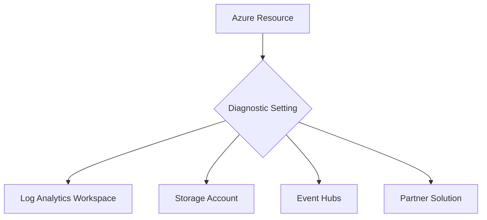

# Diagnostic Settings

Diagnostic settings enable Azure resources to stream logs and metrics to various destinations for archival, analysis, or integration. This is the primary method for collecting platform data.



## Prerequisites

- Target destination (Log Analytics workspace, Storage Account, or Event Hub) must be created.
- Permissions: **Monitoring Contributor** or **Contributor** on the resource and its destination.

## When to Use

- When platform logs (Activity, Resource, and Azure AD) must be collected.
- When long-term log archival (beyond 2 years) is required in Storage Accounts.
- When real-time log ingestion into SIEMs or third-party tools is needed via Event Hubs.

## Procedure

### Azure Portal
1. Select the Azure resource (e.g., a Virtual Machine or App Service).
2. Choose **Diagnostic settings** from the left-hand menu.
3. Select **Add diagnostic setting**.
4. Provide a unique **Name**.
5. Select the **Logs** and **Metrics** categories to stream.
6. Select the **Destination details** (e.g., Send to Log Analytics workspace).
7. Select **Save**.

### Azure CLI
Create a diagnostic setting for a resource:

```bash
az monitor diagnostic-settings create \
    --name "ds-central-logs" \
    --resource "/subscriptions/00000000-0000-0000-0000-000000000000/resourceGroups/rg-prod/providers/Microsoft.Compute/virtualMachines/vm-prod" \
    --workspace "/subscriptions/00000000-0000-0000-0000-000000000000/resourcegroups/rg-monitoring-prod/providers/microsoft.operationalinsights/workspaces/law-ops-central" \
    --logs '[{"category": "WorkflowRuntime", "enabled": true}]' \
    --metrics '[{"category": "AllMetrics", "enabled": true}]'
```

## Verification

List existing diagnostic settings for a resource:

```bash
az monitor diagnostic-settings list \
    --resource "/subscriptions/00000000-0000-0000-0000-000000000000/resourceGroups/rg-prod/providers/Microsoft.Compute/virtualMachines/vm-prod"
```

Check the workspace for incoming data using a simple KQL query in the Portal:
```kql
AzureDiagnostics 
| where TimeGenerated > ago(1h)
| take 10
```

## Rollback / Troubleshooting

- **No data:** Verify the target destination is in a supported region.
- **Permission error:** Ensure the service principal or user has "Write" access on the diagnostic setting resource.
- **Latency:** Platform logs typically appear within 2 to 5 minutes.

## See Also

- [Diagnostic settings in Azure Monitor](https://learn.microsoft.com/azure/azure-monitor/essentials/diagnostic-settings)
- [Commonly used log categories](https://learn.microsoft.com/azure/azure-monitor/essentials/resource-logs-categories)

## Sources

- [MS Learn: Diagnostic settings in Azure Monitor](https://learn.microsoft.com/azure/azure-monitor/essentials/diagnostic-settings)
- [MS Learn: Create diagnostic settings with Azure CLI](https://learn.microsoft.com/azure/azure-monitor/essentials/diagnostic-settings-cli)
