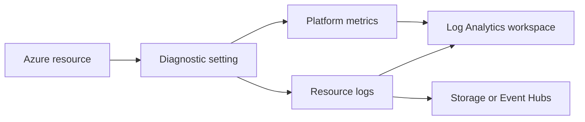

---
content_sources:
  diagrams:
    - id: diagnostic-settings
      type: flowchart
      source: mslearn-adapted
      based_on:
        - https://learn.microsoft.com/en-us/azure/azure-monitor/essentials/create-diagnostic-settings
        - https://learn.microsoft.com/en-us/azure/azure-monitor/fundamentals/data-sources
---

# Diagnostic Settings
Diagnostic settings route platform logs and metrics from Azure resources to Log Analytics, Storage, Event Hubs, or partner destinations. This runbook focuses on safe day-2 changes and validation with Azure CLI.
<!-- diagram-id: diagnostic-settings -->


## Prerequisites
- Azure CLI authenticated with `az login`.
- A destination workspace, storage account, or Event Hubs namespace already exists.
- The target resource supports diagnostic settings and relevant log categories.
- Permissions:
    - `Monitoring Contributor` on the source resource.
    - Write access on the destination resource.
- Variables used below:
```bash
RG="rg-monitoring-prod"
RESOURCE_ID="/subscriptions/<subscription-id>/resourceGroups/rg-prod/providers/Microsoft.KeyVault/vaults/kv-prod-01"
WORKSPACE_ID="/subscriptions/<subscription-id>/resourceGroups/rg-monitoring-prod/providers/Microsoft.OperationalInsights/workspaces/law-ops-central"
STORAGE_ACCOUNT_ID="/subscriptions/<subscription-id>/resourceGroups/rg-storage/providers/Microsoft.Storage/storageAccounts/stmonitoringarchive"
DIAG_NAME="ds-kv-prod-01"
```

## When to Use
- A resource is not sending platform logs to the workspace.
- Compliance requires archiving logs in Storage.
- Security tooling needs an Event Hubs stream.
- Log categories changed after a service feature rollout.
- You need to standardize diagnostics across multiple resource types.
- A team added a new resource type and monitoring baseline must be enforced quickly.

## Procedure

### Step 1: Discover current diagnostic settings and categories
Start by checking whether the resource already has a setting and which categories are supported.
```bash
az monitor diagnostic-settings list \
    --resource $RESOURCE_ID \
    --query "value[].{name:name,workspaceId:workspaceId,storageAccountId:storageAccountId}" \
    --output table
```
Expected output:
```text
Name           WorkspaceId                                                                                           StorageAccountId
-------------  ----------------------------------------------------------------------------------------------------  ----------------
ds-kv-prod-01  /subscriptions/<subscription-id>/resourceGroups/rg-monitoring-prod/providers/Microsoft.OperationalInsights/workspaces/law-ops-central
```
Then list supported categories.
```bash
az monitor diagnostic-settings categories list \
    --resource $RESOURCE_ID \
    --query "[].{name:name,type:categoryType}" \
    --output table
```
Expected output:
```text
Name                   Type
---------------------  ----------
AuditEvent             Logs
AzurePolicyEvaluation  Logs
AllMetrics             Metrics
```

### Step 2: Create or update a workspace-bound diagnostic setting
Create a setting that sends both logs and metrics to Log Analytics.
```bash
az monitor diagnostic-settings create \
    --name $DIAG_NAME \
    --resource $RESOURCE_ID \
    --workspace $WORKSPACE_ID \
    --logs '[{"category":"AuditEvent","enabled":true}]' \
    --metrics '[{"category":"AllMetrics","enabled":true}]' \
    --output json
```
Expected output:
```json
{
  "id": "/subscriptions/<subscription-id>/resourceGroups/rg-prod/providers/Microsoft.KeyVault/vaults/kv-prod-01/providers/microsoft.insights/diagnosticSettings/ds-kv-prod-01",
  "logs": [
    {
      "category": "AuditEvent",
      "enabled": true
    }
  ],
  "metrics": [
    {
      "category": "AllMetrics",
      "enabled": true
    }
  ],
  "name": "ds-kv-prod-01",
  "workspaceId": "/subscriptions/<subscription-id>/resourceGroups/rg-monitoring-prod/providers/Microsoft.OperationalInsights/workspaces/law-ops-central"
}
```
This is the most common operating pattern because it keeps searchable platform data inside Azure Monitor.

Prefer category groups such as `allLogs` when the resource type supports them, but always verify supported categories first because not every Azure service exposes the same log and metric groups.

### Step 3: Add an archive destination when retention requirements exceed workspace needs
If the resource needs long-term archive, add Storage as a secondary destination.
```bash
az monitor diagnostic-settings create \
    --name $DIAG_NAME \
    --resource $RESOURCE_ID \
    --workspace $WORKSPACE_ID \
    --storage-account $STORAGE_ACCOUNT_ID \
    --logs '[{"category":"AuditEvent","enabled":true}]' \
    --metrics '[{"category":"AllMetrics","enabled":true}]' \
    --output json
```
Expected output:
```json
{
  "name": "ds-kv-prod-01",
  "storageAccountId": "/subscriptions/<subscription-id>/resourceGroups/rg-storage/providers/Microsoft.Storage/storageAccounts/stmonitoringarchive",
  "workspaceId": "/subscriptions/<subscription-id>/resourceGroups/rg-monitoring-prod/providers/Microsoft.OperationalInsights/workspaces/law-ops-central"
}
```
Use storage primarily for archive and replay scenarios, not for interactive operational queries.

### Step 4: Read back the effective configuration
Confirm that the categories and destinations are exactly what you intended.
```bash
az monitor diagnostic-settings show \
    --name $DIAG_NAME \
    --resource $RESOURCE_ID \
    --query "{name:name,logs:logs[].category,metrics:metrics[].category,workspaceId:workspaceId,storageAccountId:storageAccountId}" \
    --output json
```
Expected output:
```json
{
  "logs": [
    "AuditEvent"
  ],
  "metrics": [
    "AllMetrics"
  ],
  "name": "ds-kv-prod-01",
  "storageAccountId": "/subscriptions/<subscription-id>/resourceGroups/rg-storage/providers/Microsoft.Storage/storageAccounts/stmonitoringarchive",
  "workspaceId": "/subscriptions/<subscription-id>/resourceGroups/rg-monitoring-prod/providers/Microsoft.OperationalInsights/workspaces/law-ops-central"
}
```
This step catches category mismatches, missing destinations, and accidental overwrites.

### Step 5: Validate data in the destination workspace
Run a workspace query to confirm that the routed data is visible after the change.
```bash
az monitor log-analytics query \
    --workspace $WORKSPACE_ID \
    --analytics-query "AzureDiagnostics | where ResourceId == '$RESOURCE_ID' | where TimeGenerated > ago(1h) | summarize Records=count() by Category | top 10 by Records desc" \
    --output table
```
Expected output:
```text
Category      Records
------------  -------
AuditEvent    14
```
If the query returns no records, wait several minutes and then re-check categories, destination IDs, and resource support for the selected streams.
For new resource types, also verify that the service emits logs into `AzureDiagnostics` or a resource-specific table expected by your workbook and alert queries.

## Verification
Verify the setting still exists and is bound to the right destinations:
```bash
az monitor diagnostic-settings list \
    --resource $RESOURCE_ID \
    --query "value[].{name:name,workspaceId:workspaceId,storageAccountId:storageAccountId}" \
    --output table
```
Expected output:
```text
Name           WorkspaceId                                                                                           StorageAccountId
-------------  ----------------------------------------------------------------------------------------------------  -------------------------------------------------------------------------------------------------------
ds-kv-prod-01  /subscriptions/<subscription-id>/resourceGroups/rg-monitoring-prod/providers/Microsoft.OperationalInsights/workspaces/law-ops-central  /subscriptions/<subscription-id>/resourceGroups/rg-storage/providers/Microsoft.Storage/storageAccounts/stmonitoringarchive
```
Verify that data is queryable:
```bash
az monitor log-analytics query \
    --workspace $WORKSPACE_ID \
    --analytics-query "AzureDiagnostics | where ResourceId == '$RESOURCE_ID' | where TimeGenerated > ago(1h) | count" \
    --output table
```
Expected output:
```text
Count
-----
14
```
For category drift checks, re-list the categories and compare them with the setting definition:
```bash
az monitor diagnostic-settings categories list \
    --resource $RESOURCE_ID \
    --output table
```
Expected output:
```text
Name                   Type
---------------------  ----------
AuditEvent             Logs
AzurePolicyEvaluation  Logs
AllMetrics             Metrics
```

## Rollback / Troubleshooting
Delete an incorrect diagnostic setting:
```bash
az monitor diagnostic-settings delete \
    --name $DIAG_NAME \
    --resource $RESOURCE_ID
```
Create a corrected setting immediately after deletion to avoid a monitoring gap.

Common problems:
- No data in the workspace
    - Confirm the selected categories are supported for the resource type.
- Permission error
    - Validate write access on both the source resource and destination resource.
- Logs arrive but metrics do not
    - Check whether the resource exposes `AllMetrics` through diagnostic settings.
- Duplicate settings across teams
    - Standardize naming and ownership because some resources allow limited setting counts.
- Archive destination exists but files do not appear
    - Check whether the storage account firewall or regional support blocks delivery.
- Event Hubs integration fails
    - Validate namespace permissions and confirm the target service supports diagnostic export to Event Hubs.

## Automation
Diagnostic settings are ideal for policy-driven or scripted enforcement.
```bash
az monitor diagnostic-settings list \
    --resource $RESOURCE_ID \
    --output json
```
Useful automation patterns:
- Use Azure Policy initiatives to enforce a baseline destination.
- Export current settings and compare them against a golden configuration.
- Add post-deployment verification queries to CI pipelines.
- Schedule inventory reports for resources missing required categories.
- Maintain an allowlist of mandatory categories per resource type.
- Pair diagnostic-setting deployment with workspace queries that validate data within the same pipeline.
- Include destination IDs in drift reports so archive routing mistakes are visible.
- Review unsupported categories during service onboarding and update the baseline template before production rollout.
- Keep per-resource-type JSON examples in source control for faster operational recovery.
- Tag policy exemptions with an expiry date so temporary exceptions do not become permanent.

## See Also
- [Operations index](index.md)
- [Workspace Management](workspace-management.md)
- [Export and Integration](export-and-integration.md)
- [Cost Control](cost-control.md)
- [Alert Rule Management](alert-rule-management.md)
- [Reference CLI cheatsheet](../reference/cli-cheatsheet.md)
- [Troubleshooting KQL query packs](../troubleshooting/kql/index.md)

## Sources
- [Microsoft Learn: Diagnostic settings in Azure Monitor](https://learn.microsoft.com/azure/azure-monitor/platform/diagnostic-settings)
- [Microsoft Learn: Create diagnostic settings using Azure CLI](https://learn.microsoft.com/azure/azure-monitor/essentials/diagnostic-settings-cli)
- [Microsoft Learn: Supported resource logs categories](https://learn.microsoft.com/azure/azure-monitor/essentials/resource-logs-categories)
- [Microsoft Learn: Metrics and logs destinations for diagnostic settings](https://learn.microsoft.com/azure/azure-monitor/essentials/diagnostic-settings#destinations)
