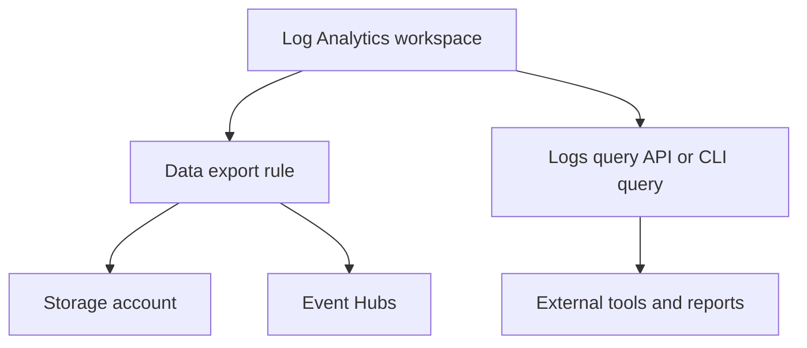

---
content_sources:
  diagrams:
    - id: export-and-integration
      type: flowchart
      source: mslearn-adapted
      based_on:
        - https://learn.microsoft.com/en-us/azure/azure-monitor/essentials/create-diagnostic-settings
        - https://learn.microsoft.com/en-us/azure/azure-monitor/fundamentals/data-sources
        - https://learn.microsoft.com/en-us/azure/azure-monitor/logs/log-analytics-overview
---

# Export and Integration
Azure Monitor exports let you route selected tables to downstream archival, streaming, and analytics systems without giving every consumer direct workspace access. This runbook covers continuous export operations and API-driven integration checks.
<!-- diagram-id: export-and-integration -->


## Prerequisites
- Azure CLI authenticated with `az login`.
- A Log Analytics workspace already collecting data.
- Destination Storage account or Event Hubs namespace already provisioned.
- Tables selected for export are supported by Azure Monitor Logs export.
- Permissions:
    - `Log Analytics Contributor` on the workspace.
    - Write permissions on the destination resource.
- Variables used below:
```bash
RG="rg-monitoring-prod"
WORKSPACE_NAME="law-ops-central"
WORKSPACE_ID="/subscriptions/<subscription-id>/resourceGroups/rg-monitoring-prod/providers/Microsoft.OperationalInsights/workspaces/law-ops-central"
STORAGE_ACCOUNT_ID="/subscriptions/<subscription-id>/resourceGroups/rg-storage/providers/Microsoft.Storage/storageAccounts/stmonitoringarchive"
EVENT_HUBS_ID="/subscriptions/<subscription-id>/resourceGroups/rg-integration/providers/Microsoft.EventHub/namespaces/eh-monitoring"
EXPORT_RULE_NAME="export-security-logs"
```

## When to Use
- Security or compliance teams need a copy of selected tables.
- Another analytics platform consumes logs from Storage or Event Hubs.
- API-driven reports need validated workspace access without portal use.
- Export rules must be reviewed after table growth or schema changes.
- A downstream integration broke and you need to confirm whether Azure Monitor is still exporting data.
- Teams want to reduce direct workspace access by moving consumers to curated exports.

## Procedure

### Step 1: Inspect current export rules and target tables
Start with the workspace inventory so you do not create overlapping rules accidentally.
```bash
az monitor log-analytics workspace data-export list \
    --resource-group $RG \
    --workspace-name $WORKSPACE_NAME \
    --query "[].{name:name,destination:destination.resourceId,tables:tableNames,enabled:enable}" \
    --output table
```
Expected output:
```text
Name                  Destination                                                                                       Tables                            Enabled
--------------------  ------------------------------------------------------------------------------------------------  --------------------------------  -------
export-security-logs  /subscriptions/<subscription-id>/resourceGroups/rg-storage/providers/Microsoft.Storage/storageAccounts/stmonitoringarchive  ['SecurityEvent','Heartbeat']    True
```
Then validate that the selected tables are actually active in the workspace.
```bash
az monitor log-analytics query \
    --workspace $WORKSPACE_ID \
    --analytics-query "Usage | where TimeGenerated > ago(1d) | summarize TotalGB=sum(Quantity)/1024 by DataType | top 10 by TotalGB desc" \
    --output table
```
Expected output:
```text
DataType         TotalGB
---------------  -------
Heartbeat        0.12
SecurityEvent    0.09
Perf             0.08
```

### Step 2: Create a continuous export rule to Storage
Use Storage export when downstream systems need durable files instead of near-real-time streaming.
```bash
az monitor log-analytics workspace data-export create \
    --resource-group $RG \
    --workspace-name $WORKSPACE_NAME \
    --name $EXPORT_RULE_NAME \
    --destination $STORAGE_ACCOUNT_ID \
    --tables SecurityEvent Heartbeat \
    --enable true \
    --output json
```
Expected output:
```json
{
  "destination": {
    "resourceId": "/subscriptions/<subscription-id>/resourceGroups/rg-storage/providers/Microsoft.Storage/storageAccounts/stmonitoringarchive"
  },
  "enable": true,
  "name": "export-security-logs",
  "tableNames": [
    "SecurityEvent",
    "Heartbeat"
  ]
}
```
This gives you a stable export path for compliance, archival, or offline reprocessing.
Storage export is usually the safer first choice when the downstream consumer can tolerate file-based delivery instead of streaming.

### Step 3: Create or switch an export rule for Event Hubs streaming
Use Event Hubs when a SIEM or external stream processor needs near-real-time delivery.
```bash
az monitor log-analytics workspace data-export create \
    --resource-group $RG \
    --workspace-name $WORKSPACE_NAME \
    --name "export-heartbeat-eventhubs" \
    --destination $EVENT_HUBS_ID \
    --tables Heartbeat \
    --enable true \
    --output json
```
Expected output:
```json
{
  "destination": {
    "resourceId": "/subscriptions/<subscription-id>/resourceGroups/rg-integration/providers/Microsoft.EventHub/namespaces/eh-monitoring"
  },
  "enable": true,
  "name": "export-heartbeat-eventhubs",
  "tableNames": [
    "Heartbeat"
  ]
}
```
Choose tables carefully. Exporting broad high-volume tables to Event Hubs can create unnecessary downstream cost and throughput pressure.
Prefer a small initial table set, validate downstream parsing, and expand only after the consumer proves stable.

### Step 4: Validate the export rule definitions
Read back each rule after creation so the destination and table set are confirmed from Azure rather than assumed from local commands.
```bash
az monitor log-analytics workspace data-export show \
    --resource-group $RG \
    --workspace-name $WORKSPACE_NAME \
    --name $EXPORT_RULE_NAME \
    --query "{name:name,destination:destination.resourceId,tables:tableNames,enabled:enable}" \
    --output json
```
Expected output:
```json
{
  "destination": "/subscriptions/<subscription-id>/resourceGroups/rg-storage/providers/Microsoft.Storage/storageAccounts/stmonitoringarchive",
  "enabled": true,
  "name": "export-security-logs",
  "tables": [
    "SecurityEvent",
    "Heartbeat"
  ]
}
```
This step catches common errors such as the wrong destination resource ID or an incomplete table list.

### Step 5: Validate workspace integration queries for external consumers
Even when exports are enabled, many teams still rely on direct query integration for reports, automation, and operational checks.
```bash
az monitor log-analytics query \
    --workspace $WORKSPACE_ID \
    --analytics-query "Heartbeat | where TimeGenerated > ago(30m) | summarize LastSeen=max(TimeGenerated), Agents=dcount(Computer)" \
    --output table
```
Expected output:
```text
LastSeen                     Agents
---------------------------  ------
2026-04-05T09:25:00.000000Z  18
```
If the query works and the export rules exist, Azure Monitor is ready for both pull-based and push-based integration patterns.
If you are onboarding a new consumer, document whether it uses push-based export, pull-based queries, or both so future teams understand the support boundary.

## Verification
Verify all export rules on the workspace:
```bash
az monitor log-analytics workspace data-export list \
    --resource-group $RG \
    --workspace-name $WORKSPACE_NAME \
    --query "[].{name:name,destination:destination.resourceId,enabled:enable}" \
    --output table
```
Expected output:
```text
Name                       Destination                                                                                     Enabled
-------------------------  ----------------------------------------------------------------------------------------------  -------
export-security-logs       /subscriptions/<subscription-id>/resourceGroups/rg-storage/providers/Microsoft.Storage/storageAccounts/stmonitoringarchive  True
export-heartbeat-eventhubs /subscriptions/<subscription-id>/resourceGroups/rg-integration/providers/Microsoft.EventHub/namespaces/eh-monitoring      True
```
Verify that a representative table still returns recent data:
```bash
az monitor log-analytics query \
    --workspace $WORKSPACE_ID \
    --analytics-query "SecurityEvent | where TimeGenerated > ago(1h) | count" \
    --output table
```
Expected output:
```text
Count
-----
42
```
If the downstream integration is event-driven, verify the Event Hubs export definition separately:
```bash
az monitor log-analytics workspace data-export show \
    --resource-group $RG \
    --workspace-name $WORKSPACE_NAME \
    --name "export-heartbeat-eventhubs" \
    --query "{name:name,destination:destination.resourceId,tables:tableNames}" \
    --output json
```
Expected output:
```json
{
  "destination": "/subscriptions/<subscription-id>/resourceGroups/rg-integration/providers/Microsoft.EventHub/namespaces/eh-monitoring",
  "name": "export-heartbeat-eventhubs",
  "tables": [
    "Heartbeat"
  ]
}
```
Verification succeeds when export rules exist with the right destinations and the source tables still have current records.

## Rollback / Troubleshooting
Disable or delete an export rule that is sending the wrong data:
```bash
az monitor log-analytics workspace data-export delete \
    --resource-group $RG \
    --workspace-name $WORKSPACE_NAME \
    --name $EXPORT_RULE_NAME \
    --yes
```
Recreate the rule with the corrected destination or table list immediately after deletion if monitoring continuity matters.

Common problems:
- Export rule created but downstream system sees nothing
    - Validate permissions and connectivity on the destination service.
- Rule creation fails
    - Confirm the selected table supports export and the destination resource ID is valid.
- Exported volume is too high
    - Reduce the table list or use DCR filtering before ingestion.
- Query integration fails
    - Check workspace RBAC and whether the external identity has query rights.
- Storage destination receives data too slowly for the use case
    - Move that consumer to Event Hubs or direct query integration instead of archive-style export.
- Event-driven parser breaks after schema changes
    - Restrict the table set and coordinate schema validation with the consumer team before widening coverage.

## Automation
Export rules should be tracked like any other integration contract.
```bash
az monitor log-analytics workspace data-export list \
    --query "[].{name:name,resourceGroup:resourceGroup,destination:destination.resourceId}" \
    --output json
```
Useful automation patterns:
- Export rule inventory checks in CI or scheduled jobs.
- Drift detection against approved table lists and destination IDs.
- Downstream smoke tests that confirm files or events arrive after a change.
- Pair export reviews with workspace cost analysis so integration does not become a hidden spend driver.
- Maintain per-consumer ownership metadata for every export rule.
- Re-run representative workspace queries after each export change to prove the source tables are still healthy.
- Separate archive-oriented rules from streaming rules in naming and tagging.
- Record expected downstream latency so support teams know whether a delay is normal or actionable.
- Review exported table lists whenever workspace cost reviews identify noisy data types.
- Keep a small canary export rule for validation before broadening coverage to high-volume tables.
- Test both push and pull integrations during platform recovery exercises.

## See Also
- [Operations index](index.md)
- [Workspace Management](workspace-management.md)
- [Diagnostic Settings](diagnostic-settings.md)
- [Cost Control](cost-control.md)

## Sources
- [Microsoft Learn: Log Analytics workspace data export in Azure Monitor](https://learn.microsoft.com/azure/azure-monitor/logs/logs-data-export)
- [Microsoft Learn: Configure Azure Monitor Logs export](https://learn.microsoft.com/azure/azure-monitor/logs/logs-data-export-configure)
- [Microsoft Learn: Query logs in Azure Monitor by using Azure CLI](https://learn.microsoft.com/azure/azure-monitor/logs/azure-cli-query)
- [Microsoft Learn: Data Exports REST API for Log Analytics](https://learn.microsoft.com/rest/api/loganalytics/data-exports)
