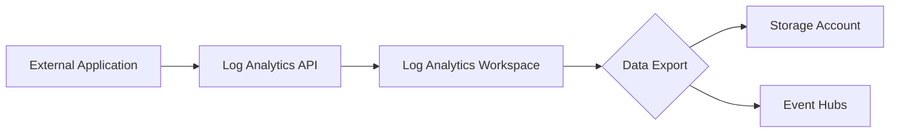

# Export and Integration

Data export and integration capabilities allow Azure Monitor data to be moved to external systems for long-term storage, advanced analytics, or third-party tool integration.



## Prerequisites

- Log Analytics workspace.
- Destination Storage Account or Event Hub.
- Permissions: **Log Analytics Contributor** or **Monitoring Contributor**.

## When to Use

- When data must be retained beyond 2 years (Storage Account export).
- When streaming logs in real-time to external SIEMs or custom applications (Event Hub export).
- When programmatically querying log data for custom reports or dashboards (API access).

## Procedure

### Azure Portal
1. Navigate to **Log Analytics workspaces**.
2. Select your workspace, then select **Data Export** in the left menu.
3. Select **New export rule**.
4. Provide a **Name**.
5. Select the **Source tables** to export.
6. Select the **Destination** (Storage Account or Event Hub).
7. Select **Create**.

### Azure CLI
Create a data export rule to a Storage Account:

```bash
az monitor log-analytics workspace data-export create \
    --resource-group "rg-monitoring-prod" \
    --workspace-name "law-ops-central" \
    --name "export-security-logs" \
    --destination "/subscriptions/00000000-0000-0000-0000-000000000000/resourceGroups/rg-storage/providers/Microsoft.Storage/storageAccounts/stmonitoringlogs" \
    --tables "SecurityEvent" "SigninLogs"
```

Create a data export rule to an Event Hub:

```bash
az monitor log-analytics workspace data-export create \
    --resource-group "rg-monitoring-prod" \
    --workspace-name "law-ops-central" \
    --name "export-to-eventhub" \
    --destination "/subscriptions/00000000-0000-0000-0000-000000000000/resourceGroups/rg-prod/providers/Microsoft.EventHub/namespaces/eh-monitoring/eventhubs/hub-logs" \
    --tables "Heartbeat"
```

## Verification

List all data export rules for a workspace:

```bash
az monitor log-analytics workspace data-export list \
    --resource-group "rg-monitoring-prod" \
    --workspace-name "law-ops-central"
```

Show details of a specific export rule:

```bash
az monitor log-analytics workspace data-export show \
    --resource-group "rg-monitoring-prod" \
    --workspace-name "law-ops-central" \
    --name "export-security-logs"
```

## Rollback / Troubleshooting

- **Unsupported tables:** Not all tables support continuous data export. Check the documentation for the current list of supported tables.
- **Latency:** Data is exported as it arrives at the workspace, but slight delays may occur during ingestion.
- **Permissions:** Ensure the destination resource has an appropriate Access Policy or RBAC role allowing the workspace to write data.

## See Also

- [Log Analytics workspace data export in Azure Monitor](https://learn.microsoft.com/azure/azure-monitor/logs/logs-data-export)
- [Azure Monitor Logs query API](https://learn.microsoft.com/rest/api/loganalytics/dataaccess/query)

## Sources

- [MS Learn: Log Analytics workspace data export in Azure Monitor](https://learn.microsoft.com/azure/azure-monitor/logs/logs-data-export)
- [MS Learn: Configure data export in Log Analytics workspace](https://learn.microsoft.com/azure/azure-monitor/logs/logs-data-export-configure)
