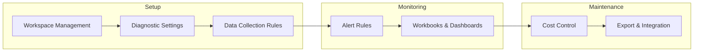

# Operations

Day-2 operational procedures for Azure Monitor.

## In This Section

| Page | Description |
|------|-------------|
| [Workspace Management](workspace-management.md) | Create, configure, manage Log Analytics workspaces |
| [Diagnostic Settings](diagnostic-settings.md) | Enable resource diagnostics, route to workspace/storage/event hub |
| [Alert Rule Management](alert-rule-management.md) | Create, update, disable alert rules; action groups |
| [Data Collection Rules Operations](data-collection-rules-ops.md) | Create and assign DCRs, transform data at ingestion |
| [Workbooks and Dashboards](workbooks-and-dashboards.md) | Create, parameterize, share workbooks |
| [Cost Control](cost-control.md) | Monitor ingestion volume, set daily caps, commitment tiers |
| [Export and Integration](export-and-integration.md) | Data export to Storage/Event Hubs, API access |

## See Also

- [Best Practices](../best-practices/index.md)
- [Troubleshooting](../troubleshooting/index.md)

## Sources

- [Manage Log Analytics workspaces](https://learn.microsoft.com/azure/azure-monitor/logs/manage-access)
- [Diagnostic settings](https://learn.microsoft.com/azure/azure-monitor/essentials/diagnostic-settings)
