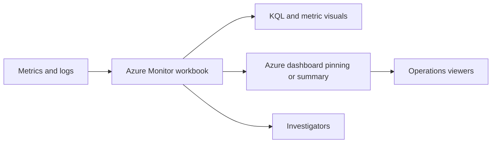

# Workbooks and Dashboards
Azure Monitor workbooks provide parameterized operational analysis, while Azure dashboards provide at-a-glance status views for shared audiences. This runbook focuses on maintaining both assets as reusable, versioned operational artifacts.

## Prerequisites
- Azure CLI authenticated with `az login`.
- A Log Analytics workspace with queryable data.
- Workbook JSON or serialized content stored in source control.
- If dashboards are used, a dashboard definition JSON file available for deployment.
- Permissions:
    - `Workbook Contributor` for workbook changes.
    - `Contributor` on the resource group for portal dashboard changes.
- Variables used below:
```bash
RG="rg-monitoring-prod"
WORKBOOK_NAME="wb-ops-health-report"
WORKBOOK_DISPLAY_NAME="Operations Health Report"
WORKBOOK_FILE="./docs/examples/workbook-ops-health-report.json"
DASHBOARD_NAME="dashboard-monitoring-overview"
DASHBOARD_FILE="./docs/examples/dashboard-monitoring-overview.json"
LOCATION="eastus"
```
## When to Use
- You need a reusable operational view for incident triage.
- A workbook query or parameter set needs an update after schema changes.
- A NOC dashboard must be standardized across subscriptions.
- Visual content drifted from the version-controlled baseline.
- A workbook needs to be verified after alert or DCR changes.
- A central team needs the same monitoring view deployed across environments.
## Procedure
### Step 1: Inventory existing workbooks and dashboards
Check what already exists before you create a duplicate artifact.
```bash
az monitor workbook list \
    --resource-group $RG \
    --query "[].{name:name,displayName:displayName,location:location,kind:kind}" \
    --output table
```
Expected output:
```text
Name                   DisplayName                Location    Kind
---------------------  -------------------------  ----------  ------------------
wb-ops-health-report   Operations Health Report   eastus      shared
```
Then list dashboards in the same resource group.
```bash
az portal dashboard list \
    --resource-group $RG \
    --query "[].{name:name,location:location,tags:tags}" \
    --output table
```
Expected output:
```text
Name                            Location    Tags
------------------------------  ----------  --------------------------------
dashboard-monitoring-overview   eastus      {'owner':'monitoring','tier':'ops'}
```
### Step 2: Create or update the workbook from a checked-in file
Use a versioned source file rather than editing only in the portal.
```bash
az monitor workbook create \
    --name $WORKBOOK_NAME \
    --resource-group $RG \
    --location $LOCATION \
    --display-name "$WORKBOOK_DISPLAY_NAME" \
    --kind shared \
    --serialized-data @$WORKBOOK_FILE \
    --output json
```
Expected output:
```json
{
  "displayName": "Operations Health Report",
  "kind": "shared",
  "location": "eastus",
  "name": "wb-ops-health-report",
  "provisioningState": "Succeeded"
}
```
If the workbook already exists, update the serialized data in place.
```bash
az monitor workbook update \
    --name $WORKBOOK_NAME \
    --resource-group $RG \
    --serialized-data @$WORKBOOK_FILE \
    --output json
```
Expected output:
```json
{
  "displayName": "Operations Health Report",
  "name": "wb-ops-health-report",
  "revision": "1d2f7d4c-xxxx-xxxx-xxxx-xxxxxxxxxxxx"
}
```
### Step 3: Read back workbook metadata and serialized content
Confirm that the workbook saved as a shared resource and still contains the expected definition.
```bash
az monitor workbook show \
    --name $WORKBOOK_NAME \
    --resource-group $RG \
    --query "{name:name,displayName:displayName,kind:kind,location:location,version:version}" \
    --output json
```
Expected output:
```json
{
  "displayName": "Operations Health Report",
  "kind": "shared",
  "location": "eastus",
  "name": "wb-ops-health-report",
  "version": "Notebook/1.0"
}
```
Use this step to verify that the workbook is still the shared artifact your team expects, not a private copy with drift.
### Step 4: Create or update the Azure dashboard definition
Dashboards are best treated like infrastructure definitions for team-wide operational views.
```bash
az portal dashboard create \
    --resource-group $RG \
    --name $DASHBOARD_NAME \
    --location $LOCATION \
    --input-path $DASHBOARD_FILE \
    --tags owner=monitoring tier=ops \
    --output json
```
Expected output:
```json
{
  "location": "eastus",
  "name": "dashboard-monitoring-overview",
  "provisioningState": "Succeeded",
  "tags": {
    "owner": "monitoring",
    "tier": "ops"
  }
}
```
If you need to refresh the JSON later, rerun the same command with the updated file so the dashboard stays aligned with source control.
Microsoft Learn guidance is to treat workbooks as rich investigative views and dashboards as broad operational summaries, so keep the two definitions intentionally different instead of mirroring every visual.
### Step 5: Validate workbook queries and dashboard presence
Operational views are only useful if the underlying queries still return data.
```bash
az monitor log-analytics query \
    --workspace "/subscriptions/<subscription-id>/resourceGroups/rg-monitoring-prod/providers/Microsoft.OperationalInsights/workspaces/law-ops-central" \
    --analytics-query "Heartbeat | where TimeGenerated > ago(1h) | summarize ActiveAgents=dcount(Computer)" \
    --output table
```
Expected output:
```text
ActiveAgents
------------
18
```
Then confirm the dashboard resource exists.
```bash
az portal dashboard show \
    --resource-group $RG \
    --name $DASHBOARD_NAME \
    --query "{name:name,location:location,tags:tags}" \
    --output json
```
Expected output:
```json
{
  "location": "eastus",
  "name": "dashboard-monitoring-overview",
  "tags": {
    "owner": "monitoring",
    "tier": "ops"
  }
}
```
If the dashboard exists but workbook-backed tiles are empty, validate the workbook query directly before changing the dashboard JSON.
## Verification
Verify workbook presence:
```bash
az monitor workbook list \
    --resource-group $RG \
    --query "[].{name:name,displayName:displayName}" \
    --output table
```
Expected output:
```text
Name                   DisplayName
---------------------  -------------------------
wb-ops-health-report   Operations Health Report
```
Verify dashboard presence:
```bash
az portal dashboard list \
    --resource-group $RG \
    --query "[].{name:name,location:location}" \
    --output table
```
Expected output:
```text
Name                            Location
------------------------------  ----------
dashboard-monitoring-overview   eastus
```
Verify that the workbook resource is still shared:
```bash
az monitor workbook show \
    --name $WORKBOOK_NAME \
    --resource-group $RG \
    --query "{name:name,kind:kind,displayName:displayName}" \
    --output json
```
Expected output:
```json
{
  "displayName": "Operations Health Report",
  "kind": "shared",
  "name": "wb-ops-health-report"
}
```
Verification succeeds when the workbook and dashboard exist in the resource group and the validation query used by the workbook still returns data.
## Rollback / Troubleshooting
Delete a broken workbook:
```bash
az monitor workbook delete \
    --name $WORKBOOK_NAME \
    --resource-group $RG \
    --yes
```
Delete a broken dashboard:
```bash
az portal dashboard delete \
    --resource-group $RG \
    --name $DASHBOARD_NAME
```
Common problems:
- Workbook loads but visual is empty
    - Run the underlying KQL manually and validate parameters.
- Workbook update fails
    - Confirm the serialized JSON is valid and not truncated.
- Dashboard tiles show authorization errors
    - Verify viewer access to the underlying resources, not only the dashboard object.
- Duplicate assets appear
    - Standardize naming, tags, and source-controlled definitions.
- Dashboard exists in the wrong subscription or resource group
    - Re-check deployment scope before assuming the JSON definition is broken.
- Shared workbook was replaced by a private draft
    - Re-deploy the shared workbook from source control and confirm the `kind` value.
## Automation
Treat workbook JSON and dashboard JSON as deployable artifacts.
```bash
az monitor workbook list \
    --query "[].{name:name,resourceGroup:resourceGroup,displayName:displayName}" \
    --output json
```
Useful automation patterns:
- Store workbook JSON and dashboard JSON in the repository.
- Deploy both through CI after pull-request review.
- Add a smoke test query for each workbook's primary visual.
- Report unmanaged workbooks or dashboards that lack standard tags.
- Require owners and environment tags on every dashboard resource.
- Run scheduled inventory exports so teams can review stale or duplicate visual assets.
- Export workbook metadata regularly so private copies and shared copies are easy to compare.
- Validate at least one parameterized workbook query after every monitoring schema change.
- Review dashboard viewers and owners during quarterly operational access checks.
## See Also
- [Operations index](index.md)
- [Alert Rule Management](alert-rule-management.md)
- [Workspace Management](workspace-management.md)
- [Troubleshooting KQL query packs](../troubleshooting/kql/index.md)
- [Export and Integration](export-and-integration.md)
- [Reference KQL quick reference](../reference/kql-quick-reference.md)
## Sources
- [Microsoft Learn: Azure Monitor workbooks overview](https://learn.microsoft.com/azure/azure-monitor/visualize/workbooks-overview)
- [Microsoft Learn: Create Azure Monitor workbooks](https://learn.microsoft.com/azure/azure-monitor/visualize/workbooks-create-workbook)
- [Microsoft Learn: Create and share dashboards in the Azure portal](https://learn.microsoft.com/azure/azure-portal/azure-portal-dashboards)
- [Microsoft Learn: Create Azure portal dashboards programmatically](https://learn.microsoft.com/azure/azure-portal/azure-portal-dashboards-create-programmatically)
- [Microsoft Learn: Azure Monitor workbook samples and templates](https://learn.microsoft.com/azure/azure-monitor/visualize/workbooks-samples)
