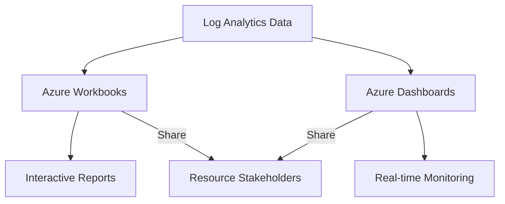

# Workbooks and Dashboards

Workbooks and dashboards provide interactive data visualization and analysis capabilities in Azure Monitor. Workbooks are ideal for rich, multi-step reporting, while dashboards offer high-level operational views.



## Prerequisites

- Log Analytics workspace with data.
- Permissions: **Workbook Contributor** or **Monitoring Reader** (for viewing).

## When to Use

- When building detailed, parameter-driven reports (Workbooks).
- When creating static, high-level overview screens for a Network Operations Center (Dashboards).
- When sharing insights with non-technical stakeholders in a guided format.

## Procedure

### Azure Portal
1. Navigate to **Monitor** > **Workbooks**.
2. Select **Empty** or choose a **Template**.
3. Add **Text**, **Query**, **Metrics**, or **Parameters** to the workbook.
4. Define parameters (e.g., Subscription, Resource Group, Time Range) to make the workbook interactive.
5. Select **Save** and provide a **Name** and **Location**.

### Azure CLI
Create a workbook from a JSON template file:

```bash
az monitor workbook create \
    --name "wb-ops-health-report" \
    --resource-group "rg-monitoring-prod" \
    --location "eastus" \
    --serialized-data "path/to/workbook-template.json" \
    --display-name "Operations Health Report"
```

Update an existing workbook:

```bash
az monitor workbook update \
    --name "wb-ops-health-report" \
    --resource-group "rg-monitoring-prod" \
    --serialized-data "path/to/updated-workbook-template.json"
```

## Verification

List all workbooks in a resource group:

```bash
az monitor workbook list \
    --resource-group "rg-monitoring-prod"
```

View the JSON content of a workbook:

```bash
az monitor workbook show \
    --name "wb-ops-health-report" \
    --resource-group "rg-monitoring-prod"
```

## Rollback / Troubleshooting

- **Query timeout:** Optimize the KQL query or use a shorter time range.
- **Permission denied:** Verify the user has at least "Reader" access on the workbook resource.
- **Dynamic content:** Ensure parameters are correctly referenced in the queries (e.g., using `{TimeRange}`).

## See Also

- [Azure Monitor Workbooks overview](https://learn.microsoft.com/azure/azure-monitor/visualize/workbooks-overview)
- [Create an Azure Dashboard](https://learn.microsoft.com/azure/azure-portal/azure-portal-dashboards)

## Sources

- [MS Learn: Azure Monitor Workbooks overview](https://learn.microsoft.com/azure/azure-monitor/visualize/workbooks-overview)
- [MS Learn: Create an Azure Monitor Workbook](https://learn.microsoft.com/azure/azure-monitor/visualize/workbooks-how-to-create)
