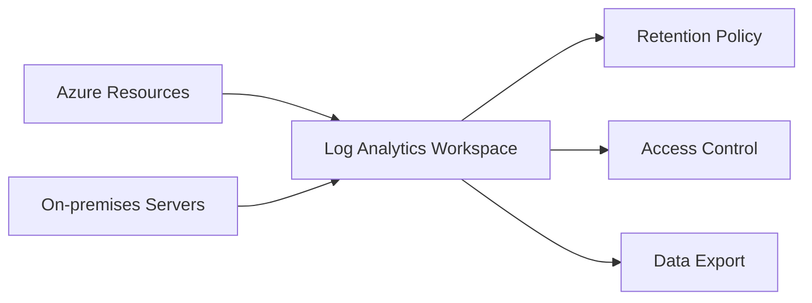

# Workspace Management

Log Analytics workspaces serve as the primary containers for Azure Monitor Logs. Efficient management ensures data is stored, secured, and retained according to organizational needs.



## Prerequisites

- An active Azure subscription.
- Permissions: **Contributor** or **Log Analytics Contributor** at the Resource Group or Subscription level.

## When to Use

- When starting a new Azure project that requires logging.
- When centralizing logs from multiple subscriptions or regions.
- When implementing specific data isolation or compliance requirements.

## Procedure

### Azure Portal
1. Navigate to **Log Analytics workspaces** in the Azure Portal.
2. Select **Create**.
3. Choose a **Subscription** and **Resource Group**.
4. Provide a unique **Name** and select a **Region**.
5. Select **Review + Create**, then **Create**.

### Azure CLI
Create a workspace using the following command:

```bash
az monitor log-analytics workspace create \
    --resource-group "rg-monitoring-prod" \
    --workspace-name "law-ops-central" \
    --location "eastus"
```

Update retention settings:

```bash
az monitor log-analytics workspace update \
    --resource-group "rg-monitoring-prod" \
    --workspace-name "law-ops-central" \
    --retention-time 90
```

## Verification

Check the workspace status and configuration:

```bash
az monitor log-analytics workspace show \
    --resource-group "rg-monitoring-prod" \
    --workspace-name "law-ops-central"
```

## Rollback / Troubleshooting

- **Soft-delete:** If a workspace is accidentally deleted, it can be recovered within 14 days by default.
- **Resource Lock:** Apply a "CanNotDelete" lock to prevent accidental removal.
- **Quota:** If data stops arriving, check the Daily Cap settings.

## See Also

- [Design a Log Analytics workspace architecture](https://learn.microsoft.com/azure/azure-monitor/logs/workspace-design)
- [Manage access to Log Analytics workspaces](https://learn.microsoft.com/azure/azure-monitor/logs/manage-access)

## Sources

- [MS Learn: Create a Log Analytics workspace](https://learn.microsoft.com/azure/azure-monitor/logs/quick-create-workspace)
- [MS Learn: Manage access to Log Analytics workspaces](https://learn.microsoft.com/azure/azure-monitor/logs/manage-access)
