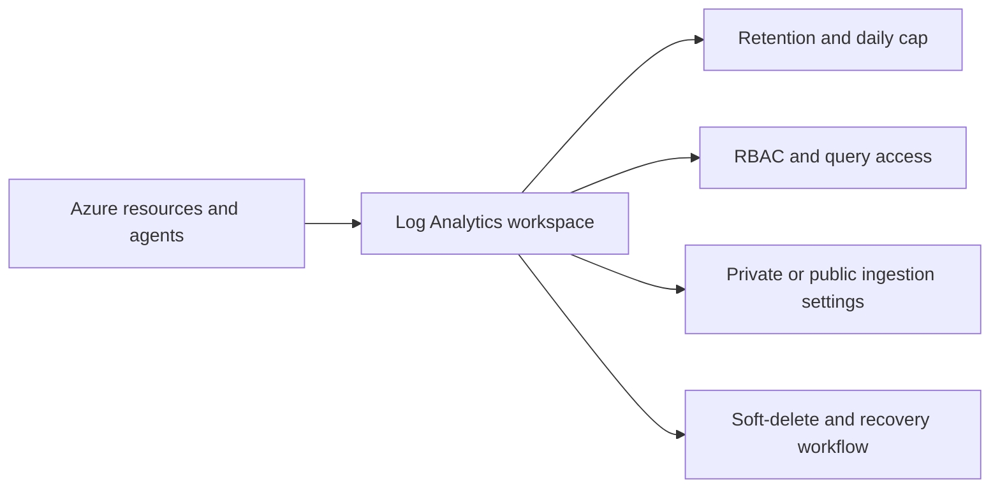

# Workspace Management
Log Analytics workspace operations determine where Azure Monitor Logs land, how long they stay available, and who can safely query or change the environment. This runbook focuses on repeatable day-2 workspace administration with Azure CLI.

## Prerequisites
- Azure CLI authenticated with `az login`.
- A resource group for the monitoring platform.
- Permissions:
    - `Log Analytics Contributor` to create or modify workspaces.
    - `Monitoring Contributor` for related Azure Monitor operations.
    - `User Access Administrator` if you also assign RBAC.
- Shell variables prepared for copy-paste examples:
```bash
RG="rg-monitoring-prod"
WORKSPACE_NAME="law-ops-central"
LOCATION="eastus"
SUBSCRIPTION_ID="<subscription-id>"
WORKSPACE_ID="/subscriptions/<subscription-id>/resourceGroups/rg-monitoring-prod/providers/Microsoft.OperationalInsights/workspaces/law-ops-central"
```
## When to Use
- You need to create a new production or non-production workspace.
- You need to adjust retention, daily cap, or pricing settings after cost review.
- You need to validate workspace features before onboarding more data sources.
- You need to review access boundaries before delegating operational ownership.
- You need to recover from accidental deletion or configuration drift.
## Procedure
### Step 1: Inspect the current workspace inventory
Start by confirming whether a workspace already exists and which operational settings are currently applied.
```bash
az monitor log-analytics workspace list \
    --resource-group $RG \
    --query "[].{name:name,location:location,sku:sku.name,retention:retentionInDays,publicNetworkAccessForIngestion:publicNetworkAccessForIngestion}" \
    --output table
```
Expected output:
```text
Name             Location    Sku       Retention    PublicNetworkAccessForIngestion
---------------  ----------  --------  -----------  --------------------------------
law-ops-central  eastus      PerGB2018 30           Enabled
```
If the list is empty, proceed with workspace creation. If a workspace already exists, record the SKU, retention days, and public ingestion setting before making changes.
### Step 2: Create or standardize the workspace baseline
Create the workspace with an explicit region and then confirm the immutable identifiers that downstream configurations depend on.
```bash
az monitor log-analytics workspace create \
    --resource-group $RG \
    --workspace-name $WORKSPACE_NAME \
    --location $LOCATION \
    --output json
```
Expected output:
```json
{
  "customerId": "xxxxxxxx-xxxx-xxxx-xxxx-xxxxxxxxxxxx",
  "features": {
    "enableLogAccessUsingOnlyResourcePermissions": true
  },
  "id": "/subscriptions/<subscription-id>/resourceGroups/rg-monitoring-prod/providers/Microsoft.OperationalInsights/workspaces/law-ops-central",
  "location": "eastus",
  "name": "law-ops-central",
  "provisioningState": "Succeeded",
  "retentionInDays": 30,
  "sku": {
    "name": "PerGB2018"
  }
}
```
Capture the workspace ID for later use by diagnostic settings, DCRs, and saved queries.
```bash
az monitor log-analytics workspace show \
    --resource-group $RG \
    --workspace-name $WORKSPACE_NAME \
    --query "{id:id,customerId:customerId,provisioningState:provisioningState}" \
    --output json
```
Expected output:
```json
{
  "customerId": "xxxxxxxx-xxxx-xxxx-xxxx-xxxxxxxxxxxx",
  "id": "/subscriptions/<subscription-id>/resourceGroups/rg-monitoring-prod/providers/Microsoft.OperationalInsights/workspaces/law-ops-central",
  "provisioningState": "Succeeded"
}
```
This step establishes the baseline object that every other Azure Monitor operations page depends on.
### Step 3: Configure retention and daily cap guardrails
Microsoft Learn recommends tuning retention and ingestion controls according to compliance and cost objectives instead of leaving defaults unchanged.
```bash
az monitor log-analytics workspace update \
    --resource-group $RG \
    --workspace-name $WORKSPACE_NAME \
    --retention-time 90 \
    --quota 25 \
    --output json
```
Expected output:
```json
{
  "name": "law-ops-central",
  "retentionInDays": 90,
  "sku": {
    "name": "PerGB2018"
  },
  "workspaceCapping": {
    "dailyQuotaGb": 25.0,
    "dataIngestionStatus": "RespectQuota"
  }
}
```
Re-read the effective settings to confirm the values are committed and not just accepted by the request.
```bash
az monitor log-analytics workspace show \
    --resource-group $RG \
    --workspace-name $WORKSPACE_NAME \
    --query "{retention:retentionInDays,dailyCap:workspaceCapping.dailyQuotaGb,ingestionStatus:workspaceCapping.dataIngestionStatus}" \
    --output json
```
Expected output:
```json
{
  "dailyCap": 25.0,
  "ingestionStatus": "RespectQuota",
  "retention": 90
}
```
Use a lower daily cap only for environments where temporary ingestion stop is acceptable. For critical production environments, use alerts and ingestion analysis before lowering the cap aggressively. Microsoft Learn positions the daily cap as a safeguard against unexpected spikes, not as the main cost-control method.
### Step 4: Review access mode and operational permissions
Workspace operations frequently fail because access is configured for the wrong audience. Validate feature flags first, then inspect RBAC assignments.
```bash
az monitor log-analytics workspace show \
    --resource-group $RG \
    --workspace-name $WORKSPACE_NAME \
    --query "{resourcePermissions:features.enableLogAccessUsingOnlyResourcePermissions,publicQueryAccess:publicNetworkAccessForQuery,publicIngestionAccess:publicNetworkAccessForIngestion}" \
    --output json
```
Expected output:
```json
{
  "publicIngestionAccess": "Enabled",
  "publicQueryAccess": "Enabled",
  "resourcePermissions": true
}
```
Then list current role assignments on the workspace scope.
```bash
az role assignment list \
    --scope $WORKSPACE_ID \
    --query "[].{principalName:principalName,role:roleDefinitionName,principalType:principalType}" \
    --output table
```
Expected output:
```text
PrincipalName               Role                        PrincipalType
--------------------------  --------------------------  -------------
monitoring-ops-admins       Log Analytics Contributor   Group
platform-readers            Log Analytics Reader        Group
automation-monitoring-spn   Monitoring Contributor      ServicePrincipal
```
This verifies that operational roles align with the least-privilege model documented in Microsoft Learn. If you need to delegate control, use explicit workspace scope assignments instead of broad subscription-wide rights.
### Step 5: Validate workspace health and ingestion readiness
Before onboarding new resources, verify that the workspace responds to metadata queries and returns usage data.
```bash
az monitor log-analytics workspace table list \
    --resource-group $RG \
    --workspace-name $WORKSPACE_NAME \
    --query "[0:5].{name:name,plan:plan,retentionInDays:retentionInDays}" \
    --output table
```
Expected output:
```text
Name                Plan          RetentionInDays
------------------  ------------  ---------------
Heartbeat           Analytics     90
Perf                Analytics     90
Usage               Analytics     90
AzureActivity       Analytics     90
AzureMetrics        Analytics     90
```
If tables are returned, the workspace is fully provisioned and ready for additional routing rules.

Use a query against the workspace to confirm that billable usage or heartbeat data is visible.
```bash
az monitor log-analytics query \
    --workspace $WORKSPACE_ID \
    --analytics-query "Usage | where TimeGenerated > ago(1d) | summarize TotalGB=sum(Quantity)/1024 by DataType | top 5 by TotalGB desc" \
    --output table
```
Expected output:
```text
DataType         TotalGB
---------------  -------
Heartbeat        0.12
Perf             0.08
AzureActivity    0.03
```
No results can be normal in a brand-new workspace, but query execution itself must succeed. A successful response proves workspace identity, control-plane health, and query permissions are aligned.
## Verification
Confirm that the workspace exists with the expected baseline:
```bash
az monitor log-analytics workspace show \
    --resource-group $RG \
    --workspace-name $WORKSPACE_NAME \
    --query "{name:name,location:location,retention:retentionInDays,sku:sku.name,provisioningState:provisioningState}" \
    --output json
```
Expected output:
```json
{
  "location": "eastus",
  "name": "law-ops-central",
  "provisioningState": "Succeeded",
  "retention": 90,
  "sku": "PerGB2018"
}
```
Confirm that the daily cap and access settings match the intended policy:
```bash
az monitor log-analytics workspace show \
    --resource-group $RG \
    --workspace-name $WORKSPACE_NAME \
    --query "{dailyCap:workspaceCapping.dailyQuotaGb,queryAccess:publicNetworkAccessForQuery,ingestionAccess:publicNetworkAccessForIngestion}" \
    --output json
```
Expected output:
```json
{
  "dailyCap": 25.0,
  "ingestionAccess": "Enabled",
  "queryAccess": "Enabled"
}
```
Verification is complete when both commands return the intended values and the query in Step 5 succeeds without authorization or resource-not-found errors.
## Rollback / Troubleshooting
If retention or daily cap changes cause operational issues, revert them explicitly:
```bash
az monitor log-analytics workspace update \
    --resource-group $RG \
    --workspace-name $WORKSPACE_NAME \
    --retention-time 30 \
    --quota -1 \
    --output json
```
Expected output:
```json
{
  "name": "law-ops-central",
  "retentionInDays": 30,
  "workspaceCapping": {
    "dailyQuotaGb": -1.0
  }
}
```
If the workspace was accidentally deleted, inspect deleted workspaces before initiating recovery.
```bash
az monitor log-analytics workspace list-deleted-workspaces \
    --resource-group $RG \
    --query "[].{name:name,location:location,deletedDate:deletedDate}" \
    --output table
```
Expected output:
```text
Name             Location    DeletedDate
---------------  ----------  -------------------------
law-ops-central  eastus      2026-04-05T09:10:12.000Z
```
Common issues and responses:
- `AuthorizationFailed`
    - Confirm workspace scope RBAC rather than only resource-group inheritance assumptions.
- `RegionNotSupported`
    - Create the workspace in a region supported by the intended Azure Monitor feature.
- Queries return no data
    - Check whether diagnostic settings, DCR associations, or agents are actually sending data.
- Daily cap reached
    - Increase quota temporarily or reduce noisy tables before business-critical data is lost.
## Automation
Workspace administration is a good candidate for scheduled governance checks. Use automation to detect drift in retention, cap, access mode, and role assignments.

Example shell automation:
```bash
az monitor log-analytics workspace list \
    --query "[].{name:name,id:id,retention:retentionInDays,dailyCap:workspaceCapping.dailyQuotaGb}" \
    --output json
```
Typical automation patterns:
- Run a daily GitHub Actions or Azure DevOps job to export workspace settings.
- Compare actual settings with a baseline JSON document stored in source control.
- Trigger an alert or pull request when retention or cap values drift.
- Pair workspace inventory reports with cost review from the `Usage` table.
## See Also
- [Operations index](index.md)
- [Diagnostic Settings](diagnostic-settings.md)
- [Data Collection Rules Operations](data-collection-rules-ops.md)
- [Cost Control](cost-control.md)
## Sources
- [Microsoft Learn: Create a Log Analytics workspace in Azure Monitor](https://learn.microsoft.com/azure/azure-monitor/logs/quick-create-workspace)
- [Microsoft Learn: Manage access to Log Analytics workspaces](https://learn.microsoft.com/azure/azure-monitor/logs/manage-access)
- [Microsoft Learn: Manage usage and costs with Azure Monitor Logs](https://learn.microsoft.com/azure/azure-monitor/logs/cost-logs)
- [Microsoft Learn: Set daily cap on a Log Analytics workspace](https://learn.microsoft.com/azure/azure-monitor/logs/daily-cap)
- [Microsoft Learn: Azure Monitor Logs best practices](https://learn.microsoft.com/azure/azure-monitor/logs/best-practices-logs)
