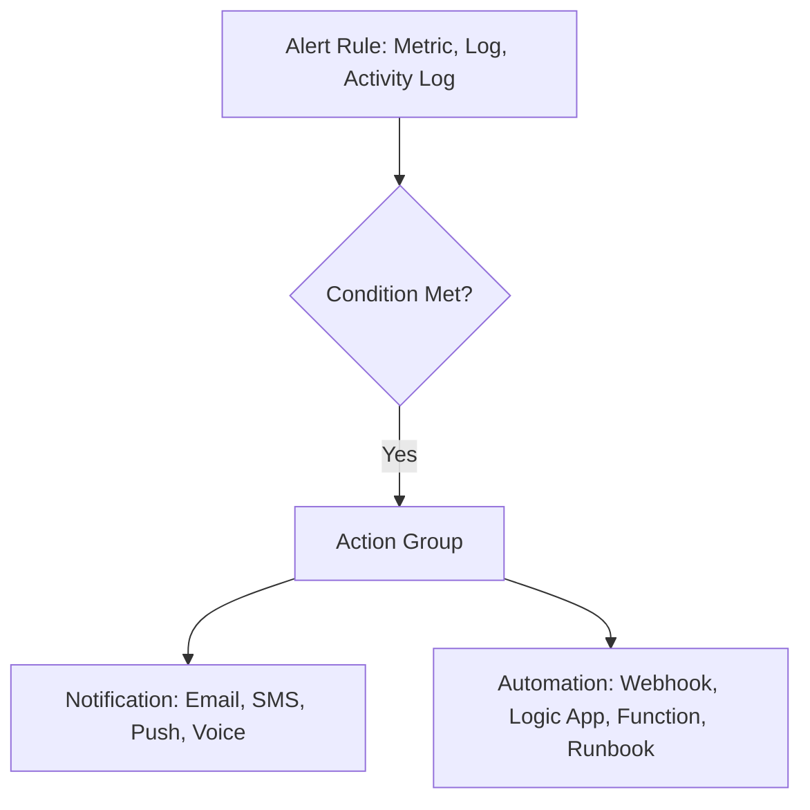

# Alerts Architecture

Alerts in Azure Monitor allow you to proactively identify issues in your data. An alert rule uses a set of conditions that, when met, trigger an alert to notify you or take an automated action.

### Alert Types

Azure Monitor supports several different types of alerts, each with its own focus:

#### Metric Alerts
These alerts evaluate a metric's condition at regular intervals. If the condition is met, the alert is triggered. Metric alerts are near real-time and provide low-latency notifications.

#### Log Alerts
These alerts use a Kusto Query Language (KQL) query to evaluate log data at regular intervals. If the query results meet the specified criteria, the alert is triggered. Log alerts allow for complex logic across multiple resources.

#### Activity Log Alerts
These alerts trigger when a new activity log event occurs that matches the defined conditions. This is useful for monitoring service health or changes to Azure resources.

### Action Groups

An action group is a collection of notification preferences and automated actions that can be triggered by an alert.

#### Notifications
Notifications can include emails, SMS messages, push notifications, and voice calls.

#### Automated Actions
Automated actions allow you to respond to an alert without manual intervention. This can include:
*   Triggering a Webhook to call an external system.
*   Starting a Logic App for a complex workflow.
*   Executing an Azure Function for custom code.
*   Running an Azure Automation Runbook for serverless management.

## See Also
*   [Metrics and Dimensions](metrics-and-dimensions.md)
*   [Log Analytics Workspace](log-analytics-workspace.md)

## Sources
*   https://learn.microsoft.com/azure/azure-monitor/alerts/alerts-overview
