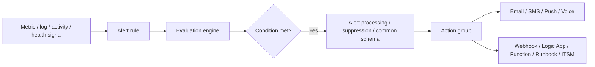
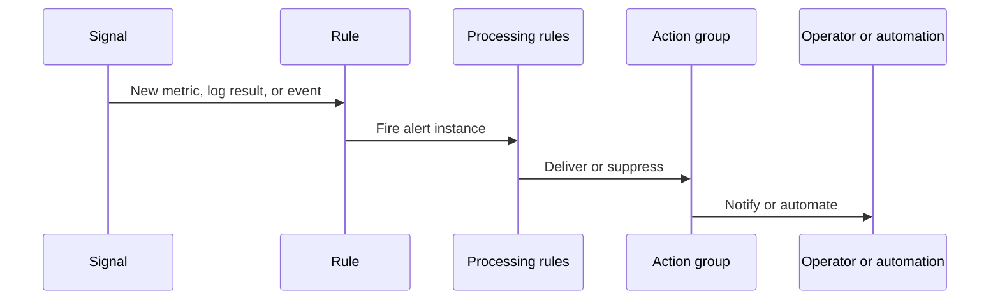

# Alerts Architecture
Azure Monitor alerting is the response layer that turns telemetry into notifications, tickets, and automation.
A good alert architecture does not start with actions; it starts with signal selection, scope, evaluation model, ownership, and the operational behavior of the team that will receive the alert.

## Architecture Overview
Azure Monitor alerting is composed of rules, evaluation engines, processing logic, and action groups.
Different alert types exist because metrics, logs, and control-plane events have different latency and data-model characteristics.

An alert architecture review should answer seven questions.
1. **What signal type is the rule built on?**
    - Metric, log query, activity log, service health, or resource health.
2. **How fast must the alert fire?**
    - Metric alerts usually support faster evaluation than log alerts.
3. **Who owns the response?**
    - Alerts without ownership quickly become ignored.
4. **What action should happen?**
    - Human paging, ticket creation, chat notification, or automated remediation.
5. **How will noise be controlled?**
    - Dynamic thresholds, suppression, action rules, and rational scoping all matter.
6. **What investigation path follows the alert?**
    - Alerts should point to the first workbook, KQL query, or runbook.
7. **What business impact justifies the page?**
    - Severity must reflect user impact, not only telemetry variance.

### Alert pipeline components
| Component | Purpose | Examples |
|---|---|---|
| Signal | Source data being evaluated | CPU metric, KQL result, Activity Log event |
| Rule | Defines scope and condition | Metric threshold, scheduled query, service health rule |
| Evaluation engine | Runs the rule on a schedule or stream | Metric engine, log alert engine |
| Action group | Defines response targets | Email, webhook, Function, Logic App |
| Processing or action rule | Adjusts downstream behavior | Suppress, route, or change actions during maintenance |

## Core Concepts

### Signal type determines rule design
Alert rules are not interchangeable.
The signal type decides latency, cost, evaluation semantics, and the kind of troubleshooting evidence the alert can include.

#### Metric alerts
Metric alerts evaluate measurements from the metrics store.
Use them when:
- You need fast threshold-based detection.
- The signal already exists as a platform or custom metric.
- You need dimension-based splitting such as per instance or per response code.
Benefits:
- Lower latency.
- Efficient repeated evaluation.
- Strong fit for availability, saturation, and threshold breaches.
Trade-offs:
- Less contextual evidence than logs.
- Limited to available metrics and dimensions.

#### Scheduled query alerts
Scheduled query alerts evaluate KQL queries against workspace data.
Use them when:
- You need correlation across tables or resources.
- You need parsing, joins, or custom conditions.
- You need app, platform, and infrastructure context in one rule.
Benefits:
- Flexible logic.
- Broad analytic power.
- Good fit for complex error conditions and security-oriented detections.
Trade-offs:
- Higher latency than metric alerts.
- Query quality and cost matter.
- Requires careful testing and maintenance.

#### Activity Log alerts
Activity Log alerts detect control-plane and subscription-level events.
Use them when:
- You need to know about resource changes.
- You need service health or planned maintenance notifications.
- You need governance or deployment awareness.

#### Resource health and service health alerts
These alert types are designed for platform health events rather than application telemetry.
They are important because many incidents begin outside the application boundary.

### CLI example: create a fast metric alert
```bash
az monitor metrics alert create \
    --name "alert-vm-high-cpu" \
    --resource-group "$RG" \
    --scopes "$RESOURCE_ID" \
    --condition "avg Percentage CPU > 80" \
    --window-size "PT5M" \
    --evaluation-frequency "PT1M" \
    --severity 2 \
    --description "Trigger when average VM CPU exceeds 80 percent for five minutes." \
    --output json
```
Example output:
```json
{
  "enabled": true,
  "evaluationFrequency": "PT1M",
  "id": "/subscriptions/<subscription-id>/resourceGroups/rg-monitoring-prod/providers/Microsoft.Insights/metricAlerts/alert-vm-high-cpu",
  "name": "alert-vm-high-cpu",
  "severity": 2,
  "windowSize": "PT5M"
}
```

### Severity should map to impact, not emotion
Severity is an operational contract.
A severity 0 or 1 alert usually implies immediate business impact or major outage response.
If severity is assigned casually, teams stop trusting the system.

#### Example severity framing
| Severity | Typical meaning |
|---|---|
| 0 | Broad outage or severe user impact |
| 1 | Critical degradation requiring immediate action |
| 2 | Significant issue requiring prompt response |
| 3 | Important but not urgent investigation |
| 4 | Informational or automation-only event |
Use this only if it aligns with your team’s operational model.
The main goal is consistency.

### Action groups define response, not detection logic
Action groups are reusable sets of notification and automation targets.
They allow the same alerting signal to page humans, call a webhook, start a Logic App, or open an ITSM path.

#### Typical action group targets
- Email.
- SMS.
- Push notification.
- Voice call.
- Webhook.
- Azure Function.
- Logic App.
- Automation runbook.
The architectural principle is separation of concerns.
The rule decides **when** something is bad.
The action group decides **what happens next**.

### CLI example: create an action group with common schema enabled
```bash
az monitor action-group create \
    --resource-group "$RG" \
    --name "$ACTION_GROUP_NAME" \
    --short-name "oncall" \
    --action email platformoncall ops-team@example.com \
    --output json
```
Example output:
```json
{
  "enabled": true,
  "groupShortName": "oncall",
  "id": "/subscriptions/<subscription-id>/resourceGroups/rg-monitoring-prod/providers/microsoft.insights/actionGroups/ag-oncall-team",
  "name": "ag-oncall-team"
}
```
Production action groups often include more than one target so there is both human notification and machine-readable automation.

### Alert noise is usually a design failure
Most noisy alert environments suffer from one or more avoidable design issues.
- Alerting on every symptom instead of a few high-value symptoms.
- Thresholds created without a baseline.
- Scopes that are too broad.
- Lack of dimension filtering.
- No distinction between informational events and paging events.
- Duplicate rules across workspaces or environments.
- No maintenance suppression plan.

### CLI example: create a scheduled query alert for correlated failures
The `az monitor scheduled-query create` command uses a placeholder in `--condition` and the KQL body in `--condition-query`.
```bash
az monitor scheduled-query create \
    --name "alert-checkout-failure-rate" \
    --resource-group "$RG" \
    --scopes "$WORKSPACE_ID" \
    --condition "count 'FailureRateQuery' > 0" \
    --condition-query "FailureRateQuery=requests | where timestamp > ago(5m) | summarize FailureRate=100.0 * avg(todouble(not(success))) by cloud_RoleName | where FailureRate > 2" \
    --evaluation-frequency "5m" \
    --window-size "5m" \
    --severity 2 \
    --skip-query-validation true \
    --description "Trigger when checkout application failure rate exceeds 2 percent over five minutes." \
    --output json
```
Example output:
```json
{
  "enabled": true,
  "evaluationFrequency": "PT5M",
  "id": "/subscriptions/<subscription-id>/resourceGroups/rg-monitoring-prod/providers/Microsoft.Insights/scheduledQueryRules/alert-checkout-failure-rate",
  "name": "alert-checkout-failure-rate",
  "severity": 2,
  "windowSize": "PT5M"
}
```
This is the right kind of rule when a single metric cannot express the logic cleanly.

## Data Flow
Alert data flow begins with telemetry, but operational flow begins with ownership.

### Technical evaluation flow
1. A signal becomes available in Azure Monitor.
2. The relevant rule evaluates that signal on its schedule or event stream.
3. If the condition is met, Azure Monitor creates an alert instance.
4. Action rules or processing logic can suppress or reroute action delivery.
5. Action groups notify humans or trigger automation.
6. Operators use linked dashboards, KQL, or runbooks to investigate.

### Data flow by alert type
| Alert type | Source | Typical evaluation style | Best use |
|---|---|---|---|
| Metric alert | Metrics store | Frequent threshold check | Fast performance or availability thresholds |
| Log alert | Workspace KQL | Scheduled query | Complex correlation and derived conditions |
| Activity Log alert | Activity Log stream | Event match | Deployments, changes, service health |
| Resource health alert | Azure health signals | Event-driven | Platform health changes |

### Alert lifecycle diagram


### Investigative handoff after firing
The first minute after an alert should be predictable.
A production-grade rule should have:
- A human-readable description.
- Clear severity.
- Correct resource or service naming.
- An owner.
- A runbook link.
- A first investigation query or workbook.
Without these, the alert technically works but operationally fails.

## Integration Points
Alert architecture touches nearly every other Azure Monitor feature.

### Metrics and dimensions
Metric alert quality depends on metric selection, aggregation, and dimensions.
This is why alert design is inseparable from metric design.

### Log Analytics workspace
Log alert quality depends on workspace topology, query performance, and schema consistency.
Multi-workspace design can complicate alert deployment and ownership.

### Application Insights
Application telemetry provides many of the most valuable user-impacting alert signals such as failure rate, latency, dependency health, and synthetic availability.

### Action groups and automation
Action groups integrate Azure Monitor with Logic Apps, Functions, Automation, webhooks, and external incident systems.
This is where Azure Monitor moves from observability to response.

### Maintenance processes
Action rules or maintenance workflows are essential to avoid alert storms during planned changes.
If maintenance suppression is not part of the design, the operational cost of alerting rises sharply.

## Configuration Options
Alert rules have a small set of settings, but each one affects operational behavior.

### Key rule settings
| Setting | Why it matters |
|---|---|
| Scope | Decides which resources or workspace data are evaluated |
| Evaluation frequency | Determines how quickly new issues are checked |
| Window size | Defines the data period used in evaluation |
| Condition | Encodes the threshold or query logic |
| Severity | Signals operational urgency |
| Description | Gives responders context |
| Action group | Defines downstream notifications or automation |

### CLI example: inspect a metric alert rule
```bash
az monitor metrics alert show \
    --name "alert-vm-high-cpu" \
    --resource-group "$RG" \
    --output json
```
Example output:
```json
{
  "enabled": true,
  "evaluationFrequency": "PT1M",
  "name": "alert-vm-high-cpu",
  "severity": 2,
  "windowSize": "PT5M"
}
```

### CLI example: inspect an action group
```bash
az monitor action-group show \
    --name "$ACTION_GROUP_NAME" \
    --resource-group "$RG" \
    --output json
```
Example output:
```json
{
  "enabled": true,
  "groupShortName": "oncall",
  "name": "ag-oncall-team",
  "emailReceivers": [
    {
      "emailAddress": "ops-team@example.com",
      "name": "platformoncall",
      "status": "Enabled"
    }
  ]
}
```

### Design review checklist
1. Is the chosen signal the simplest one that can express the condition?
2. Is the rule scoped to the right resources and environment?
3. Is the severity aligned with customer impact?
4. Does the action group match the urgency?
5. Does the rule include an investigation path?
6. Is there a maintenance suppression plan?

## Pricing Considerations
Alerting cost comes from rule count, rule type, and the surrounding operational cost of maintaining noisy or overly complex rules.

### Pricing-aware guidance
- Prefer metric alerts for simple thresholds.
- Use log alerts only when you truly need KQL logic.
- Reuse action groups instead of creating one-off copies for every rule.
- Remove obsolete rules after service decommissioning.
- Review whether very frequent log queries are operationally necessary.
Microsoft Learn pricing guidance also distinguishes metric alerts, log alerts, activity log alerts, and Prometheus-related alerts, so rule-type choice directly changes the billable model.

### Hidden costs of poor alert design
- Pager fatigue and ignored pages.
- Duplicate incident tickets.
- Slower response during real outages.
- Time spent maintaining many near-identical rules.

## Limitations and Quotas
Always validate current quota and pricing pages on Microsoft Learn before rollout.

### Practical limitations
- Metric alerts cannot express every cross-table correlation pattern.
- Log alerts depend on good KQL and good workspace hygiene.
- Activity Log alerts are event-oriented, not app-performance-oriented.
- Action delivery depends on downstream systems being healthy and reachable.

### Architectural implications
| Limitation | Design response |
|---|---|
| No single alert type fits every need | Standardize by use case, not by one default |
| Excessive rule count becomes unmanageable | Use modules, naming standards, and reviews |
| Poor descriptions slow triage | Treat description and runbook links as mandatory |
| No suppression strategy causes storms | Make action rules part of the architecture |

### Recommended alert portfolio pattern
- A small set of paging metric alerts for critical availability and saturation.
- Correlated log alerts for failure rate, dependency failure, and security-relevant conditions.
- Activity Log alerts for major control-plane change and service health events.
- Informational alerts routed to chat or tickets instead of phone-based paging.

### Common failure modes in alert programs

#### Failure mode: every team creates rules independently
This usually creates duplicated conditions, inconsistent severity, and action groups that no one owns.
Standard modules and naming conventions reduce the drift.

#### Failure mode: no baseline before thresholding
Thresholds created without historical review are noisy from day one.
Use metrics and KQL baselines before you decide on paging criteria.

#### Failure mode: alert descriptions are operationally empty
Descriptions such as “CPU too high” are not enough.
Good descriptions include impact, scope, and first investigation direction.

#### Failure mode: one action group for every rule
This increases maintenance overhead.
Prefer reusable action groups aligned to operational responsibilities.

### Design patterns by scenario

#### Availability pattern
- Use metric alerts for hard downtime indicators.
- Use synthetic availability checks for outside-in validation.
- Route the first page to the owning service team.

#### Latency pattern
- Use request duration metrics or KQL percentiles depending on the service.
- Page only when the latency breach aligns with user impact, not background noise.
- Include dependency investigation queries in the runbook.

#### Change detection pattern
- Use Activity Log alerts for delete, scale, policy, and key resource changes.
- Route these alerts to teams that can validate whether the change was expected.

#### Security-aware pattern
- Use log alerts where multiple tables or event types must be correlated.
- Route notifications to security workflows instead of general operations paging when appropriate.

### Operational governance checklist
1. Review the top paging alerts every month.
2. Remove rules that never provided useful signal.
3. Demote alerts that repeatedly wake people without action.
4. Promote informational rules to paging only after impact is proven.
5. Validate that every critical alert still points to a current runbook.
6. Validate that action groups still contain valid recipients and endpoints.

### Example naming guidance
- Use names that encode service, condition, and environment.
- Keep rule names stable so tickets and incident history remain traceable.
- Tag rules with owner, business service, and severity class when governance tooling expects tags.

### Example runbook payload guidance
An alert should ideally send or link to:
- Resource name or service name.
- Environment.
- Signal type and threshold.
- Time window.
- Investigation workbook or KQL link.
- On-call ownership information.

### Choosing between metric and log alerts
Use this decision guide when both seem possible.
| Question | Prefer metric alert when | Prefer log alert when |
|---|---|---|
| Is the signal already a clean metric? | Yes | No |
| Do you need joins or parsing? | No | Yes |
| Is low latency critical? | Yes | Not necessarily |
| Do you need rich context in the condition itself? | No | Yes |
| Is the rule expected to run very frequently? | Yes | Only if justified |

### Alert review meeting questions
- Which alerts created incidents that led to meaningful action?
- Which alerts fired but were only duplicate symptoms?
- Which alerts are missing runbook links or clear ownership?
- Which alerts should become dashboards instead of pages?
- Which alerts should be split by dimension so one bad instance does not hide in fleet averages?

### Cross-environment guidance
Keep development and test alerts distinct from production paging.
Non-production environments can still generate useful alerts, but they should usually route to chat, backlog, or engineering notifications rather than high-urgency pages.
Production alert portfolios should be smaller, sharper, and tied to service-level expectations.

### Minimum documentation per critical alert
- Why the condition matters.
- What user or platform impact it represents.
- Which team owns response.
- Which dashboard or query to open first.
- Which automated action, if any, is expected to run.

### Retirement guidance
Retire alerts when the service is gone, when ownership has changed and the rule was not updated, or when the monitored signal is no longer part of the operational model.
Stale alerts add cost and confuse responders.

### Escalation design reminder
- Not every alert should page by phone or SMS.
- Some alerts should create tickets.
- Some alerts should trigger automation only.
- Some alerts should remain informational in dashboards until the team proves they matter.

### Final architecture reminder
The goal of alerting is not to maximize the number of detections.
The goal is to create a small, trusted set of signals that lead to timely action.
That principle should guide every rule review and every new alert request.
Keep the portfolio understandable enough that a new on-call engineer can explain it.
Prefer clarity, ownership, and actionability over rule volume.
Review the noisiest alerts first.
Review the highest-severity alerts most often.

## See Also
- [Metrics and Dimensions](metrics-and-dimensions.md)
- [Log Analytics Workspace](log-analytics-workspace.md)
- [Application Insights](application-insights.md)
- [How Azure Monitor Works](how-azure-monitor-works.md)
- [Networking and Security](networking-and-security.md)

## Sources
- https://learn.microsoft.com/en-us/azure/azure-monitor/alerts/alerts-overview
- https://learn.microsoft.com/en-us/azure/azure-monitor/alerts/alerts-types
- https://learn.microsoft.com/en-us/azure/azure-monitor/alerts/alerts-metric-overview
- https://learn.microsoft.com/en-us/azure/azure-monitor/alerts/alerts-log-overview
- https://learn.microsoft.com/en-us/azure/azure-monitor/alerts/action-groups
- https://learn.microsoft.com/en-us/azure/azure-monitor/alerts/alerts-processing-rules
- https://learn.microsoft.com/en-us/azure/azure-monitor/cost-usage
- https://learn.microsoft.com/en-us/cli/azure/monitor/metrics/alert?view=azure-cli-latest
- https://learn.microsoft.com/en-us/cli/azure/monitor/scheduled-query?view=azure-cli-latest
