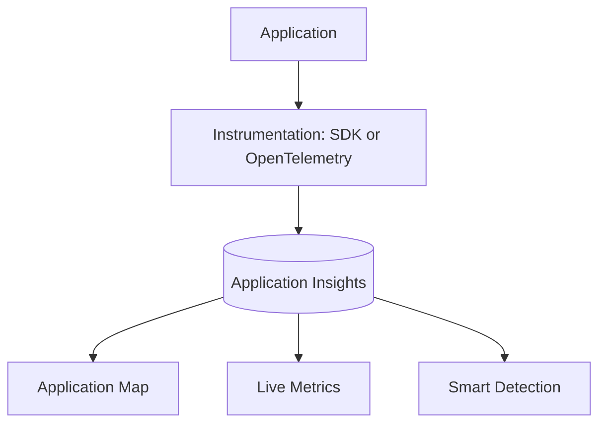

# Application Insights

Application Insights is an extension of Azure Monitor and provides Application Performance Management (APM) features. It allows you to monitor your live applications and automatically detects performance anomalies.

### OpenTelemetry and SDKs

Application Insights supports monitoring through various methods, with a focus on OpenTelemetry for a standardized and vendor-neutral approach.

*   **OpenTelemetry:** The recommended way to instrument applications, providing a consistent API and SDK across different languages and platforms.
*   **Application Insights SDKs:** Language-specific SDKs (e.g., .NET, Java, Node.js) that offer deep integration and features like autocollection for common libraries.

### Telemetry Types

Application Insights collects several types of telemetry to give you a complete picture of your application's health:

*   **Requests:** Incoming requests to your application, including response time and status code.
*   **Dependencies:** Calls from your application to external services, such as databases or APIs.
*   **Exceptions:** Details of errors that occur within your code.
*   **Page views and browser telemetry:** Data from the client-side of your web application.

### Application Map and Live Metrics

These tools provide real-time visibility into your application's architecture and performance.

#### Application Map
The Application Map provides a visual representation of your application's components and their relationships. It shows health metrics and performance indicators for each component.

#### Live Metrics
Live Metrics Stream allows you to monitor the health and performance of your application in real-time, with sub-second latency. This is useful for observing the impact of a new deployment or troubleshooting an active issue.

## See Also
*   [How Azure Monitor Works](how-azure-monitor-works.md)
*   [Log Analytics Workspace](log-analytics-workspace.md)

## Sources
*   https://learn.microsoft.com/azure/azure-monitor/app/app-insights-overview
