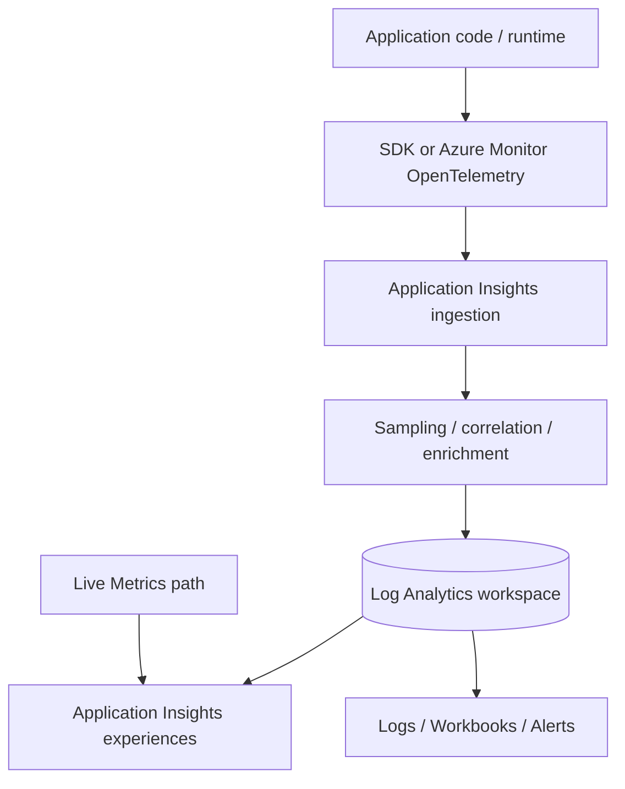
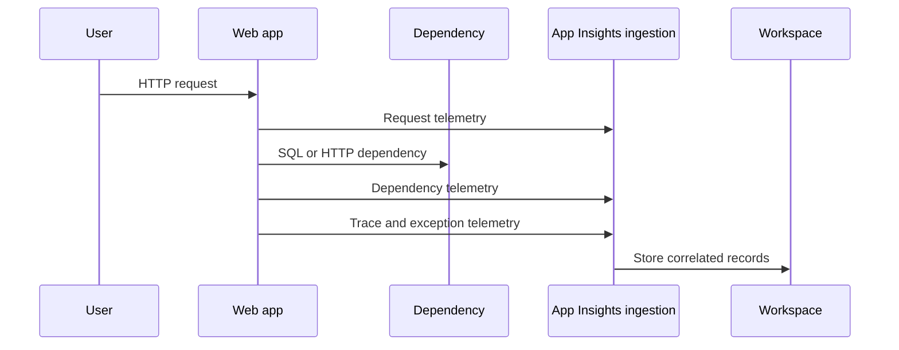

---
content_sources:
  diagrams:
    - id: architecture-overview
      type: flowchart
      source: mslearn-adapted
      based_on:
        - https://learn.microsoft.com/en-us/azure/azure-monitor/app/app-insights-overview
        - https://learn.microsoft.com/en-us/azure/azure-monitor/app/create-workspace-resource
        - https://learn.microsoft.com/en-us/azure/azure-monitor/app/opentelemetry-overview
        - https://learn.microsoft.com/en-us/azure/azure-monitor/app/live-stream
        - https://learn.microsoft.com/en-us/azure/azure-monitor/app/availability-overview
        - https://learn.microsoft.com/en-us/azure/azure-monitor/app/distributed-trace-data
        - https://learn.microsoft.com/en-us/cli/azure/monitor/app-insights?view=azure-cli-latest
        - https://learn.microsoft.com/en-us/cli/azure/monitor/scheduled-query?view=azure-cli-latest
    - id: data-flow-diagram-for-a-web-request
      type: sequenceDiagram
      source: mslearn-adapted
      based_on:
        - https://learn.microsoft.com/en-us/azure/azure-monitor/app/app-insights-overview
        - https://learn.microsoft.com/en-us/azure/azure-monitor/app/create-workspace-resource
        - https://learn.microsoft.com/en-us/azure/azure-monitor/app/opentelemetry-overview
        - https://learn.microsoft.com/en-us/azure/azure-monitor/app/live-stream
        - https://learn.microsoft.com/en-us/azure/azure-monitor/app/availability-overview
        - https://learn.microsoft.com/en-us/azure/azure-monitor/app/distributed-trace-data
        - https://learn.microsoft.com/en-us/cli/azure/monitor/app-insights?view=azure-cli-latest
        - https://learn.microsoft.com/en-us/cli/azure/monitor/scheduled-query?view=azure-cli-latest
---

# Application Insights
Application Insights is Azure Monitor’s application performance management layer for requests, dependencies, exceptions, traces, page views, availability, and user-impact analysis.
In modern Azure Monitor design, Application Insights is usually workspace-based, which means the telemetry is stored in Log Analytics while still powering curated APM experiences such as Application Map, Failures, Performance, Live Metrics, and Transaction Search.

## Architecture Overview
Application Insights should be understood as both an ingestion model and a set of analysis experiences.
Instrumentation emits telemetry, Azure Monitor processes and correlates it, the workspace stores it, and the Application Insights experience layer renders application-centric views on top.
<!-- diagram-id: architecture-overview -->

There are five architecture concepts to keep in view.

1. **Instrumentation is the source of truth**
    - No instrumentation means no request, dependency, or exception telemetry.
    - Diagnostic settings do not replace application instrumentation.
2. **Workspace-based storage is the default architectural direction**
    - Application data is stored in a Log Analytics workspace.
    - The Application Insights resource still exists as the application-centric control and experience surface.
3. **Correlation is a first-class capability**
    - Operation IDs, parent-child spans, cloud role names, and dependency telemetry allow distributed tracing.
4. **Sampling changes cost and fidelity**
    - Sampling can significantly reduce ingestion cost.
    - It can also reduce the completeness of investigations if configured badly.
5. **Live and historical analysis are different modes**
    - Live Metrics is optimized for immediate observation.
    - KQL and curated blades are optimized for historical analysis.

### Component relationships
| Component | Main role | Typical decision |
|---|---|---|
| Application code or runtime | Emits telemetry | Choose auto-instrumentation or explicit SDK/OpenTelemetry |
| Application Insights resource | App-centric control surface | Workspace linkage, availability tests, feature posture |
| Log Analytics workspace | Durable telemetry store | Retention, query access, export, networking |
| Alerting layer | Detect user-impacting conditions | Metric alerts, log alerts, smart detection review |
| Workbooks and dashboards | Operational visualization | Team and environment scoping |

## Core Concepts

### Instrumentation model decides what you can see
Application Insights is only as useful as the instrumentation strategy.
Microsoft Learn now recommends Azure Monitor OpenTelemetry for many new workloads because it aligns with industry standards and keeps telemetry pipelines more portable.
Some workloads still use classic Application Insights SDKs or auto-instrumentation features.

#### Common telemetry types
- **Requests**
    - Server-side operations entering the application.
    - Includes response code, duration, success, and operation context.
- **Dependencies**
    - Outbound calls to SQL, HTTP endpoints, queues, storage, and other services.
    - Critical for showing where latency or failures originate.
- **Exceptions**
    - Captured failures with stack, message, and operation correlation.
- **Traces**
    - Application log-like records and custom diagnostic messages.
- **Custom events and custom metrics**
    - Business or workflow-specific telemetry.
- **Availability results**
    - Synthetic checks that validate endpoint reachability and correctness.

#### Instrumentation choices
| Choice | Best fit | Watch out for |
|---|---|---|
| Azure Monitor OpenTelemetry | New builds, standard telemetry model | Ensure exporter and sampling are configured deliberately |
| Classic Application Insights SDK | Existing apps already using it | Migration planning and feature parity |
| Auto-instrumentation | Low-code onboarding or platform-managed scenarios | Lower control than explicit instrumentation |

### CLI example: create a workspace-based Application Insights component
```bash
az monitor app-insights component create     --app "$APP_INSIGHTS_NAME"     --location "$LOCATION"     --resource-group "$RG"     --workspace "$WORKSPACE_ID"     --application-type "web"     --output json
```
Example output:
```json
{
  "appId": "xxxxxxxx-xxxx-xxxx-xxxx-xxxxxxxxxxxx",
  "applicationId": "appi-prod-checkout",
  "connectionString": "InstrumentationKey=<redacted>;IngestionEndpoint=https://koreacentral-0.in.applicationinsights.azure.com/;LiveEndpoint=https://koreacentral.livediagnostics.monitor.azure.com/",
  "id": "/subscriptions/<subscription-id>/resourceGroups/rg-monitoring-prod/providers/microsoft.insights/components/appi-prod-checkout",
  "kind": "web",
  "location": "koreacentral",
  "name": "appi-prod-checkout",
  "workspaceResourceId": "/subscriptions/<subscription-id>/resourceGroups/rg-monitoring-prod/providers/Microsoft.OperationalInsights/workspaces/law-prod-observability"
}
```
This output shows the dual nature of the service.
The Application Insights component exists, but the workspace is the durable store.

### Workspace-based mode changes operating practice
In a workspace-based design:
- Application Insights experiences still exist in the portal.
- KQL queries run directly against workspace-backed tables.
- Retention and networking behavior are affected by workspace settings.
- Cross-resource correlation gets easier when app and infrastructure data share the same workspace.
This is usually the preferred model because it unifies application and platform operations.

### Correlation is the feature that changes troubleshooting quality
Many teams think of Application Insights only as request charts.
The real value appears when requests, dependencies, traces, and exceptions share operation context.
That is what allows you to follow one user operation through several microservices or downstream dependencies.

#### Correlation fields you should understand
- Operation ID.
- Parent ID.
- Cloud role name.
- Dependency target.
- Success flag.
- Result code or response code.

#### Why correlation matters
- It distinguishes a slow database dependency from slow application code.
- It reveals whether failures are user-facing requests or only background jobs.
- It powers Application Map and end-to-end transaction views.

### CLI example: query request latency and failure rate
```bash
az monitor log-analytics query     --workspace "$WORKSPACE_ID"     --analytics-query "requests | where timestamp > ago(1h) | summarize Requests=count(), FailureRate=100.0 * avg(todouble(not(success))), P95DurationMs=percentile(duration, 95) / 1ms by cloud_RoleName"     --output table
```
Example output:
```text
cloud_RoleName      Requests    FailureRate    P95DurationMs
------------------  ----------  -------------  -------------
checkout-api             18231           0.42            486
checkout-worker           1247           0.00            211
frontend-web             90514           0.17            321
```
This is a typical operational query because it combines user impact and latency by logical component.

### Live Metrics is not the same as standard analytics
Live Metrics provides near-real-time visibility for supported telemetry streams.
It is useful for validating a rollout, observing a live incident, or confirming whether an active mitigation changed throughput or failure rate.
It should not be treated as the long-term store.
Historical analysis and alerting still rely on the underlying data platform.

### Availability tests extend application monitoring beyond code
Application Insights supports synthetic monitoring through availability tests.
That means the product can validate external behavior, not only internal server timing.
Use availability tests when:
- You need to confirm public reachability.
- You need to measure response validation from expected endpoints.
- You need a simple outside-in signal for alerting.
Be careful not to confuse an availability test passing with the whole application being healthy.
A single endpoint can pass while background processing or deeper dependencies are failing.

## Data Flow
Application Insights data flow starts in code, but it does not end in the component resource.

### Ingestion flow
1. Application emits telemetry through SDK, OpenTelemetry, or auto-instrumentation.
2. Azure Monitor receives the telemetry at the application ingestion endpoint.
3. Telemetry is enriched, correlated, and possibly sampled.
4. Workspace-based tables store the records.
5. Application Insights experiences, workbooks, KQL, and alerts consume the records.

### Data flow by telemetry type
| Telemetry type | Typical table or experience | Main use |
|---|---|---|
| Request | `requests` | User-facing performance and error analysis |
| Dependency | `dependencies` | Downstream latency and failure isolation |
| Exception | `exceptions` | Failure diagnostics |
| Trace | `traces` | App logs and custom diagnostics |
| Availability | Availability views and related data | Synthetic monitoring |
| Custom event / metric | Custom tables and app views | Business workflow observability |

### Data flow diagram for a web request
<!-- diagram-id: data-flow-diagram-for-a-web-request -->


### Failure points in the flow
| Stage | Symptom | Likely cause |
|---|---|---|
| Instrumentation | No data at all | SDK missing, wrong connection string, exporter not configured |
| Correlation | Requests appear but dependencies do not connect | Unsupported library, custom code path, trace context mismatch |
| Volume control | Data looks incomplete | Sampling too aggressive |
| Workspace storage | Component exists but tables are empty | Wrong workspace linkage or ingestion problem |
| Consumption | Portal chart empty or partial | Wrong time range, wrong role filter, KQL bug |

### CLI example: query dependency failures for one application role
```bash
az monitor log-analytics query     --workspace "$WORKSPACE_ID"     --analytics-query "dependencies | where timestamp > ago(1h) | where cloud_RoleName == 'checkout-api' | summarize Calls=count(), Failures=countif(success == false), P95Ms=percentile(duration, 95) / 1ms by target, type"     --output table
```
Example output:
```text
target                         type    Calls    Failures    P95Ms
-----------------------------  ------  -------  ----------  -----
sql-prod-checkout.database     SQL       9244           3    148
redis-prod-cache               Redis    12011          27     19
api.payment.contoso.internal   HTTP      3812          94    612
```
This kind of query usually reveals whether the application itself is slow or whether one dependency dominates the problem.

## Integration Points
Application Insights is tightly connected to the rest of Azure Monitor.

### Log Analytics workspace
Workspace-based storage is the most important integration point.
It allows app telemetry to be queried beside platform logs and infrastructure logs.

### Alerts
Application Insights telemetry can drive metric alerts and log alerts.
Choose metric alerts for fast thresholds and log alerts for correlated conditions such as “error rate is high and dependency failures are increasing.”

### Workbooks
Workbooks combine requests, dependencies, exceptions, platform metrics, and deployment metadata into one operational narrative.

### Deployment and release workflows
Many teams use Application Insights immediately after deployment to validate latency, error rate, throughput, and dependency health.
Live Metrics and workbook views are especially useful during controlled rollouts.

### OpenTelemetry ecosystem
OpenTelemetry keeps instrumentation closer to industry standards and can simplify multi-vendor observability strategies while still using Azure Monitor as the backend.

## Configuration Options
Application Insights has several settings that materially affect operations.

### Key configuration choices
| Area | Decision | Why it matters |
|---|---|---|
| Workspace linkage | Which workspace stores the data | Correlation, retention, access, networking |
| Instrumentation method | SDK, OpenTelemetry, auto-instrumentation | Data quality and control |
| Sampling | Fixed, adaptive, or none | Cost versus fidelity |
| Availability tests | Which endpoints and locations | Outside-in monitoring |
| Alerts | Metric, log, smart detection review | Detection strategy |

### CLI example: inspect the component configuration
```bash
az monitor app-insights component show     --app "$APP_INSIGHTS_NAME"     --resource-group "$RG"     --query "{name:name,kind:kind,location:location,applicationType:applicationType,workspaceResourceId:workspaceResourceId,connectionString:connectionString}"     --output json
```
Example output:
```json
{
  "applicationType": "web",
  "connectionString": "InstrumentationKey=<redacted>;IngestionEndpoint=https://koreacentral-0.in.applicationinsights.azure.com/;LiveEndpoint=https://koreacentral.livediagnostics.monitor.azure.com/",
  "kind": "web",
  "location": "koreacentral",
  "name": "appi-prod-checkout",
  "workspaceResourceId": "/subscriptions/<subscription-id>/resourceGroups/rg-monitoring-prod/providers/Microsoft.OperationalInsights/workspaces/law-prod-observability"
}
```

### CLI example: create an availability-failure alert using scheduled query
The `az monitor scheduled-query create` command uses a placeholder in `--condition` and the KQL body in `--condition-query`.
```bash
az monitor scheduled-query create \
    --name "alert-checkout-availability-failures" \
    --resource-group "$RG" \
    --scopes "$WORKSPACE_ID" \
    --condition "count 'AvailabilityFailures' > 0" \
    --condition-query "AvailabilityFailures=availabilityResults | where timestamp > ago(5m) | where success == false" \
    --description "Trigger when synthetic availability failures are detected for the checkout application." \
    --evaluation-frequency "5m" \
    --window-size "5m" \
    --severity 2 \
    --skip-query-validation true \
    --output json
```
Example output:
```json
{
  "enabled": true,
  "evaluationFrequency": "PT5M",
  "id": "/subscriptions/<subscription-id>/resourceGroups/rg-monitoring-prod/providers/Microsoft.Insights/scheduledQueryRules/alert-checkout-availability-failures",
  "name": "alert-checkout-availability-failures",
  "severity": 2,
  "windowSize": "PT5M"
}
```

### Recommended configuration review topics
1. **Connection string handling**
    - Use secure configuration management.
    - Never hardcode values in source control.
2. **Sampling posture**
    - Review whether high-traffic services need adaptive or fixed sampling.
    - Ensure critical workflows remain sufficiently visible.
3. **Cloud role naming**
    - Use clear, stable role names for multi-service applications.
    - This directly improves Application Map and KQL usability.
4. **Availability coverage**
    - Monitor public endpoints and key health routes.
    - Align with service-level objectives.

## Pricing Considerations
Application Insights cost is driven mainly by telemetry ingestion volume and related retention choices.

### Primary cost drivers
- Request and dependency volume in high-traffic services.
- Trace verbosity from application logging.
- Exception storms during unstable releases.
- Retention beyond default interactive windows.
- Duplicate telemetry to other systems.

### Cost optimization guidance
1. Sample thoughtfully rather than globally suppressing telemetry.
2. Keep verbose trace logging out of steady-state production unless justified.
3. Use custom events and custom metrics only for signals with clear value.
4. Prefer metric alerts for simple thresholds instead of expensive repeated log scans.
5. Review top app tables in the workspace regularly.

### Cost anti-patterns
- Turning on highly verbose trace logging permanently in production.
- Treating Application Insights as a raw audit log for every business event.
- Ignoring dependency and request volume after major feature launches.
- Using aggressive sampling with no validation of investigative blind spots.

## Limitations and Quotas
Always confirm current Microsoft Learn limits before final rollout.
The most important practical limits are usually design-related.

### Key limitations
- No instrumentation means no application visibility.
- Sampling can make rare issues harder to investigate if not planned.
- Not every framework or library has identical auto-collection behavior.
- Live Metrics is not a complete historical record.
- Application telemetry alone does not replace platform metrics and resource logs.

### Design implications
| Limitation | Operational impact | Design response |
|---|---|---|
| Missing instrumentation | Portal blades look empty or partial | Standardize onboarding per runtime |
| Over-sampling | Rare errors disappear from history | Validate sampling against critical paths |
| Weak role naming | Maps and queries become confusing | Enforce naming conventions |
| App-only view | Infrastructure issues remain hidden | Correlate with workspace and platform telemetry |

### Practical review checklist
- Verify every critical service emits requests, dependencies, traces, and exceptions.
- Verify cloud role naming reflects real service boundaries.
- Verify availability tests cover the public user path, not only internal health checks.
- Verify KQL queries used by runbooks still match current schema and service names.
- Verify cost reviews include app tables, not only infrastructure tables.

### Common operating patterns

#### Golden signals with Application Insights
Most production teams use Application Insights to answer four questions first.

1. Is request volume normal?
2. Is user-facing latency increasing?
3. Are dependencies failing or slowing down?
4. Are exceptions concentrated in one service or endpoint?
Those questions map naturally to `requests`, `dependencies`, and `exceptions` queries.

#### Release validation workflow
After a deployment, teams often review:
- Request count compared with baseline.
- Failure rate by operation name.
- P95 and P99 duration by cloud role.
- Dependency failures against critical downstream systems.
- Live Metrics to confirm the service is not actively regressing.
Application Insights is especially useful here because it combines service performance and failure context in one place.

#### Application Map usage guidance
Application Map is most helpful when cloud role naming and dependency correlation are clean.
It becomes less useful when every service shares the same role name or when unsupported dependencies are not instrumented.
Use it to identify:
- Which service sits on the critical path.
- Which dependency fan-out pattern is causing latency.
- Whether one node in a distributed system has abnormal failure behavior.

### KQL usage patterns for app telemetry

#### Query pattern: operation-level failures
Use this kind of query for endpoint-level failure isolation.
```kusto
requests
| where timestamp > ago(1h)
| summarize Requests=count(), Failures=countif(success == false), P95=percentile(duration, 95) by name
| top 10 by Failures desc
```
This pattern answers whether one route or controller is driving the incident.

#### Query pattern: dependency bottlenecks
Use this query family to isolate downstream problems.
```kusto
dependencies
| where timestamp > ago(1h)
| summarize Calls=count(), Failures=countif(success == false), P95=percentile(duration, 95) by target, type
| top 10 by P95 desc
```
This pattern is useful when the application is slow but infrastructure metrics look normal.

#### Query pattern: trace-exception correlation
Use a correlation query when you need to connect verbose traces and thrown exceptions within the same operation.
```kusto
exceptions
| where timestamp > ago(30m)
| join kind=leftouter (traces | where timestamp > ago(30m)) on operation_Id
| project timestamp, problemId, outerMessage=message, traceMessage=message1, cloud_RoleName
```
This pattern often gives richer context than looking at exceptions alone.

### Telemetry hygiene recommendations
Good data quality is an application design responsibility.

#### Naming hygiene
- Use stable cloud role names.
- Use meaningful operation names.
- Avoid random or host-specific role naming patterns.

#### Context hygiene
- Preserve trace context across service boundaries.
- Propagate correlation headers through custom middleware and gateways.
- Enrich telemetry with environment and service metadata where supported.

#### Logging hygiene
- Keep trace verbosity aligned with operational value.
- Avoid logging secrets, tokens, or sensitive payloads.
- Prefer structured custom events over unbounded free-form traces for important workflow states.

### Application Insights and the wider platform
Application Insights is strongest when paired with surrounding Azure Monitor signals.

#### Pair with platform metrics
Use resource metrics to validate whether an app issue matches host or service saturation.
For example, high request duration with normal CPU may suggest dependency latency or lock contention rather than raw compute exhaustion.

#### Pair with resource logs
Use resource logs when the hosting platform itself may be failing.
Examples include App Service platform logs, Application Gateway access logs, or AKS control plane and container logs.

#### Pair with change telemetry
Pair app telemetry with Activity Log events or deployment markers when a regression started after a release or configuration change.

### Smart detection and anomaly features
Microsoft Learn also documents smart and curated experiences that can assist operators.
These features can help surface:
- Failure anomalies.
- Performance degradation.
- Dependency anomaly patterns.
They are useful accelerators, but they should not replace explicit alert rules and runbook-friendly KQL.
Treat them as an extra signal, not the only signal.

### Questions to answer before production rollout
1. Which services must be instrumented on day one?
2. Which transaction paths are business critical and need dependency visibility?
3. What sampling model preserves enough detail for rare but severe incidents?
4. Which availability tests represent real user journeys?
5. Which role naming convention will remain stable across releases and environments?
6. Which KQL queries will operators use in the first 15 minutes of an incident?
7. Which application teams own remediation when dependency failures are external versus internal?
8. Which data should be excluded because it is low value or sensitive?

## See Also
- [How Azure Monitor Works](how-azure-monitor-works.md)
- [Data Platform](data-platform.md)
- [Log Analytics Workspace](log-analytics-workspace.md)
- [Metrics and Dimensions](metrics-and-dimensions.md)
- [Alerts Architecture](alerts-architecture.md)

## Sources
- https://learn.microsoft.com/en-us/azure/azure-monitor/app/app-insights-overview
- https://learn.microsoft.com/en-us/azure/azure-monitor/app/create-workspace-resource
- https://learn.microsoft.com/en-us/azure/azure-monitor/app/opentelemetry-overview
- https://learn.microsoft.com/en-us/azure/azure-monitor/app/live-stream
- https://learn.microsoft.com/en-us/azure/azure-monitor/app/availability-overview
- https://learn.microsoft.com/en-us/azure/azure-monitor/app/distributed-trace-data
- https://learn.microsoft.com/en-us/cli/azure/monitor/app-insights?view=azure-cli-latest
- https://learn.microsoft.com/en-us/cli/azure/monitor/scheduled-query?view=azure-cli-latest
