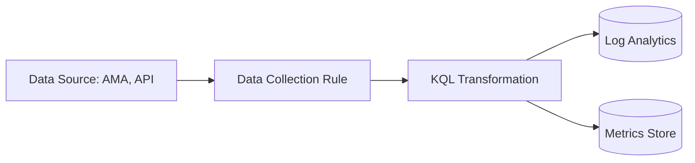

# Data Collection Rules

Data Collection Rules (DCRs) define the data to be collected from one or more sources and specify where that data should be sent. DCRs are used by the Azure Monitor Agent (AMA) and the Data Collection API.

### DCR Concepts

A DCR consists of several key components:

*   **Data Sources:** The sources of the data to be collected, such as Performance Counters, Syslog, or Windows Event Logs.
*   **Destinations:** One or more destinations for the collected data, such as a Log Analytics workspace or Azure Monitor Metrics.
*   **Data Flows:** The mapping between the data sources and the destinations.

### Transformations

DCRs allow you to transform the data as it's being collected. This is done using Kusto Query Language (KQL) queries. Common transformations include:

*   **Filtering:** Removing irrelevant data to reduce costs and complexity.
*   **Enrichment:** Adding context to the data, such as the environment or application name.
*   **Restructuring:** Changing the format of the data to match the destination schema.

### Azure Monitor Agent

The Azure Monitor Agent (AMA) is the primary agent for collecting data from your virtual machines and other resources. AMA uses DCRs to determine what data to collect and where to send it.

*   **Multi-homing:** A single agent can be configured with multiple DCRs, allowing it to send different data to different destinations.
*   **Performance:** AMA is designed for high performance and low resource consumption.
*   **Security:** AMA supports Managed Identities and Microsoft Entra ID for authentication.

## See Also
*   [How Azure Monitor Works](how-azure-monitor-works.md)
*   [Log Analytics Workspace](log-analytics-workspace.md)

## Sources
*   https://learn.microsoft.com/azure/azure-monitor/essentials/data-collection-rule-overview
