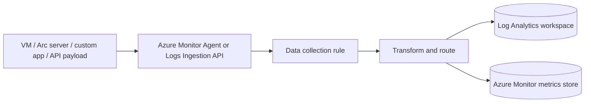
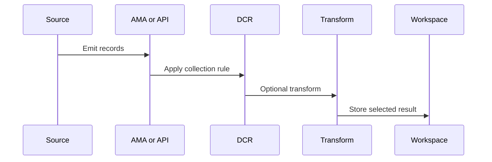

# Data Collection Rules
Data collection rules, or DCRs, define what Azure Monitor should collect, how selected records should be transformed, and where the resulting streams should be sent.
They are the configuration backbone for Azure Monitor Agent, the Logs Ingestion API, and several modern data onboarding patterns that need more control than legacy agent or diagnostic-setting approaches.

## Architecture Overview
A DCR separates telemetry collection intent from the monitored resource itself.
Instead of configuring every collection behavior directly on a machine, you declare sources, streams, transformations, and destinations in a reusable rule and then associate that rule with the relevant resource.

There are five architecture ideas to keep in mind.
1. **DCRs are reusable collection policies**
    - One rule can be associated with many resources when the telemetry requirement is the same.
2. **DCRs define streams, not just sources**
    - Windows events, Syslog, performance counters, custom text logs, and API payloads become named streams in the pipeline.
3. **DCRs can transform before storage**
    - Filtering and reshaping before ingestion can reduce cost and normalize schemas.
4. **Association is separate from rule definition**
    - A DCR can exist without affecting any machine until it is associated to a resource.
5. **DCRs modernize collection governance**
    - They provide more explicit control than ad hoc host-by-host agent settings.

### DCR building blocks
| Building block | Purpose |
|---|---|
| Data sources | Define what is collected, such as Syslog, performance counters, or Windows events |
| Streams | Logical representation of the data flowing through the rule |
| Destinations | Workspace or metrics targets that receive the data |
| Data flows | Mapping from streams to destinations |
| Transform KQL | Optional filtering or shaping before the data lands |

## Core Concepts

### DCRs are the preferred collection model for AMA
Azure Monitor Agent relies on DCRs to know what guest telemetry to collect.
That means the rule is where you decide whether to collect:
- Syslog facilities and levels.
- Windows event channels and event levels.
- Performance counters and collection frequency.
- Text or file-based custom logs where supported.
- API-ingested custom payloads through defined streams.
The agent is only the runtime.
The DCR is the policy.

### CLI example: create a DCR from a JSON rule file
Current Azure CLI help recommends `--rule-file` for non-trivial DCR definitions.
That pattern is safer than embedding large JSON blobs directly in shell arguments.
```bash
az monitor data-collection rule create \
    --name "$DCR_NAME" \
    --resource-group "$RG" \
    --location "$LOCATION" \
    --rule-file "$DCR_FILE" \
    --output json
```
Example output:
```json
{
  "id": "/subscriptions/<subscription-id>/resourceGroups/rg-monitoring-prod/providers/Microsoft.Insights/dataCollectionRules/dcr-linux-core",
  "location": "koreacentral",
  "name": "dcr-linux-core",
  "provisioningState": "Succeeded"
}
```
In practice you define sources, streams, destinations, and data flows together in the rule file.

### Association is what activates the rule
A DCR does nothing until it is associated with a machine, Arc server, VM scale set, or other supported target.
This separation is important because it lets you:
- Reuse the same rule across many resources.
- Roll out collection in stages.
- Update the rule independently of the target resource lifecycle.

### CLI example: associate a DCR with a VM
```bash
az monitor data-collection rule association create \
    --name "vm-app-01-linux-core" \
    --resource "$RESOURCE_ID" \
    --rule-id "$DCR_ID" \
    --description "Associate Linux baseline telemetry collection with vm-app-01." \
    --output json
```
Example output:
```json
{
  "description": "Associate Linux baseline telemetry collection with vm-app-01.",
  "id": "/subscriptions/<subscription-id>/resourceGroups/rg-monitoring-prod/providers/Microsoft.Compute/virtualMachines/vm-app-01/providers/Microsoft.Insights/dataCollectionRuleAssociations/vm-app-01-linux-core",
  "name": "vm-app-01-linux-core"
}
```
This association is the operational point where the monitored resource begins following the DCR policy.

### Transformations are a cost and quality control tool
DCR transformations use KQL-like syntax to reshape records before storage.
This is one of the most important architectural advantages of DCRs.
Use transformations when you need to:
- Drop low-value records before they reach the workspace.
- Keep only selected columns.
- Normalize incoming custom payloads.
- Enrich records with fixed values or simple derived fields.
Do not use transformations as a substitute for all downstream analytics.
The goal is pre-ingestion shaping, not replacing KQL investigation.

### Common DCR source patterns
| Source pattern | Typical use |
|---|---|
| Syslog baseline | Linux servers, appliances, Arc machines |
| Windows event baseline | Windows servers and domain workloads |
| Performance counter baseline | CPU, memory, disk, and network monitoring |
| Custom text logs | App or agent logs not covered by native collectors |
| Logs Ingestion API payload | Custom applications or external pipelines |

### CLI example: list associations for a resource
```bash
az monitor data-collection rule association list     --resource "$RESOURCE_ID"     --output json
```
Example output:
```json
[
  {
    "id": "/subscriptions/<subscription-id>/resourceGroups/rg-monitoring-prod/providers/Microsoft.Compute/virtualMachines/vm-app-01/providers/Microsoft.Insights/dataCollectionRuleAssociations/vm-app-01-linux-core",
    "name": "vm-app-01-linux-core",
    "properties": {
      "dataCollectionRuleId": "/subscriptions/<subscription-id>/resourceGroups/rg-monitoring-prod/providers/Microsoft.Insights/dataCollectionRules/dcr-linux-core"
    }
  }
]
```
This is one of the fastest ways to prove whether a VM is actually bound to the intended collection policy.

## Data Flow
DCR data flow is more explicit than many other Azure Monitor pipelines.

### AMA-driven flow
1. Azure Monitor Agent runs on the host.
2. The host is associated to a DCR.
3. The DCR defines data sources and streams.
4. Optional transform logic filters or shapes records.
5. Data flows send the results to the workspace or metrics store.
6. Queries, workbooks, and alerts consume the resulting tables or metrics.

### Logs Ingestion API flow
1. External producer sends data to Azure Monitor.
2. The DCR maps the payload to a stream.
3. Transform logic normalizes the payload if needed.
4. The destination receives the data in the selected table or stream.

### Data flow diagram with transformation stage


### Failure points in DCR-based collection
| Stage | Symptom | Common cause |
|---|---|---|
| Agent runtime | No guest data appears | AMA not installed or unhealthy |
| Association | DCR exists but host is silent | No association to the resource |
| Source definition | Only some data arrives | Wrong Syslog facility, event channel, or counter path |
| Transformation | Expected records missing | Transform filters out the data |
| Destination | Wrong workspace receives data | Incorrect destination in the DCR |

### Verification path
When DCR-based data is missing, validate in this order.
1. Is Azure Monitor Agent installed and healthy?
2. Is the right DCR associated to the resource?
3. Does the DCR include the expected sources and streams?
4. Does transform logic preserve the records you need?
5. Is the workspace query looking at the correct table and time range?

## Integration Points
DCRs connect several Azure Monitor capabilities.

### Azure Monitor Agent
AMA is the most obvious integration point.
The agent executes the collection policy defined by the DCR.

### Log Analytics workspace
Most DCR designs send data to a workspace.
That makes workspace governance, retention, and access design part of DCR planning.

### Metrics store
Some DCR scenarios can route collected data into metrics.
This is useful when you need fast alerting on data that originated outside the standard platform metric path.

### Logs Ingestion API
Custom ingestion scenarios use DCRs as the schema and routing layer.
This makes DCRs relevant even when no agent is involved.

### Alerts and workbooks
Once DCR-collected data lands, log alerts and workbooks consume it like any other workspace data.

## Configuration Options
DCR configuration choices directly affect cost, fidelity, and maintainability.

### Key options to review
| Area | Why it matters |
|---|---|
| Source set | Determines what is even eligible for collection |
| Collection frequency | Changes freshness and volume |
| Transform logic | Changes data quality and cost |
| Destination mapping | Decides where the data becomes visible |
| Association scope | Controls rollout and reuse |

### CLI example: inspect a DCR
```bash
az monitor data-collection rule show     --name "$DCR_NAME"     --resource-group "$RG"     --output json
```
Example output:
```json
{
  "dataFlows": [
    {
      "destinations": [
        "centralWorkspace"
      ],
      "streams": [
        "Microsoft-Syslog"
      ]
    }
  ],
  "destinations": {
    "logAnalytics": [
      {
        "name": "centralWorkspace",
        "workspaceResourceId": "/subscriptions/<subscription-id>/resourceGroups/rg-monitoring-prod/providers/Microsoft.OperationalInsights/workspaces/law-prod-observability"
      }
    ]
  },
  "location": "koreacentral",
  "name": "dcr-linux-core"
}
```

### CLI example: query a table commonly populated by DCR-based guest collection
```bash
az monitor log-analytics query     --workspace "$WORKSPACE_ID"     --analytics-query "Syslog | where TimeGenerated > ago(30m) | summarize Records=count() by Facility, SeverityLevel | top 10 by Records desc"     --output table
```
Example output:
```text
Facility     SeverityLevel    Records
-----------  ---------------  -------
authpriv     Error                 17
cron         Informational         28
daemon       Warning               11
syslog       Error                  4
```
This confirms not only that the DCR is associated, but also that the expected source data is arriving.

## Pricing Considerations
DCRs do not create cost directly in isolation.
They control what gets ingested, which strongly affects Azure Monitor cost.

### Cost drivers influenced by DCRs
- Number of sources enabled.
- Collection frequency for counters.
- Whether noisy records are filtered before storage.
- Number of destinations used.
- Reuse versus duplication of similar DCRs.

### Cost optimization guidance
1. Start with a clear baseline source set.
2. Filter low-value records before storage where supported.
3. Avoid creating slightly different DCRs for every machine if one shared rule will work.
4. Validate collection frequency against real operational need.
5. Review `Usage` data after every major DCR rollout.

### Common anti-patterns
- Collecting all Syslog levels from every facility with no ownership.
- Creating many nearly identical DCRs that are hard to audit.
- Adding transform logic that is too clever to maintain.
- Assuming a DCR update affects hosts immediately without validation.

## Limitations and Quotas
Always check Microsoft Learn for current service limits before large-scale rollout.

### Practical limitations
- DCR support varies by source type and monitored resource.
- Transform logic is powerful but not unlimited.
- Collection success still depends on the agent runtime and connectivity.
- Misconfigured associations can silently leave hosts unmonitored.

### Design implications
| Limitation | Response |
|---|---|
| Support varies by source | Standardize separate DCRs by workload type |
| Too many rules become hard to govern | Reuse DCRs where possible |
| Transform errors can hide data | Keep transform logic simple and testable |
| Association drift causes blind spots | Audit associations regularly |

### Baseline rollout guidance
- Define one Linux baseline DCR.
- Define one Windows baseline DCR.
- Add specialized DCRs only when a workload needs more collection than the baseline.
- Review exceptions quarterly so the DCR portfolio stays understandable.

### Example DCR portfolio patterns

#### Platform baseline pattern
Use one baseline DCR per operating system for common telemetry such as heartbeat, core counters, and standard logs.
This keeps onboarding simple and makes compliance reviews easier.

#### Workload extension pattern
Add a second DCR only when a workload needs extra logs, higher-frequency counters, or custom streams.
Examples include database-heavy systems, security monitoring hosts, or middleware appliances.

#### API ingestion pattern
Use a DCR with the Logs Ingestion API when a custom platform emits structured data that should become a workspace table.
Treat the DCR as schema documentation, not only as routing logic.

### DCR governance checklist
1. Is the rule name descriptive and stable?
2. Is the owner documented in tags?
3. Is the destination workspace intentional and approved?
4. Is every transform documented in plain language?
5. Is association rollout tracked so no target is missed?
6. Is there a rollback plan if a transform drops required data?

### Operational review guidance
- Review DCR changes in change management because they alter observability coverage.
- Review source volume after rollout to detect unexpected ingestion spikes.
- Review associations whenever new VMs or Arc machines are added to a fleet.
- Review transform logic after schema changes in custom payloads.

### Troubleshooting heuristics

#### If `Heartbeat` exists but `Syslog` does not
The agent is probably healthy, but the DCR source definition or association may be wrong.

#### If records appear in the wrong table
The transform or destination mapping likely does not match the expected stream.

#### If one fleet member is silent
Check association drift or machine-specific agent issues before editing the shared DCR.

### Simple transform design principles
- Filter only what you are confident is low value.
- Keep transform logic short enough that another engineer can read it quickly.
- Test with a narrow pilot before wide rollout.
- Document business meaning when a field is derived or renamed.

### Questions to answer before publishing a new DCR
1. Which hosts need this rule?
2. Which tables should the data land in?
3. Which volume increase do you expect after rollout?
4. Which alerts or workbooks depend on the new data?
5. Which rollback step removes or updates the association safely?

### Documentation recommendations
- Keep a diagram of baseline and specialized DCRs.
- Record which machine classes receive each association.
- Record the last validation query used to confirm success.
- Record which tables are expected to change after deployment.

### Why DCRs matter strategically
They move Azure Monitor collection from ad hoc per-host tuning toward policy-based collection.
That makes large environments easier to reason about, especially when the fleet spans Azure VMs, Arc servers, and custom ingestion pipelines.

### Change management reminder
- Treat DCR updates like production monitoring changes.
- Validate on a pilot target before broad rollout.
- Confirm expected tables and ingestion volume after each update.

### Example ownership model
- Platform team owns baseline DCRs.
- Workload teams request extensions through a reviewed process.
- Security team reviews rules that affect sensitive audit or event collection.

### Fleet audit guidance
Regularly answer these questions.
- Which resources have AMA installed but no DCR association?
- Which resources are associated to deprecated DCRs?
- Which DCRs have not changed in a long time but still collect high volumes?
- Which DCRs have transforms that no longer match current payload formats?

### Rule naming guidance
- Include operating system or workload class in the name.
- Include the purpose, such as baseline, security, or application extension.
- Keep the name stable even if individual hosts change.

### Destination strategy guidance
- Use a shared workspace when cross-host investigation matters.
- Use separate destinations only when a compliance or ownership boundary clearly requires it.
- Document why a DCR sends data to more than one destination.

### Final design reminder
Good DCRs are boring.
They are simple enough to audit, predictable enough to troubleshoot, and explicit enough that engineers know what data should appear where.
That is a strength, not a limitation.
Simple collection policies scale better than clever ones.
Keep them reviewable.
Keep them documented.

## See Also
- [How Azure Monitor Works](how-azure-monitor-works.md)
- [Log Analytics Workspace](log-analytics-workspace.md)
- [Data Platform](data-platform.md)
- [Networking and Security](networking-and-security.md)

## Sources
- https://learn.microsoft.com/en-us/azure/azure-monitor/data-collection/data-collection-rule-overview
- https://learn.microsoft.com/en-us/azure/azure-monitor/agents/azure-monitor-agent-overview
- https://learn.microsoft.com/en-us/azure/azure-monitor/data-collection/data-collection-transformations-create
- https://learn.microsoft.com/en-us/azure/azure-monitor/logs/logs-ingestion-api-overview
- https://learn.microsoft.com/en-us/azure/azure-monitor/vm/data-collection
- https://learn.microsoft.com/en-us/cli/azure/monitor/data-collection/rule?view=azure-cli-latest
