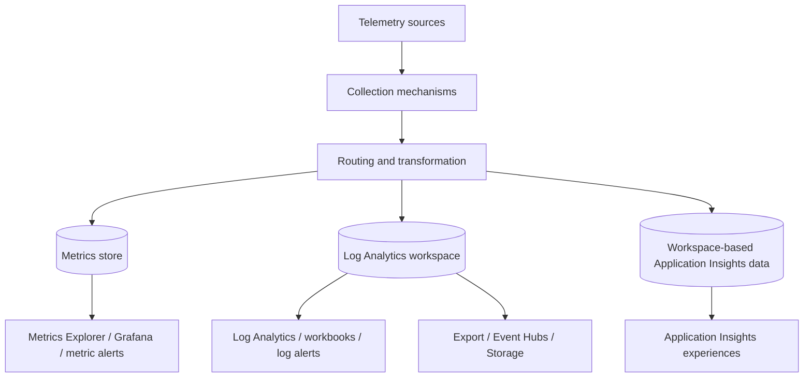
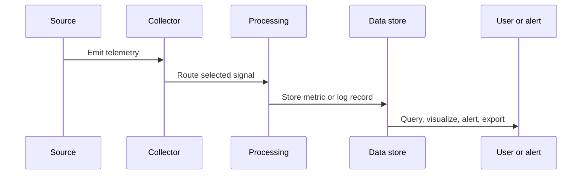

---
content_sources:
  diagrams:
    - id: architecture-overview
      type: flowchart
      source: mslearn-adapted
      based_on:
        - https://learn.microsoft.com/en-us/azure/azure-monitor/fundamentals/data-sources
        - https://learn.microsoft.com/en-us/azure/azure-monitor/metrics/data-platform-metrics
        - https://learn.microsoft.com/en-us/azure/azure-monitor/logs/data-platform-logs
        - https://learn.microsoft.com/en-us/azure/azure-monitor/logs/log-analytics-workspace-overview
        - https://learn.microsoft.com/en-us/azure/azure-monitor/app/app-insights-overview
        - https://learn.microsoft.com/en-us/azure/azure-monitor/platform/diagnostic-settings
        - https://learn.microsoft.com/en-us/azure/azure-monitor/cost-usage
    - id: data-platform-sequencing-diagram
      type: sequenceDiagram
      source: mslearn-adapted
      based_on:
        - https://learn.microsoft.com/en-us/azure/azure-monitor/fundamentals/data-sources
        - https://learn.microsoft.com/en-us/azure/azure-monitor/metrics/data-platform-metrics
        - https://learn.microsoft.com/en-us/azure/azure-monitor/logs/data-platform-logs
        - https://learn.microsoft.com/en-us/azure/azure-monitor/logs/log-analytics-workspace-overview
        - https://learn.microsoft.com/en-us/azure/azure-monitor/app/app-insights-overview
        - https://learn.microsoft.com/en-us/azure/azure-monitor/platform/diagnostic-settings
        - https://learn.microsoft.com/en-us/azure/azure-monitor/cost-usage
---

# Data Platform
Azure Monitor data platform combines specialized stores for metrics, logs, traces, and curated application telemetry.
The design goal is not to force every signal into one engine, but to keep each signal in the storage model that best matches latency, scale, correlation, and cost requirements.

## Architecture Overview
Azure Monitor data platform is easier to understand when separated into collection, routing, storage, query, and action layers.
<!-- diagram-id: architecture-overview -->

The data platform has four practical responsibilities.

1. **Accept telemetry from many producers**
    - Azure resources emit platform metrics automatically.
    - Azure resources emit resource logs when diagnostic settings are configured.
    - Azure Monitor Agent and the Logs Ingestion API emit workspace-bound log streams.
    - Application Insights and Azure Monitor OpenTelemetry emit application telemetry.
2. **Normalize data into supported streams**
    - Metrics are stored as time-series values with optional dimensions.
    - Logs are stored as rows in Kusto-backed tables.
    - Application telemetry becomes queryable in application-specific tables such as `requests`, `dependencies`, and `exceptions`.
3. **Expose the right query model**
    - Metrics use metric namespaces, aggregations, intervals, and dimensions.
    - Logs use Kusto Query Language, which supports filtering, parsing, joins, and summarization.
4. **Support response and export**
    - Alerts, autoscale, workbooks, dashboards, and partner tools consume the stored data.
    - Export patterns move selected data to Event Hubs or Storage when operational or compliance workflows need downstream copies.
A production architecture review should always answer three questions.
- Which signals must be near real time?
- Which signals must retain rich context for investigation?
- Which signals must be archived or shared outside Azure Monitor?

### Data platform building blocks
| Building block | Primary purpose | Typical data |
|---|---|---|
| Metrics store | Low-latency time series | CPU, latency, request count, availability |
| Log Analytics workspace | Investigative and operational log analytics | Resource logs, guest logs, application traces |
| Application Insights experience layer | Curated APM views on top of workspace-backed telemetry | Requests, dependencies, exceptions, availability |
| DCR and ingestion services | Route and transform logs before storage | AMA streams, custom logs, filtered records |
| Alerting layer | Evaluate conditions and trigger actions | Metric thresholds, KQL conditions, activity events |

## Core Concepts

### Signal type decides the storage engine
Microsoft Learn consistently separates metrics, logs, and traces because the trade-offs are different.
Metrics are optimized for speed and repeated evaluation.
Logs are optimized for flexible analysis.
Traces are specialized records that preserve operation context across services.

#### Metrics
Metrics are numerical measurements with a timestamp, metric name, namespace, and optional dimensions.
Platform metrics are collected automatically for many Azure resources.
Some scenarios also support custom metrics.
Use metrics for:
- Fast alert evaluation.
- Visualization of trends over short to medium periods.
- Autoscale and threshold-based automation.
- Dimension-based slicing such as by status code, instance, or node.
Be careful with metrics when:
- You need per-event detail.
- You need joins across resources.
- You need to parse payloads or preserve long text values.

#### Logs
Logs are records with many columns and flexible schemas.
The Kusto engine makes them suitable for correlation and investigation.
Use logs for:
- Root-cause analysis.
- Correlation across subscriptions, workspaces, or resource types.
- Parsing semi-structured data.
- Long-term operational review.
- Compliance-oriented retention and export patterns.
Be careful with logs when:
- You need very low alert latency.
- The only condition is a simple threshold on a platform metric.
- You have no plan to control ingestion volume.

#### Traces and application tables
Application Insights telemetry is still part of the Azure Monitor data platform.
Requests, dependencies, exceptions, traces, page views, and browser timings are stored as structured tables in a workspace-based model.
That means the telemetry is both application-centric and query-centric.
Use traces when:
- You need to follow one transaction through many services.
- You need dependency timing, correlation IDs, and failure context.
- You need performance analysis from the user transaction perspective rather than only resource health.

### CLI example: inspect workspace data platform settings
```bash
az monitor log-analytics workspace show \
    --resource-group "$RG" \
    --workspace-name "$WORKSPACE_NAME" \
    --query "{name:name,location:location,sku:sku.name,retentionInDays:retentionInDays,features:features,workspaceCapping:workspaceCapping}" \
    --output json
```
Example output:
```json
{
  "features": {
    "disableLocalAuth": false,
    "enableDataExport": true,
    "immediatePurgeDataOn30Days": false
  },
  "location": "koreacentral",
  "name": "law-prod-observability",
  "retentionInDays": 30,
  "sku": "PerGB2018",
  "workspaceCapping": {
    "dailyQuotaGb": -1,
    "dataIngestionStatus": "RespectQuota"
  }
}
```
This output shows the workspace as a data platform boundary.
Retention, local authentication posture, and capping behavior all affect how logs are consumed and governed.

### Data collection path decides schema and cost
The second design concept is that collection method shapes the resulting data.
A resource log routed with diagnostic settings is not the same as a guest log collected with AMA.
A transformed DCR stream is not the same as a raw application telemetry stream.

#### Common collection paths
1. **Platform metrics path**
    - Source: Azure resource provider.
    - Configuration: Usually automatic, sometimes with dimension or alert selection later.
    - Store: Metrics store.
2. **Diagnostic settings path**
    - Source: Supported Azure resource logs and exportable metrics.
    - Configuration: Diagnostic setting on the resource.
    - Store: Workspace, Storage, Event Hubs, or partner destination.
3. **AMA plus DCR path**
    - Source: Guest OS and custom text logs.
    - Configuration: Data collection rule plus resource association.
    - Store: Workspace and supported metrics destinations.
4. **Application Insights path**
    - Source: Instrumented application.
    - Configuration: Connection string, SDK/OpenTelemetry, sampling, workspace linkage.
    - Store: Workspace-based application tables.
The same monitored service may use several paths.
For example, an App Service application can emit platform metrics, resource logs, and application telemetry at the same time.
Each path answers a different operational question.

### CLI example: inspect metric definitions available in the metrics store
```bash
az monitor metrics list-definitions \
    --resource "$RESOURCE_ID" \
    --output table
```
Example output:
```text
Name                          Unit       Primary Aggregation Type    Dimensions
----------------------------  ---------  --------------------------  -----------------------------
Percentage CPU                Percent    Average, Minimum, Maximum   VMName
Network In Total              Bytes      Total                       VMName
Network Out Total             Bytes      Total                       VMName
Disk Read Bytes               Bytes      Total                       LUN
Disk Write Bytes              Bytes      Total                       LUN
```
This is a pure metrics-platform view.
If the signal you need is already here, you usually do not need to recreate it through log ingestion.

### Table shape matters more than many teams expect
Log Analytics does not behave like a generic file bucket.
Data lands in tables, and those table choices strongly influence KQL queries, retention decisions, and export patterns.

#### Common workspace table styles
| Table style | Example | What it means |
|---|---|---|
| Azure-native application tables | `requests`, `dependencies`, `exceptions` | Curated application telemetry schema |
| Legacy/shared diagnostics table | `AzureDiagnostics` | Multi-resource table with broad schema |
| Resource-specific tables | `AppServiceHTTPLogs`, `StorageBlobLogs` | More structured resource provider output |
| Agent tables | `Perf`, `Heartbeat`, `Syslog`, `Event` | Guest OS and infrastructure visibility |
| Custom tables | `CustomAppAudit_CL` | Logs from custom ingestion or connectors |
Choose resource-specific tables when supported because they are easier to query and often more predictable than highly generalized tables.

### CLI example: query a workspace table to verify actual landing shape
```bash
az monitor log-analytics query \
    --workspace "$WORKSPACE_ID" \
    --analytics-query "Heartbeat | where TimeGenerated > ago(15m) | summarize LastSeen=max(TimeGenerated) by Computer, OSType" \
    --output table
```
Example output:
```text
Computer        OSType    LastSeen
--------------  --------  ------------------------
vm-app-01       Linux     2026-04-05T08:21:37Z
vm-app-02       Linux     2026-04-05T08:21:12Z
vm-jump-01      Windows   2026-04-05T08:20:54Z
```
This validates that data is not only configured, but actually landing in a specific table with expected columns.

### Data platform boundaries are architectural boundaries
A workspace is often treated as only a storage target.
In practice it is also a boundary for:
- RBAC and query access.
- Regional placement.
- Interactive retention settings.
- Daily cap safety controls.
- Data export and networking behavior.
Likewise, the metrics store is a boundary for:
- Dimension cardinality.
- Aggregation model.
- Retention window.
- Alert latency expectations.

## Data Flow
The Azure Monitor data platform uses several concurrent data flows.
Understanding them helps explain why one signal appears in seconds while another appears after a delay.

### Resource metric flow
1. Azure resource provider emits a point.
2. Azure Monitor metrics service stores it in the resource metric namespace.
3. Metrics Explorer, Grafana, autoscale, and metric alerts read the value.
This is the lowest-friction path.
It requires the least configuration and is usually the first operational signal available.

### Resource log flow
1. Resource produces a log event in a supported category.
2. Diagnostic settings decide which categories and destinations are enabled.
3. Log lands in a workspace table, Storage account, Event Hubs namespace, or partner sink.
4. KQL queries, workbooks, and log alerts consume it.
This path is category- and destination-dependent.
Enabling everything without a purpose creates noisy workspaces and unnecessary spend.

### AMA and DCR flow
1. Azure Monitor Agent runs on a machine or Arc-enabled server.
2. DCR declares sources, streams, transformations, and destinations.
3. Agent sends records to Azure Monitor ingestion endpoints.
4. Azure Monitor writes the records to target tables or metrics destinations.
This path is flexible and is the preferred modern model for guest collection.

### Application telemetry flow
1. Application code or auto-instrumentation emits telemetry.
2. Ingestion service enriches and processes the telemetry.
3. Workspace-backed tables store the data.
4. Application Insights experiences and KQL analytics use the result.
Sampling and enrichment decisions affect both cost and diagnostic fidelity.

### Flow comparison
| Flow | Best for | Main latency profile | Main design control |
|---|---|---|---|
| Platform metrics | Threshold alerting and trend charts | Low | Scope, aggregation, dimensions |
| Diagnostic settings | Resource provider detail | Medium | Category and destination |
| AMA plus DCR | Guest and custom collection | Medium | Streams, transformation, destination |
| App Insights | APM and traces | Medium, with separate live features | Instrumentation and sampling |

### Data platform sequencing diagram
<!-- diagram-id: data-platform-sequencing-diagram -->


### Operational checkpoints in the flow
When data is missing, validate in this order.

1. **Source emitting**
    - Is the application instrumented?
    - Does the resource support the category?
2. **Collection configured**
    - Is diagnostic setting enabled?
    - Is the DCR associated to the resource?
3. **Destination correct**
    - Did data go to the expected workspace?
    - Is the region supported for the feature?
4. **Consumption correct**
    - Are you querying the right table and time range?
    - Are you using the correct metric namespace and dimension filters?

## Integration Points
Azure Monitor data platform integrates with surrounding Azure services rather than replacing them.

### Resource providers and diagnostic settings
Many Azure resource providers support metrics automatically and logs through diagnostic settings.
This is the standard platform integration point for Azure-native services.

### Application Insights and OpenTelemetry
Application Insights is a first-class consumer of the same data platform.
The integration point is application instrumentation, not diagnostic settings.

### Managed Prometheus and Grafana
Azure Monitor managed service for Prometheus stores Prometheus metrics for supported Kubernetes scenarios.
Grafana can query Azure Monitor metrics, logs, and Prometheus data as visualization sources.

### Event Hubs and Storage
Diagnostic settings and workspace export make the platform interoperable with SIEM, lakehouse, or long-term archival pipelines.

### RBAC and Microsoft Entra ID
Workspace access, resource-context queries, and automation all depend on Microsoft Entra ID identities and Azure RBAC assignments.

## Configuration Options
Configuration choices define behavior more than the storage engines do.

### Core options to review
| Area | Options to review | Why it matters |
|---|---|---|
| Workspace | SKU, retention, daily cap, networking, local auth | Cost, governance, access |
| Diagnostic settings | Categories, destination, per-resource rollout | Ingestion volume and usefulness |
| DCR | Sources, transformKql, destinations, associations | Filtering before storage |
| Application Insights | Workspace-based mode, sampling, connection string | App observability cost and fidelity |
| Alert rules | Signal type, evaluation frequency, window | Detection speed and reliability |

### CLI example: create a resource diagnostic setting
```bash
az monitor diagnostic-settings create \
    --name "send-to-law-prod" \
    --resource "$RESOURCE_ID" \
    --workspace "$WORKSPACE_ID" \
    --logs '[{"category":"AuditEvent","enabled":true}]' \
    --metrics '[{"category":"AllMetrics","enabled":true}]' \
    --output json
```
Example output:
```json
{
  "id": "/subscriptions/<subscription-id>/resourceGroups/rg-monitoring-prod/providers/Microsoft.Sql/servers/sql-prod-01/providers/microsoft.insights/diagnosticSettings/send-to-law-prod",
  "logs": [
    {
      "category": "AuditEvent",
      "enabled": true
    }
  ],
  "metrics": [
    {
      "category": "AllMetrics",
      "enabled": true
    }
  ],
  "name": "send-to-law-prod",
  "workspaceId": "/subscriptions/<subscription-id>/resourceGroups/rg-monitoring-prod/providers/Microsoft.OperationalInsights/workspaces/law-prod-observability"
}
```

### CLI example: inspect workspace table availability indirectly with a query
```bash
az monitor log-analytics query \
    --workspace "$WORKSPACE_ID" \
    --analytics-query "search * | where TimeGenerated > ago(10m) | summarize Records=count() by \$table | top 5 by Records desc" \
    --output table
```
Example output:
```text
$Table                Records
--------------------  -------
Heartbeat             1542
AzureActivity          218
Perf                   176
requests                91
AppServiceHTTPLogs      44
```
This is useful after onboarding a new environment because it confirms where the largest current telemetry volumes are landing.

## Pricing Considerations
Azure Monitor pricing is not one number.
It is the sum of usage patterns across the data platform.

### Major pricing factors
- Log ingestion volume into workspaces.
- Retention beyond included periods.
- Data restoration or archive use where applicable.
- Application Insights telemetry volume and sampling posture.
- Alert rule count and type.
- Export and downstream service cost.
Microsoft Learn pricing guidance also separates native platform metrics from billed custom metrics and Prometheus-related data paths, so cost modeling should treat metrics and logs as different products instead of one blended line item.

### Cost-aware design guidance
1. Send high-value fast-moving health signals to metrics and metric alerts first.
2. Use logs for context-rich investigation, not as a default destination for every possible event.
3. Use DCR transformations or selective categories to reduce low-value records before they are stored.
4. Sample application telemetry deliberately instead of sampling blindly.
5. Separate compliance archive requirements from interactive analytics requirements.

### Anti-patterns that inflate cost
- Enabling all diagnostic categories on all resources without ownership.
- Retaining verbose trace data indefinitely in the primary workspace.
- Building dashboard queries that scan very large tables for simple health checks.
- Duplicating the same logs into several analytics systems without a retention reason.

## Limitations and Quotas
Always confirm current quota pages on Microsoft Learn before final design sign-off.
The most important practical constraints are architectural, not just numeric.

### Important constraints
- Metrics and logs have different retention and latency characteristics.
- Not every resource provider supports resource-specific tables or export of all signals.
- DCR transformations support many, but not unlimited, transformation patterns.
- Application telemetry fidelity depends on instrumentation quality and sampling.
- Cross-workspace queries are powerful, but they add complexity to saved queries and alerts.
- Daily caps protect spend but can reduce visibility if used as a normal operating control.

### Platform design implications
| Constraint | Impact | Response |
|---|---|---|
| Metrics are summarized by interval | You cannot recover per-event context from a metric point | Use logs for forensic detail |
| Logs cost depends on volume | Verbose sources can become expensive | Filter at source or DCR where possible |
| Query power encourages wide scans | Expensive analytics can slow operations | Standardize efficient KQL patterns |
| Multi-workspace topologies add access complexity | Analysts may need cross-scope permissions and queries | Keep topology simple unless there is a real boundary need |

## See Also
- [How Azure Monitor Works](how-azure-monitor-works.md)
- [Log Analytics Workspace](log-analytics-workspace.md)
- [Application Insights](application-insights.md)
- [Metrics and Dimensions](metrics-and-dimensions.md)
- [Data Collection Rules](data-collection-rules.md)

## Sources
- https://learn.microsoft.com/en-us/azure/azure-monitor/fundamentals/data-sources
- https://learn.microsoft.com/en-us/azure/azure-monitor/metrics/data-platform-metrics
- https://learn.microsoft.com/en-us/azure/azure-monitor/logs/data-platform-logs
- https://learn.microsoft.com/en-us/azure/azure-monitor/logs/log-analytics-workspace-overview
- https://learn.microsoft.com/en-us/azure/azure-monitor/app/app-insights-overview
- https://learn.microsoft.com/en-us/azure/azure-monitor/platform/diagnostic-settings
- https://learn.microsoft.com/en-us/azure/azure-monitor/cost-usage
