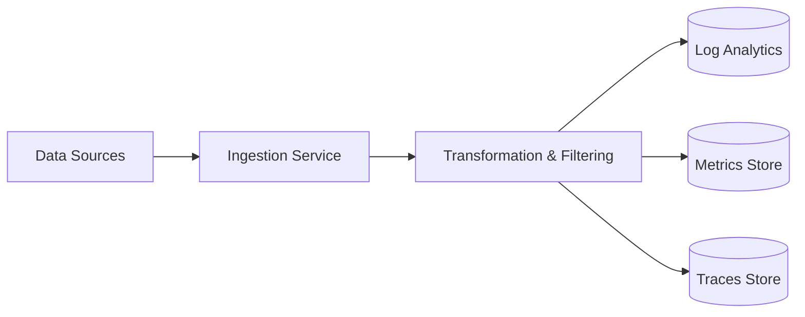

# Data Platform

The Azure Monitor data platform consists of two primary types of data: Metrics and Logs. Each type has its own strengths and is optimized for different scenarios. Understanding the differences between them is key to a successful monitoring strategy.

### Logs vs Metrics vs Traces

Azure Monitor organizes data into these three fundamental types:

#### Metrics
*   **Format:** Numerical values with time stamps and optional dimensions.
*   **Performance:** Near real-time processing and low latency.
*   **Usage:** Best for alerting and detecting fast-moving issues.
*   **Storage:** Stored in a specialized time-series database.

#### Logs
*   **Format:** Structured or unstructured records with varying properties.
*   **Performance:** Slightly higher latency than metrics but supports complex analysis.
*   **Usage:** Best for root cause analysis, querying across resources, and long-term storage.
*   **Storage:** Stored in a Log Analytics workspace.

#### Traces
*   **Format:** Spans that represent individual operations within a request.
*   **Performance:** Collected as logs, with analysis performed via specialized tools.
*   **Usage:** Best for understanding dependencies and performance in distributed systems.

### Ingestion Pipeline

The data ingestion pipeline ensures that telemetry from various sources is correctly processed and stored.

### Data Retention and Archiving

Data in Azure Monitor has different retention periods depending on the data type and configuration:

*   **Metrics:** Standard platform metrics are retained for 93 days. Custom metrics are retained for the same period.
*   **Logs:** The default retention period for a Log Analytics workspace is 30 days. You can increase this up to 730 days (2 years).
*   **Archiving:** For long-term retention beyond 2 years, you can use Azure Storage or export logs to an external system via Event Hubs.

## See Also
*   [How Azure Monitor Works](how-azure-monitor-works.md)
*   [Log Analytics Workspace](log-analytics-workspace.md)

## Sources
*   https://learn.microsoft.com/azure/azure-monitor/data-platform
