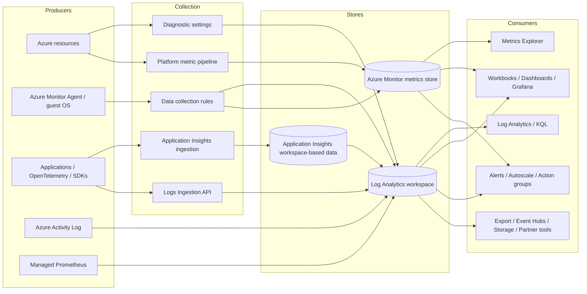
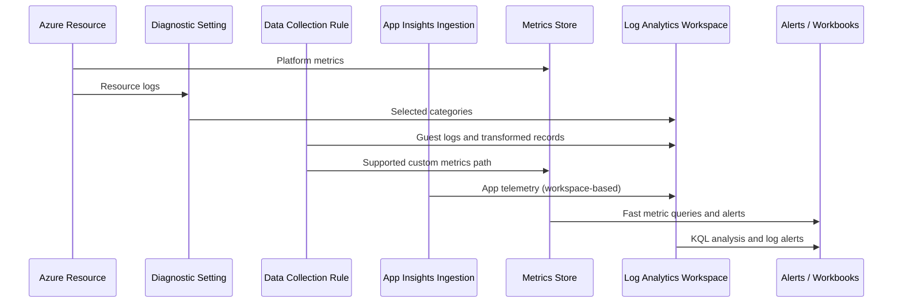

---
content_sources:
  diagrams:
    - id: architecture-overview
      type: flowchart
      source: mslearn-adapted
      based_on:
        - https://learn.microsoft.com/en-us/azure/azure-monitor/fundamentals/overview
        - https://learn.microsoft.com/en-us/azure/azure-monitor/fundamentals/data-sources
        - https://learn.microsoft.com/en-us/azure/azure-monitor/metrics/data-platform-metrics
        - https://learn.microsoft.com/en-us/azure/azure-monitor/logs/data-platform-logs
        - https://learn.microsoft.com/en-us/azure/azure-monitor/logs/log-analytics-workspace-overview
        - https://learn.microsoft.com/en-us/azure/azure-monitor/app/app-insights-overview
        - https://learn.microsoft.com/en-us/azure/azure-monitor/data-collection/data-collection-rule-overview
        - https://learn.microsoft.com/en-us/azure/azure-monitor/platform/diagnostic-settings
        - https://learn.microsoft.com/en-us/azure/azure-monitor/alerts/alerts-overview
        - https://learn.microsoft.com/en-us/azure/azure-monitor/cost-usage
    - id: data-flow-diagram-by-signal-type
      type: sequenceDiagram
      source: mslearn-adapted
      based_on:
        - https://learn.microsoft.com/en-us/azure/azure-monitor/fundamentals/overview
        - https://learn.microsoft.com/en-us/azure/azure-monitor/fundamentals/data-sources
        - https://learn.microsoft.com/en-us/azure/azure-monitor/metrics/data-platform-metrics
        - https://learn.microsoft.com/en-us/azure/azure-monitor/logs/data-platform-logs
        - https://learn.microsoft.com/en-us/azure/azure-monitor/logs/log-analytics-workspace-overview
        - https://learn.microsoft.com/en-us/azure/azure-monitor/app/app-insights-overview
        - https://learn.microsoft.com/en-us/azure/azure-monitor/data-collection/data-collection-rule-overview
        - https://learn.microsoft.com/en-us/azure/azure-monitor/platform/diagnostic-settings
        - https://learn.microsoft.com/en-us/azure/azure-monitor/alerts/alerts-overview
        - https://learn.microsoft.com/en-us/azure/azure-monitor/cost-usage
---

# How Azure Monitor Works
Azure Monitor is the telemetry fabric for Azure services, guest operating systems, containers, applications, and selected non-Azure environments.
It collects platform metrics, logs, traces, activity events, and health signals, then routes them into Azure Monitor experiences such as Metrics Explorer, Log Analytics, Application Insights, alerts, workbooks, and downstream integrations.

## Architecture Overview
The most useful mental model is not a single product.
Azure Monitor is a platform made of collection endpoints, ingestion services, data stores, analysis engines, and actioning services.
Different data types move through different paths, and that difference explains why metrics feel faster than logs and why Application Insights data ends up queryable beside workspace data.
<!-- diagram-id: architecture-overview -->

At a high level, Azure Monitor architecture breaks into five layers.
1. **Producers**
    - Azure resources emit platform metrics automatically.
    - Azure resources can emit resource logs when diagnostic settings are configured.
    - Guest operating systems emit Windows events, Syslog, performance counters, and text logs through Azure Monitor Agent and a data collection rule.
    - Applications emit requests, dependencies, traces, exceptions, custom events, and custom metrics through Application Insights or OpenTelemetry-based instrumentation.
    - Azure itself emits control-plane and health signals such as Activity Log, service health, and resource health.
2. **Collection and routing**
    - Diagnostic settings route supported resource logs and some metrics from a resource to a destination.
    - Data collection rules define what Azure Monitor Agent or the Logs Ingestion API should collect, transform, and where it should land.
    - Application Insights has a specialized application telemetry ingestion path.
    - Platform metrics use a dedicated low-latency metrics path rather than the Log Analytics ingestion path.
3. **Storage**
    - Metrics are stored in the Azure Monitor time-series metrics database.
    - Logs are stored in a Log Analytics workspace.
    - Workspace-based Application Insights stores application data in a Log Analytics workspace while keeping Application Insights experiences on top.
4. **Analysis**
    - Metrics Explorer, dashboards, workbooks, and Grafana use metrics or logs depending on the scenario.
    - Log Analytics and Application Insights analytics use Kusto Query Language.
    - Service experiences such as VM Insights and Container Insights build opinionated analysis on top of the same data platform.
5. **Actioning and integration**
    - Metric alerts, scheduled query alerts, activity log alerts, processing rules, action groups, and autoscale react to telemetry.
    - Export paths such as Event Hubs, Storage, webhooks, and partner integrations move data to downstream systems.
Two design truths from Microsoft Learn matter in practice.
- **Not every data type supports every destination or experience in the same way.**
  Metrics, logs, and traces have different latency, retention, and query characteristics.
- **Collection configuration is distributed.**
  Some settings live on the monitored resource, some on a workspace, some on a DCR, and some on the Application Insights component.

### Control plane versus data plane
Another useful distinction is control plane versus data plane.
| Plane | Purpose | Typical Azure Monitor examples |
|---|---|---|
| Control plane | Resource management and configuration | Create workspace, update retention, create alert rule, associate DCR |
| Data plane | Telemetry ingestion, query, and evaluation | Send logs, query KQL, metric evaluation, Application Insights telemetry processing |
This distinction explains common surprises.
- A workspace can exist and be healthy in Azure Resource Manager while ingestion from an agent still fails because the data plane path or identity configuration is wrong.
- An alert rule can be created successfully, but never fire because the underlying metric namespace or KQL query returns no data.
- Private networking choices often apply differently to configuration APIs and ingestion/query traffic.

## Core Concepts

### Concept 1: Azure Monitor is a multi-store platform, not a single database
Microsoft Learn describes Azure Monitor as collecting and aggregating telemetry from multiple scopes and then using the right storage engine for each data type.
That is why choosing the correct signal is the first design decision.

#### Metrics
Metrics are numeric values with timestamps and optional dimensions.
They are optimized for lightweight collection, fast retrieval, and frequent alert evaluation.
Use metrics when you need:
- Near real-time detection.
- Cheap repeated evaluation.
- Aggregations such as average, minimum, maximum, total, and count.
- Dimension slicing such as per response code, per instance, or per node pool.
Typical examples include:
- VM Percentage CPU.
- Storage account availability.
- Azure SQL DTU or CPU percentage.
- App Service Http5xx and Requests.

#### Logs
Logs are structured records, often with more columns and more variation than metrics.
They are optimized for exploration, correlation, joins, parsing, and long-term investigation.
Use logs when you need:
- Rich context for root-cause analysis.
- Correlation across resources or subscriptions.
- Ad hoc investigation with KQL.
- Flexible transformations and custom schemas.
Typical examples include:
- Azure Activity Log records.
- Azure resource logs such as Application Gateway access logs.
- Syslog and Windows event logs from VMs.
- Container logs and Kubernetes events.
- Application traces and exceptions.

#### Traces and application telemetry
Distributed traces follow a single operation across multiple services.
In Azure Monitor, trace-related application telemetry is surfaced through Application Insights experiences and stored in the workspace-based analytics platform.
Use application telemetry when you need:
- End-to-end request timing.
- Dependency breakdown.
- Failure analysis with operation IDs.
- Application maps and intelligent views of service relationships.

#### CLI example: inspect workspace configuration used by the logs platform
```bash
az monitor log-analytics workspace show \
    --resource-group "$RG" \
    --workspace-name "$WORKSPACE_NAME" \
    --query "{name:name,location:location,sku:sku.name,retentionInDays:retentionInDays,publicNetworkAccessForIngestion:publicNetworkAccessForIngestion,publicNetworkAccessForQuery:publicNetworkAccessForQuery}" \
    --output json
```
Example output:
```json
{
  "location": "koreacentral",
  "name": "law-prod-observability",
  "publicNetworkAccessForIngestion": "Enabled",
  "publicNetworkAccessForQuery": "Enabled",
  "retentionInDays": 30,
  "sku": "PerGB2018"
}
```
This command does not query telemetry.
It confirms the configuration boundary for one of the Azure Monitor data stores.

#### CLI example: inspect platform metrics from a resource
```bash
az monitor metrics list \
    --resource "$RESOURCE_ID" \
    --metrics "Percentage CPU" \
    --interval "PT5M" \
    --aggregation "Average" \
    --top 3 \
    --output json
```
Example output:
```json
{
  "cost": 0,
  "interval": "PT5M",
  "namespace": "Microsoft.Compute/virtualMachines",
  "resourceregion": "koreacentral",
  "value": [
    {
      "displayDescription": "Percentage CPU",
      "id": "/subscriptions/<subscription-id>/resourceGroups/rg-monitoring-prod/providers/Microsoft.Compute/virtualMachines/vm-app-01/providers/microsoft.insights/metrics/Percentage CPU",
      "name": {
        "localizedValue": "Percentage CPU",
        "value": "Percentage CPU"
      },
      "timeseries": [
        {
          "data": [
            {
              "average": 21.7,
              "timeStamp": "2026-04-05T08:00:00Z"
            },
            {
              "average": 28.4,
              "timeStamp": "2026-04-05T08:05:00Z"
            },
            {
              "average": 17.9,
              "timeStamp": "2026-04-05T08:10:00Z"
            }
          ]
        }
      ]
    }
  ]
}
```
This output demonstrates the time-series model.
Each point is already aggregated for the requested interval.

#### CLI example: query workspace logs from the same environment
```bash
az monitor log-analytics query \
    --workspace "$WORKSPACE_ID" \
    --analytics-query "AzureActivity | where TimeGenerated > ago(1h) | summarize Events=count() by CategoryValue" \
    --output table
```
Example output:
```text
CategoryValue           Events
----------------------  ------
Administrative          12
Policy                   3
Security                 1
ServiceHealth            2
```
This example illustrates the different operating model for logs.
You query records and summarize them after ingestion rather than requesting pre-aggregated time-series points.

### Concept 2: Scope matters as much as signal type
Microsoft Learn documents Azure Monitor data sources across multiple scopes.
Understanding scope prevents design gaps.

#### Common scopes
1. **Application scope**
    - Requests, dependencies, traces, exceptions, browser telemetry, custom events.
    - Usually collected through Application Insights or Azure Monitor OpenTelemetry.
2. **Guest OS scope**
    - Performance counters, Syslog, Windows events, text logs.
    - Usually collected by Azure Monitor Agent with DCRs.
3. **Azure resource scope**
    - Platform metrics and resource logs emitted by a specific resource provider.
    - Collected automatically for metrics and through diagnostic settings for logs.
4. **Subscription and tenant scope**
    - Azure Activity Log, service health, and some governance signals.
    - Often essential for operational change tracking.

#### Why scope changes the design
- A VM CPU spike is resource-scope telemetry.
  It can trigger a metric alert even if you have no workspace at all.
- A failed deployment event is subscription-scope telemetry.
  It belongs to Activity Log and is typically handled with activity log alerts or routed to a workspace for longer-term analysis.
- Application dependencies and traces are application-scope telemetry.
  They require instrumentation, not diagnostic settings.
- Guest Syslog requires Azure Monitor Agent and a DCR.
  A workspace alone does not collect it.

#### CLI example: inspect diagnostic settings on a resource
```bash
az monitor diagnostic-settings list \
    --resource "$RESOURCE_ID" \
    --output json
```
Example output:
```json
[
  {
    "id": "/subscriptions/<subscription-id>/resourceGroups/rg-monitoring-prod/providers/Microsoft.Network/applicationGateways/agw-edge-01/providers/microsoft.insights/diagnosticSettings/send-to-law-prod",
    "logs": [
      {
        "category": "ApplicationGatewayAccessLog",
        "enabled": true
      },
      {
        "category": "ApplicationGatewayPerformanceLog",
        "enabled": true
      }
    ],
    "metrics": [
      {
        "category": "AllMetrics",
        "enabled": true
      }
    ],
    "name": "send-to-law-prod",
    "workspaceId": "/subscriptions/<subscription-id>/resourceGroups/rg-monitoring-prod/providers/Microsoft.OperationalInsights/workspaces/law-prod-observability"
  }
]
```
Diagnostic settings sit on the monitored resource.
That placement is an important architecture decision because it decentralizes collection configuration.

### Concept 3: Azure Monitor experiences are layered on the same platform
Azure Monitor includes both generic tools and specialized experiences.
The platform is easier to design when you know which tools are “raw” and which are “curated.”

#### Generic experiences
- Metrics Explorer.
- Log Analytics.
- Workbooks.
- Dashboards and Grafana integration.
- Alerts and action groups.

#### Curated experiences built on top
- Application Insights.
- VM Insights.
- Container Insights.
- Managed Prometheus and Azure Managed Grafana integrations.
These curated experiences do not replace the platform.
They package opinionated collection, default workbooks, maps, and queries.

### Concept 4: Collection latency and query latency are different
Metrics usually have lower ingestion-to-visibility latency than logs.
Logs support richer analysis but take longer to become queryable.
Application Insights has both analytics experiences and live features such as Live Metrics with a different path.
This matters for alert design.
- Use metric alerts for fast, simple threshold conditions.
- Use log alerts for conditions requiring joins, parsing, suppression logic, or cross-resource analysis.
- Use Activity Log alerts for control-plane and service health events.

## Data Flow
Azure Monitor data flow is not a single pipeline.
There are several common paths, each with different configuration points and operational behaviors.

### Path 1: Azure resource metrics
1. A resource provider emits platform metrics automatically.
2. Azure Monitor stores metric points in the metrics database.
3. Metrics Explorer, metric alerts, autoscale, dashboards, and Grafana query those points.
4. If the resource supports exporting metrics through diagnostic settings, selected metrics can also be routed elsewhere.
This path is simple and low latency.
It is the reason teams often start with metrics before they deploy log pipelines.

### Path 2: Azure resource logs through diagnostic settings
1. A supported Azure resource generates resource logs.
2. A diagnostic setting on that resource selects categories and destinations.
3. The logs flow to a Log Analytics workspace, Storage account, Event Hubs namespace, or partner solution depending on supported destinations.
4. A workspace stores those records in tables such as `AzureDiagnostics` or resource-specific tables.
5. KQL queries, scheduled query alerts, workbooks, and downstream exports consume the records.
This path is category-driven.
The categories you choose directly affect cost, investigation depth, and compliance posture.

### Path 3: Guest operating system logs through AMA and DCR
1. Azure Monitor Agent runs on a VM, Arc-enabled server, or supported environment.
2. A DCR defines data sources such as performance counters, Windows events, Syslog, or text logs.
3. The DCR can transform data before storage.
4. The DCR sends data to one or more destinations such as a workspace or the metrics store for supported scenarios.
5. Azure Monitor consumers use the resulting tables and metrics.
This path is rule-driven rather than resource-category-driven.
It is more flexible and usually the preferred collection model for guest telemetry.

### Path 4: Application Insights telemetry
1. An application is instrumented with Azure Monitor OpenTelemetry or a supported SDK.
2. Telemetry is enriched with context such as cloud role name, operation ID, and dependency information.
3. Application Insights ingestion receives the events.
4. In a workspace-based model, data becomes available in the linked Log Analytics workspace as application tables.
5. Application Insights experiences such as Application Map, Failures, Performance, and Transaction Search render curated views.

### Path 5: Activity Log and service health
1. Azure control-plane events occur.
2. Azure records them in the Activity Log.
3. Activity Log alerts can trigger on new events.
4. Events can also be analyzed or retained using Azure Monitor integrations, including workspaces and archival destinations.

### Data flow diagram by signal type
<!-- diagram-id: data-flow-diagram-by-signal-type -->


### Failure domains in the data flow
When data does not appear, classify the failure by stage.
| Stage | Typical symptom | Common cause |
|---|---|---|
| Source | No telemetry produced | Resource feature not enabled, SDK missing, wrong app configuration |
| Collection | Expected category absent | Diagnostic setting missing, DCR not associated, unsupported source |
| Ingestion | Delay or drop | Network restrictions, identity issues, throttling, endpoint mismatch |
| Storage | Data lands in unexpected place | Wrong workspace, wrong table, transformation changed schema |
| Consumption | Alert/dashboard empty | Query bug, wrong namespace, wrong dimensions, wrong time range |
That classification makes troubleshooting much faster than immediately changing queries.

## Integration Points
Azure Monitor connects to other Azure services and external systems in specific ways.

### Azure Resource Manager and resource providers
- Workspaces, Application Insights components, alert rules, DCRs, diagnostic settings, and action groups are Azure resources.
- Infrastructure as code tools such as Bicep, ARM, Terraform, and Azure CLI manage them through Azure Resource Manager.

### Microsoft Entra ID and RBAC
- Access to query or configure Azure Monitor is controlled through Azure RBAC and service-specific permissions.
- Managed identities are commonly used for agents, automation, and data collection scenarios.

### Networking controls
- Private Link and Azure Monitor Private Link Scope affect ingestion and query paths for supported resources.
- Public network access settings on workspaces and related resources determine whether traffic can use public endpoints.

### Automation and incident response
- Alerts trigger action groups.
- Action groups can notify people or call automation targets such as Logic Apps, Azure Functions, Automation runbooks, webhooks, and ITSM connectors.

### Analytics and visualization tools
- Azure Managed Grafana can visualize Azure Monitor metrics and logs.
- Workbooks combine multiple data sources and queries in a shared operational view.
- Power BI and partner tools can consume exported or queried data in selected scenarios.

### Data export and downstream pipelines
- Diagnostic settings can stream resource logs to Storage or Event Hubs.
- Workspace data export can continuously send supported tables to Storage or Event Hubs.
- The Logs Ingestion API enables custom pipelines into Azure Monitor.

## Configuration Options
Azure Monitor configuration is spread across multiple resources.
Good architecture reviews always identify where each setting lives.

### Common configuration objects
| Object | Primary purpose | Typical decisions |
|---|---|---|
| Log Analytics workspace | Log storage and query boundary | Region, retention, access mode, networking, daily cap |
| Application Insights component | Application telemetry experience | Workspace linkage, sampling, availability, feature settings |
| Diagnostic setting | Resource log routing | Categories, destination, retention via destination |
| Data collection rule | Agent/API collection logic | Sources, transformations, streams, destinations |
| Alert rule | Telemetry evaluation | Signal type, threshold, frequency, scope, action group |
| Action group | Response target | Notifications, webhooks, automation, common schema |

### CLI example: create a production-style workspace
```bash
az monitor log-analytics workspace create \
    --resource-group "$RG" \
    --workspace-name "$WORKSPACE_NAME" \
    --location "$LOCATION" \
    --sku "PerGB2018" \
    --retention-time 30 \
    --output json
```
Example output:
```json
{
  "customerId": "xxxxxxxx-xxxx-xxxx-xxxx-xxxxxxxxxxxx",
  "id": "/subscriptions/<subscription-id>/resourceGroups/rg-monitoring-prod/providers/Microsoft.OperationalInsights/workspaces/law-prod-observability",
  "location": "koreacentral",
  "name": "law-prod-observability",
  "provisioningState": "Succeeded",
  "retentionInDays": 30,
  "sku": {
    "name": "PerGB2018"
  }
}
```

### CLI example: link resource logs to the workspace
```bash
az monitor diagnostic-settings create \
    --name "send-to-law-prod" \
    --resource "$RESOURCE_ID" \
    --workspace "$WORKSPACE_ID" \
    --logs '[{"category":"ApplicationGatewayAccessLog","enabled":true},{"category":"ApplicationGatewayPerformanceLog","enabled":true}]' \
    --metrics '[{"category":"AllMetrics","enabled":true}]' \
    --output json
```
Example output:
```json
{
  "id": "/subscriptions/<subscription-id>/resourceGroups/rg-monitoring-prod/providers/Microsoft.Network/applicationGateways/agw-edge-01/providers/microsoft.insights/diagnosticSettings/send-to-law-prod",
  "logs": [
    {
      "category": "ApplicationGatewayAccessLog",
      "enabled": true
    },
    {
      "category": "ApplicationGatewayPerformanceLog",
      "enabled": true
    }
  ],
  "metrics": [
    {
      "category": "AllMetrics",
      "enabled": true
    }
  ],
  "name": "send-to-law-prod",
  "workspaceId": "/subscriptions/<subscription-id>/resourceGroups/rg-monitoring-prod/providers/Microsoft.OperationalInsights/workspaces/law-prod-observability"
}
```

### CLI example: create a metric alert on a core platform signal
```bash
az monitor metrics alert create \
    --name "alert-vm-high-cpu" \
    --resource-group "$RG" \
    --scopes "$RESOURCE_ID" \
    --condition "avg Percentage CPU > 80" \
    --description "Trigger when VM CPU average exceeds 80 percent over the evaluation window." \
    --window-size "PT5M" \
    --evaluation-frequency "PT1M" \
    --severity 2 \
    --output json
```
Example output:
```json
{
  "enabled": true,
  "evaluationFrequency": "PT1M",
  "id": "/subscriptions/<subscription-id>/resourceGroups/rg-monitoring-prod/providers/Microsoft.Insights/metricAlerts/alert-vm-high-cpu",
  "name": "alert-vm-high-cpu",
  "scopes": [
    "/subscriptions/<subscription-id>/resourceGroups/rg-monitoring-prod/providers/Microsoft.Compute/virtualMachines/vm-app-01"
  ],
  "severity": 2,
  "windowSize": "PT5M"
}
```

### Key architecture decisions to document
1. **Which signals matter first**
    - Platform metrics for availability and saturation.
    - Resource logs for compliance and detailed troubleshooting.
    - App telemetry for user-impact and dependency tracing.
2. **Where logs land**
    - Central workspace.
    - Region-specific workspace.
    - Environment-segmented workspace.
3. **How network boundaries apply**
    - Public endpoints allowed.
    - Private Link enforced for query and ingestion.
4. **How alerts map to operations**
    - Fast metric alerts for paging.
    - Log alerts for correlated incidents.
    - Activity Log alerts for control-plane change detection.

## Pricing Considerations
Azure Monitor pricing follows the data type and feature used.
Microsoft Learn pricing guidance consistently maps cost to ingestion volume, retention, and premium experiences.

### Major cost drivers
1. **Log ingestion volume**
    - Resource logs, VM logs, container logs, and app traces can grow rapidly.
    - Chatty categories and verbose application traces are the most common surprise.
2. **Retention and archive choices**
    - Interactive retention and long-term retention decisions change workspace cost.
3. **Alert rule count and type**
    - Metric alerts, log alerts, and special-purpose alerting features have different billing models.
4. **Application Insights volume-based telemetry**
    - Sampling strategy is a primary optimization lever.
5. **Export and downstream services**
    - Event Hubs, Storage, partner tools, and network egress can add cost outside Azure Monitor itself.
Microsoft Learn pricing guidance also distinguishes log ingestion and retention charges, alert charges by alert type, and separate pricing models for custom metrics and Prometheus-related features.

### Cost optimization patterns
- Collect platform metrics broadly because they are foundational and efficient.
- Be selective with verbose resource log categories.
- Use DCR transformations to drop low-value records before storage where supported.
- Use sampling for high-traffic application telemetry.
- Separate diagnostic destinations by purpose when compliance requires raw archive but operations need only summarized analysis.

### Cost anti-patterns
- Enabling every diagnostic category without a use case.
- Treating application traces as an unlimited audit log.
- Creating duplicate pipelines that send the same data to multiple expensive destinations without a retention strategy.
- Building log alerts for simple threshold conditions that a metric alert can evaluate more cheaply and quickly.

## Limitations and Quotas
Exact numbers change over time, so verify current Microsoft Learn quota pages before implementation reviews.
The architectural limits below are the ones that matter most conceptually.

### Important platform limits to remember
- Metrics retention is shorter than log retention and optimized for recent operational use.
- Not every resource log category supports every destination.
- Diagnostic settings are configured per resource and can create operational sprawl at scale.
- Cross-workspace and cross-resource queries are powerful, but they increase query complexity and may change alerting design.
- Application telemetry completeness can be affected by sampling, SDK configuration, and unsupported frameworks.
- DCR transformations support many useful scenarios, but they are not an unrestricted replacement for post-ingestion KQL analytics.

### Quota-aware design guidance
| Area | Why it matters | Design response |
|---|---|---|
| Workspace ingestion rate and daily caps | Prevents runaway spend but can also interrupt visibility | Use caps as safety rails, not normal operating controls |
| Alert rule count | Large estates can create management overhead | Standardize naming, scoping, and reusable modules |
| Action group rate limits and integrations | Downstream notification systems can throttle | Route paging through consolidated tooling |
| Query complexity and time range | Expensive KQL affects performance and alert reliability | Pre-filter, summarize early, and validate query cost |

### What Azure Monitor does not do for you automatically
- It does not decide the right workspace topology.
- It does not infer business criticality from raw telemetry.
- It does not turn every resource log on by default.
- It does not guarantee identical latency across all signal types.
- It does not replace incident management, ownership mapping, or service-level objectives.

## See Also
- [Data Platform](data-platform.md)
- [Log Analytics Workspace](log-analytics-workspace.md)
- [Application Insights](application-insights.md)
- [Metrics and Dimensions](metrics-and-dimensions.md)
- [Alerts Architecture](alerts-architecture.md)
- [Data Collection Rules](data-collection-rules.md)
- [Networking and Security](networking-and-security.md)

## Sources
- https://learn.microsoft.com/en-us/azure/azure-monitor/fundamentals/overview
- https://learn.microsoft.com/en-us/azure/azure-monitor/fundamentals/data-sources
- https://learn.microsoft.com/en-us/azure/azure-monitor/metrics/data-platform-metrics
- https://learn.microsoft.com/en-us/azure/azure-monitor/logs/data-platform-logs
- https://learn.microsoft.com/en-us/azure/azure-monitor/logs/log-analytics-workspace-overview
- https://learn.microsoft.com/en-us/azure/azure-monitor/app/app-insights-overview
- https://learn.microsoft.com/en-us/azure/azure-monitor/data-collection/data-collection-rule-overview
- https://learn.microsoft.com/en-us/azure/azure-monitor/platform/diagnostic-settings
- https://learn.microsoft.com/en-us/azure/azure-monitor/alerts/alerts-overview
- https://learn.microsoft.com/en-us/azure/azure-monitor/cost-usage
