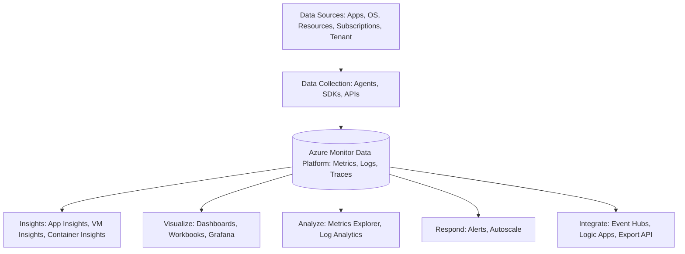

# How Azure Monitor Works

Azure Monitor maximizes the availability and performance of your applications and services by delivering a comprehensive solution for collecting, analyzing, and acting on telemetry from your cloud and on-premises environments.

### The Three Data Pillars

Azure Monitor collects and aggregates data into three primary stores:

#### Metrics
Metrics are numerical values that describe some aspect of a system at a particular point in time. They are lightweight and capable of supporting near real-time scenarios, making them useful for alerting and fast detection of issues.

#### Logs
Logs contain different kinds of data organized into records with different sets of properties for each type. Telemetry such as events and traces are stored as logs in addition to performance data so that it can all be combined for analysis.

#### Traces
Distributed tracing follows a request as it moves through various components of a distributed system. This allows you to understand the relationships between different services and identify bottlenecks or failures in a complex architecture.

### Data Flow Architecture

Azure Monitor collects data from a variety of sources and uses that data for analysis, visualization, and responding to events.

### Data Collection Strategy

Azure Monitor can collect data from several different tiers of your application:

*   **Application telemetry:** Data about the performance and functionality of the code you've written, regardless of its platform.
*   **Guest OS telemetry:** Data about the operating system on which your application is running. This could be running in Azure, another cloud, or on-premises.
*   **Azure resource telemetry:** Data about the operation of an Azure resource, such as a virtual machine or a storage account.
*   **Azure subscription monitoring telemetry:** Data about the operation and management of an Azure subscription, as well as data about the health and operation of Azure itself.
*   **Azure tenant monitoring telemetry:** Data about the operation of tenant-level Azure services, such as Microsoft Entra ID.

## See Also
*   [Data Platform](data-platform.md)
*   [Log Analytics Workspace](log-analytics-workspace.md)

## Sources
*   https://learn.microsoft.com/azure/azure-monitor/overview
