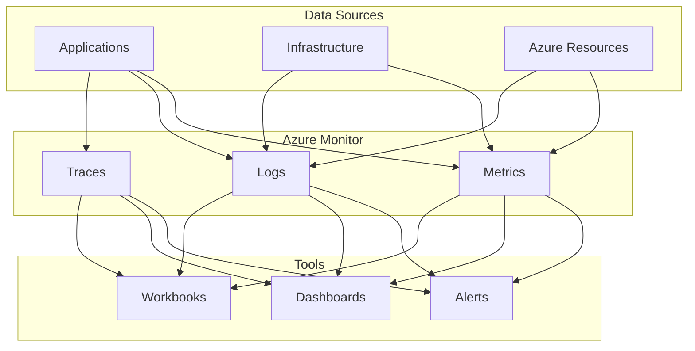

---
content_sources:
  diagrams:
    - id: platform
      type: flowchart
      source: self-generated
      based_on:
        - https://learn.microsoft.com/en-us/azure/azure-monitor/fundamentals/overview
        - https://learn.microsoft.com/en-us/azure/azure-monitor/fundamentals/data-sources
        - https://learn.microsoft.com/en-us/azure/azure-monitor/alerts/alerts-overview
        - https://learn.microsoft.com/en-us/azure/azure-monitor/app/app-insights-overview
---

# Platform

Understanding Azure Monitor architecture and core concepts.

<!-- diagram-id: platform -->

## In This Section

| Page | Description |
|------|-------------|
| [How Azure Monitor Works](how-azure-monitor-works.md) | Three data pillars, data flow, management vs data plane |
| [Data Platform](data-platform.md) | Logs vs Metrics vs Traces, ingestion pipeline, retention |
| [Log Analytics Workspace](log-analytics-workspace.md) | Workspace concepts, scope, access control, design strategy |
| [Application Insights](application-insights.md) | OpenTelemetry, telemetry types, App Map, Live Metrics |
| [Metrics and Dimensions](metrics-and-dimensions.md) | Platform vs custom metrics, dimensions, aggregations |
| [Alerts Architecture](alerts-architecture.md) | Alert types, signal processing, action groups |
| [Data Collection Rules](data-collection-rules.md) | DCR concepts, transformations, Azure Monitor Agent |
| [Networking and Security](networking-and-security.md) | Private Link, AMPLS, RBAC for monitoring |

## See Also

- [Best Practices](../best-practices/index.md)
- [Operations](../operations/index.md)

## Sources

- [Azure Monitor overview](https://learn.microsoft.com/azure/azure-monitor/overview)
- [Azure Monitor data platform](https://learn.microsoft.com/azure/azure-monitor/data-platform)
