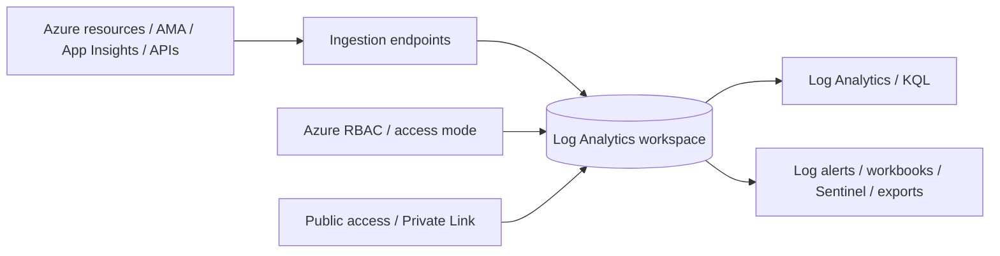
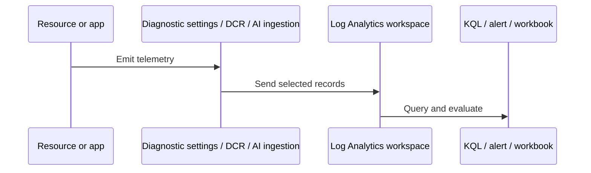

---
content_sources:
  diagrams:
    - id: architecture-overview
      type: flowchart
      source: mslearn-adapted
      based_on:
        - https://learn.microsoft.com/en-us/azure/azure-monitor/logs/log-analytics-workspace-overview
        - https://learn.microsoft.com/en-us/azure/azure-monitor/logs/design-logs-deployment
        - https://learn.microsoft.com/en-us/azure/azure-monitor/logs/manage-access
        - https://learn.microsoft.com/en-us/azure/azure-monitor/logs/data-retention-archive
        - https://learn.microsoft.com/en-us/azure/azure-monitor/logs/private-link-security
        - https://learn.microsoft.com/en-us/azure/azure-monitor/reference/tables/tables-category
        - https://learn.microsoft.com/en-us/azure/azure-monitor/cost-usage
    - id: data-flow-diagram-focused-on-the-workspace
      type: sequenceDiagram
      source: mslearn-adapted
      based_on:
        - https://learn.microsoft.com/en-us/azure/azure-monitor/logs/log-analytics-workspace-overview
        - https://learn.microsoft.com/en-us/azure/azure-monitor/logs/design-logs-deployment
        - https://learn.microsoft.com/en-us/azure/azure-monitor/logs/manage-access
        - https://learn.microsoft.com/en-us/azure/azure-monitor/logs/data-retention-archive
        - https://learn.microsoft.com/en-us/azure/azure-monitor/logs/private-link-security
        - https://learn.microsoft.com/en-us/azure/azure-monitor/reference/tables/tables-category
        - https://learn.microsoft.com/en-us/azure/azure-monitor/cost-usage
---

# Log Analytics Workspace
A Log Analytics workspace is the primary log storage, query, retention, access, and governance boundary in Azure Monitor.
It is where Azure resource logs, guest telemetry, Application Insights workspace-based telemetry, and custom ingestion streams become analyzable with Kusto Query Language.

## Architecture Overview
A workspace is not just a database.
It is the operating boundary for data residency, query permissions, retention, export, daily caps, and several network access controls.
<!-- diagram-id: architecture-overview -->

A production workspace design should answer six questions.

1. **Where is the workspace located?**
    - Region determines data residency and can affect latency and compliance.
2. **Who can query it?**
    - Workspace-context and resource-context access models change how teams consume data.
3. **How long is data kept?**
    - Retention and archive decisions affect cost and investigation depth.
4. **How is ingestion controlled?**
    - Daily cap, DCR filtering, diagnostic settings, and application sampling all influence workspace growth.
5. **How is network access controlled?**
    - Public network access and Azure Monitor Private Link Scope affect ingestion and query paths.
6. **What data is expected to land here?**
    - Resource logs, guest logs, application telemetry, and custom tables require clear ownership.

### Workspace as a platform boundary
| Concern | Workspace role |
|---|---|
| Storage | Holds log records and workspace-based application tables |
| Query engine | Exposes KQL through Log Analytics and dependent experiences |
| Security | Enforces workspace access controls and data access models |
| Cost control | Tracks ingestion, retention, and capping decisions |
| Integration | Supports export, alerts, workbooks, and downstream services |

## Core Concepts

### Workspace topology is a design choice, not a default answer
Microsoft Learn generally recommends keeping workspace topology as simple as possible unless there is a clear requirement for separation.
A single workspace improves correlation and reduces administrative overhead.
Multiple workspaces may still be justified for regulatory, billing, or strict access boundary reasons.

#### Centralized workspace model
Use a centralized workspace when:
- The same operations team supports many resources.
- Cross-service troubleshooting is common.
- Billing separation is not the main concern.
- Data residency requirements allow one region.
Benefits include:
- Simpler alert and workbook management.
- Easier cross-service KQL.
- Fewer duplicated queries and exports.
Trade-offs include:
- Broader RBAC planning.
- Larger ingestion footprint.
- Potentially more contention for shared governance processes.

#### Multiple workspace model
Use multiple workspaces when:
- You must isolate data by region or sovereign boundary.
- Separate business units need hard billing separation.
- Access models cannot be safely enforced through resource-context access alone.
- Different retention or export requirements are unavoidable.
Trade-offs include:
- More operational overhead.
- More cross-workspace query logic.
- More alert deployment targets and workbook scoping.

### CLI example: create a workspace with explicit retention
```bash
az monitor log-analytics workspace create \
    --resource-group "$RG" \
    --workspace-name "$WORKSPACE_NAME" \
    --location "$LOCATION" \
    --sku "PerGB2018" \
    --retention-time 30 \
    --output json
```
Example output:
```json
{
  "customerId": "xxxxxxxx-xxxx-xxxx-xxxx-xxxxxxxxxxxx",
  "id": "/subscriptions/<subscription-id>/resourceGroups/rg-monitoring-prod/providers/Microsoft.OperationalInsights/workspaces/law-prod-observability",
  "location": "koreacentral",
  "name": "law-prod-observability",
  "provisioningState": "Succeeded",
  "retentionInDays": 30,
  "sku": {
    "name": "PerGB2018"
  }
}
```
This is the foundational workspace creation pattern used by many Azure Monitor features.

### Access model is as important as storage model
Workspaces support two broad consumption patterns documented by Microsoft Learn.

#### Workspace-context access
Workspace-context access grants rights directly to the workspace.
It suits central monitoring teams, platform teams, and SOC teams that need broad visibility.

#### Resource-context access
Resource-context access allows users to see data for resources they already have access to, even when the underlying data sits in a shared workspace.
It suits application owners who should not automatically see every other team’s logs.

#### Why the distinction matters
- It influences how you share workbooks and saved queries.
- It affects how incident responders pivot across resources.
- It changes whether one shared workspace can safely support many teams.
- It reduces the number of workspaces needed when properly implemented.

### CLI example: inspect current workspace access-related settings
```bash
az monitor log-analytics workspace show \
    --resource-group "$RG" \
    --workspace-name "$WORKSPACE_NAME" \
    --query "{name:name,features:features,publicNetworkAccessForIngestion:publicNetworkAccessForIngestion,publicNetworkAccessForQuery:publicNetworkAccessForQuery,retentionInDays:retentionInDays}" \
    --output json
```
Example output:
```json
{
  "features": {
    "disableLocalAuth": false,
    "enableLogAccessUsingOnlyResourcePermissions": true,
    "immediatePurgeDataOn30Days": false
  },
  "name": "law-prod-observability",
  "publicNetworkAccessForIngestion": "Enabled",
  "publicNetworkAccessForQuery": "Enabled",
  "retentionInDays": 30
}
```
The `enableLogAccessUsingOnlyResourcePermissions` style of setting is what enables a resource-context consumption model in many shared-workspace scenarios.

### Table strategy matters
A workspace contains many tables, and table shape influences query quality.

#### Common table families
| Table family | Examples | Typical source |
|---|---|---|
| Azure resource logs | `AzureDiagnostics`, resource-specific tables | Diagnostic settings |
| Guest telemetry | `Heartbeat`, `Perf`, `Syslog`, `Event` | AMA with DCR |
| Application telemetry | `requests`, `dependencies`, `exceptions`, `traces` | Application Insights / OpenTelemetry |
| Control-plane logs | `AzureActivity` | Activity Log routing and Azure integrations |
| Custom tables | `MyAppAudit_CL` | Logs Ingestion API or connectors |

#### Operational meaning of table choice
- `AzureDiagnostics` is flexible but can be harder to query because many resource types share the same table.
- Resource-specific tables usually offer cleaner schemas and more predictable queries.
- Application tables are optimized for APM workflows.
- Agent tables support infrastructure operations and troubleshooting.

### CLI example: check which tables currently contain recent data
```bash
az monitor log-analytics query \
    --workspace "$WORKSPACE_ID" \
    --analytics-query "search * | where TimeGenerated > ago(1h) | summarize Rows=count() by \$table | top 10 by Rows desc" \
    --output table
```
Example output:
```text
$Table                 Rows
---------------------  -----
Heartbeat              6120
Perf                   4380
AzureActivity           344
requests                227
AppServiceHTTPLogs      121
exceptions               14
```
This is a practical first check after onboarding a new environment because it shows whether your expected sources are actually active.

### Retention is an operating policy
Retention should follow investigation requirements, legal requirements, and cost limits.
Short retention may be acceptable for noisy low-value logs.
Longer retention may be necessary for audit-oriented tables or for slow-moving incident patterns.
Retention decisions should not be made table by table by accident.
They should reflect a documented policy.

### Daily cap is a safety rail, not a steady-state strategy
Daily caps can limit runaway ingestion cost.
They are useful as a guardrail during early onboarding or when teams are still discovering their telemetry profile.
They are dangerous if treated as a normal cost optimization technique because they can stop data ingestion and create blind spots during an incident.

## Data Flow
The workspace participates in several data flows simultaneously.

### Flow 1: resource logs into tables
1. Resource emits logs in supported categories.
2. Diagnostic setting selects the workspace as destination.
3. Azure Monitor writes the records into a table.
4. KQL, workbooks, and alert rules consume the table.

### Flow 2: guest telemetry through AMA and DCR
1. Azure Monitor Agent reads configured sources.
2. DCR defines streams and destinations.
3. Data reaches the workspace through Azure Monitor ingestion.
4. Tables such as `Heartbeat`, `Perf`, `Syslog`, and `Event` are populated.

### Flow 3: application telemetry into workspace-based tables
1. Application emits requests, traces, dependencies, exceptions, or custom events.
2. Application Insights ingestion processes the telemetry.
3. Workspace-based tables receive the data.
4. Application Insights experiences and KQL both operate over the same underlying telemetry.

### Flow 4: custom ingestion
1. An external system or pipeline sends records through the Logs Ingestion API.
2. A DCR maps the payload to a stream and destination.
3. Workspace custom tables receive the transformed records.

### Data flow diagram focused on the workspace
<!-- diagram-id: data-flow-diagram-focused-on-the-workspace -->


### What “data landed” really means
Data landing successfully means all of the following are true.
- The source emitted records.
- The collection rule or diagnostic setting selected them.
- The destination workspace was reachable.
- The records were written to the expected table.
- The analyst is querying the correct time range and schema.
A common mistake is validating only the first three steps.

## Integration Points
A workspace integrates with other Azure Monitor components and downstream systems.

### Alerts
Scheduled query alerts execute KQL against one or more workspaces.
A poor workspace topology can therefore complicate alert scoping and query performance.

### Application Insights
Workspace-based Application Insights depends on a workspace.
The workspace becomes the durable data store, while Application Insights provides curated APM experiences.

### Microsoft Sentinel and security tooling
Many organizations connect workspaces to Microsoft Sentinel or external SIEM tooling.
That makes workspace governance part of security operations design as well as monitoring design.

### Workbooks and dashboards
Workbooks often query one or many workspaces.
A single shared workspace simplifies dashboard ownership.
Multiple workspaces improve separation but increase workbook complexity.

### Export pipelines
Workspace data export or diagnostic settings can feed Storage and Event Hubs.
This is common for regulatory retention, partner analysis, or central data engineering pipelines.

## Configuration Options
Workspace configuration is operationally significant.

### Key settings to review
| Setting area | Typical decision |
|---|---|
| Region | Choose based on residency, service support, and latency |
| SKU | Most modern designs use `PerGB2018` |
| Retention | Align to investigation and compliance needs |
| Daily cap | Use as a controlled safety rail |
| Public network access | Allow or disable ingestion/query over public endpoints |
| Local auth | Prefer disabling where identity-based auth is required |
| Data export | Enable only for justified downstream flows |

### CLI example: update workspace daily cap
```bash
az monitor log-analytics workspace update \
    --resource-group "$RG" \
    --workspace-name "$WORKSPACE_NAME" \
    --quota 20 \
    --output json
```
Example output:
```json
{
  "name": "law-prod-observability",
  "retentionInDays": 30,
  "workspaceCapping": {
    "dailyQuotaGb": 20.0,
    "dataIngestionStatus": "RespectQuota"
  }
}
```
Use this only when you understand the operational effect of limiting ingestion.

### CLI example: review recent ingestion activity with a query
```bash
az monitor log-analytics query \
    --workspace "$WORKSPACE_ID" \
    --analytics-query "Usage | where TimeGenerated > ago(1d) | summarize IngestedGB=sum(Quantity) by DataType | top 10 by IngestedGB desc" \
    --output table
```
Example output:
```text
DataType             IngestedGB
-------------------  ----------
Perf                       3.42
Syslog                     1.78
AppServiceHTTPLogs         0.94
AzureDiagnostics           0.61
requests                   0.28
```
This query helps validate which data types drive cost inside a workspace.

## Pricing Considerations
Workspace cost is primarily driven by ingestion and retention.
Creating the workspace itself is not the billable event.
Microsoft Learn pricing guidance treats the workspace as the boundary for charges such as data ingestion, retention beyond included periods, and selected archive or restore operations.

### Main cost drivers
- Volume ingested per day.
- Retention beyond included periods.
- Restore or archive retrieval scenarios where applicable.
- Duplicate collection into several workspaces.
- Noisy resource logs or verbose traces.

### Cost optimization guidance
1. Prefer one workspace unless you have a real separation requirement.
2. Review `Usage` data regularly to identify the dominant tables.
3. Turn on only required diagnostic categories.
4. Use DCR filtering or application sampling before the data becomes expensive.
5. Avoid unnecessary duplicate exports.

### Cost anti-patterns
- One workspace per application with no residency or security reason.
- Extremely long retention for high-volume transient logs.
- Daily cap used to “solve” overcollection instead of fixing the source.

## Limitations and Quotas
Always confirm the latest Microsoft Learn quota pages before rollout.
The main practical limits are about architecture and operations.

### Key limitations
- Workspace queries only return useful results if you know the correct table and time range.
- Multi-workspace querying is possible but increases complexity.
- Daily cap can stop ingestion and create blind spots.
- Different tables may have very different schema quality and usability.
- Network restrictions can affect query and ingestion separately.

### Architecture guidance from those limits
| Limitation | Practical implication | Design response |
|---|---|---|
| Shared workspaces need careful RBAC | Analysts may see too much or too little | Use resource-context access where possible |
| Many workspaces reduce correlation | Incidents take longer to investigate | Keep topology simple |
| Ingestion cost grows with volume | Workspace can become the cost center of observability | Measure top tables continuously |
| Query complexity grows with schema diversity | Saved queries become brittle | Standardize queries and favor resource-specific tables |

### Workspace design checklist
Use the following checklist during design reviews.

1. **Boundary clarity**
    - Is the workspace scoped by environment, region, business unit, or the whole platform?
    - Is that boundary documented and owned?
2. **Access model clarity**
    - Are operators expected to use workspace-context access?
    - Are application teams expected to rely on resource-context access?
3. **Retention clarity**
    - Which tables need short operational retention?
    - Which data sets need longer compliance or audit retention?
4. **Ingestion clarity**
    - Which resource categories are mandatory?
    - Which noisy categories are intentionally excluded?
5. **Cost clarity**
    - Is there a weekly review of `Usage` trends?
    - Is there a documented response when ingestion spikes?
6. **Network clarity**
    - Are ingestion and query expected to stay on public endpoints?
    - If not, is Azure Monitor Private Link Scope part of the design?

### Common workspace patterns from Microsoft Learn guidance

#### Shared operations workspace
This pattern uses one main workspace for most Azure Monitor logs.
It works best when a central platform or operations team owns alerting, workbooks, and retention policy.
It reduces duplicated content and supports broad KQL investigations.

#### Regional workspace split
This pattern uses one workspace per required geography.
It is common when data residency rules are the primary design driver.
It preserves simple operations inside each region but makes global workbooks and cross-region queries more complex.

#### Security plus operations split
This pattern routes operational logs to an operations workspace and security-relevant data to a SOC-oriented workflow.
It should be used carefully because duplicate ingestion can increase cost.
The split must exist for a clear operational reason, not only because different teams exist.

### Query ergonomics guidance
- Prefer resource-specific tables when the resource supports them.
- Build saved queries for common pivots such as “latest heartbeat,” “ingestion by table,” and “top noisy categories.”
- Standardize naming for workspaces so cross-workspace queries are readable.
- Review schema assumptions whenever a resource provider changes or when new diagnostic categories are enabled.

### When to split a workspace
Split a workspace only when at least one of these is true.
- A regulatory boundary requires separate storage location or administration.
- Billing or chargeback must be enforced with a hard log boundary.
- Security policy forbids sharing a workspace even with resource-context access.
- Operational retention requirements differ so much that one shared policy is unworkable.

### Naming guidance
- Use a name that encodes purpose, environment, and region.
- Keep naming consistent with alert, workbook, and DCR modules.
- Avoid opaque names that force analysts to open the resource every time they troubleshoot.
- Document the owning team in tags so lifecycle and cost reviews are easier.

### Operational review cadence
- Review top ingested tables weekly.
- Review retention and export settings monthly.
- Review RBAC and resource-context assumptions quarterly.
- Review workspace sprawl whenever a new business unit or region is onboarded.

## See Also
- [How Azure Monitor Works](how-azure-monitor-works.md)
- [Data Platform](data-platform.md)
- [Application Insights](application-insights.md)
- [Data Collection Rules](data-collection-rules.md)
- [Networking and Security](networking-and-security.md)

## Sources
- https://learn.microsoft.com/en-us/azure/azure-monitor/logs/log-analytics-workspace-overview
- https://learn.microsoft.com/en-us/azure/azure-monitor/logs/design-logs-deployment
- https://learn.microsoft.com/en-us/azure/azure-monitor/logs/manage-access
- https://learn.microsoft.com/en-us/azure/azure-monitor/logs/data-retention-archive
- https://learn.microsoft.com/en-us/azure/azure-monitor/logs/private-link-security
- https://learn.microsoft.com/en-us/azure/azure-monitor/reference/tables/tables-category
- https://learn.microsoft.com/en-us/azure/azure-monitor/cost-usage
