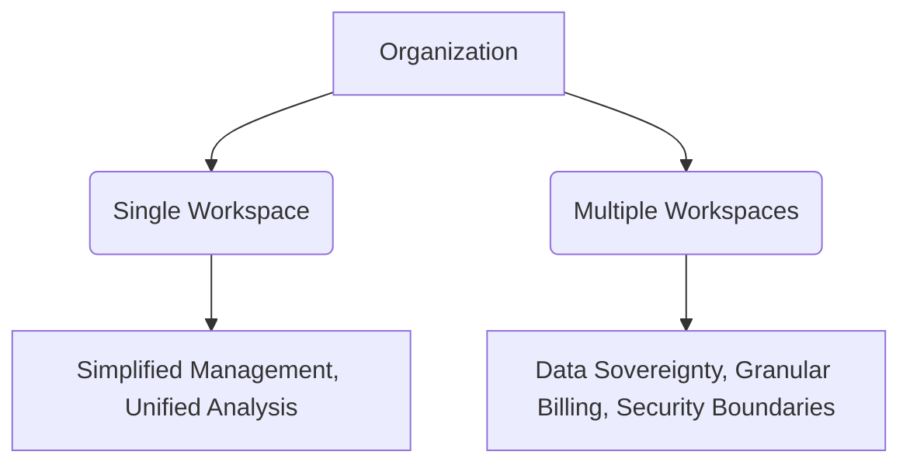

# Log Analytics Workspace

A Log Analytics workspace is a unique environment for Azure Monitor log data. Each workspace has its own data repository and configuration, and data sources are configured to store their data in a particular workspace.

### Workspace Concepts

A workspace is essentially a logical container that provides:

*   **A geographic location** for data storage.
*   **A security boundary** with granular access control.
*   **Configuration settings** such as data retention and daily caps.
*   **Isolation of data** for different customers or departments.

### Scope and Access Control

You can control access to a workspace using two different models:

#### Workspace-context
In this model, users have access to all data in the workspace. This is often used for central IT teams or shared workspaces.

#### Resource-context
In this model, users have access to data associated with a specific resource, even if that data is stored in a workspace they don't have direct access to. This allows application owners to see only their own data.

### Design Strategy

The design of your workspace architecture depends on your organizational structure and data governance requirements.

#### Centralized vs Decentralized
A single workspace is generally recommended unless you have specific requirements for multiple workspaces, such as:
*   Data must be stored in specific geographic regions for regulatory reasons.
*   Strict billing separation between departments.
*   Access control that cannot be handled via resource-context.

## See Also
*   [Data Platform](data-platform.md)
*   [Networking and Security](networking-and-security.md)

## Sources
*   https://learn.microsoft.com/azure/azure-monitor/logs/log-analytics-workspace-overview
