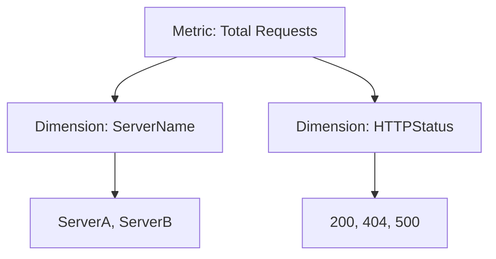

# Metrics and Dimensions

Metrics in Azure Monitor are numerical values that describe some aspect of a system at a particular point in time. They are lightweight and capable of supporting near real-time scenarios.

### Platform vs Custom Metrics

Metrics in Azure Monitor come from two primary sources:

#### Platform Metrics
These are automatically collected from Azure resources. They provide information about the health and performance of the resource itself, such as CPU percentage for a virtual machine or DTU usage for an Azure SQL database.

#### Custom Metrics
These are metrics that you define and send to Azure Monitor. For example, an application could send a custom metric for the number of items in a shopping cart or the time it takes to process a transaction.

### Dimensions

Dimensions are name-value pairs that carry additional data to describe the metric value. For example, a metric for "Free disk space" could have a dimension named "Drive" with values of "C:" and "D:".

Dimensions allow you to filter and group your metrics for more granular analysis.

### Aggregations

When you view metrics, you often need to aggregate the data over a period of time. Common aggregations include:

*   **Average:** The average value of the metric over the period.
*   **Minimum:** The minimum value recorded during the period.
*   **Maximum:** The maximum value recorded during the period.
*   **Sum:** The total sum of all values recorded during the period.
*   **Count:** The number of values recorded during the period.

The appropriate aggregation depends on the metric and what you're trying to achieve. For example, "Average" is useful for CPU percentage, while "Sum" is useful for "Total Requests".

## See Also
*   [Data Platform](data-platform.md)
*   [Alerts Architecture](alerts-architecture.md)

## Sources
*   https://learn.microsoft.com/azure/azure-monitor/essentials/data-platform-metrics
