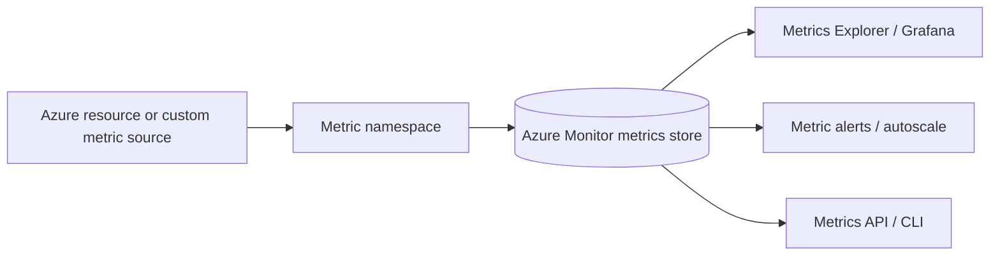
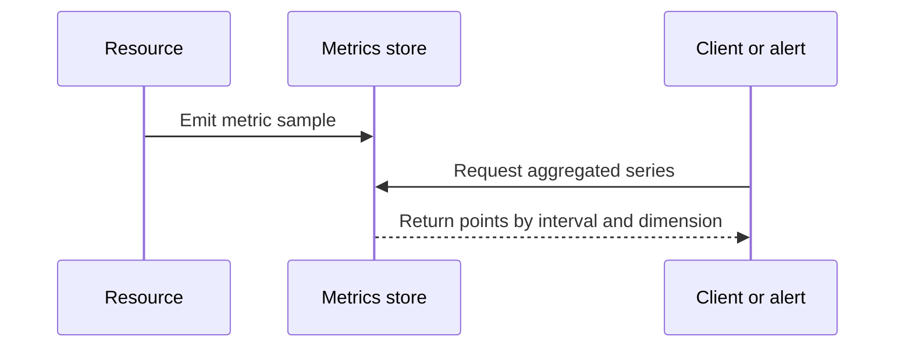

---
content_sources:
  diagrams:
    - id: architecture-overview
      type: flowchart
      source: mslearn-adapted
      based_on:
        - https://learn.microsoft.com/en-us/azure/azure-monitor/metrics/data-platform-metrics
        - https://learn.microsoft.com/en-us/azure/azure-monitor/alerts/alerts-metric-overview
        - https://learn.microsoft.com/en-us/azure/azure-monitor/metrics/analyze-metrics
        - https://learn.microsoft.com/en-us/azure/azure-monitor/reference/metrics-index
        - https://learn.microsoft.com/en-us/cli/azure/monitor/metrics?view=azure-cli-latest
    - id: data-flow-diagram
      type: sequenceDiagram
      source: mslearn-adapted
      based_on:
        - https://learn.microsoft.com/en-us/azure/azure-monitor/metrics/data-platform-metrics
        - https://learn.microsoft.com/en-us/azure/azure-monitor/alerts/alerts-metric-overview
        - https://learn.microsoft.com/en-us/azure/azure-monitor/metrics/analyze-metrics
        - https://learn.microsoft.com/en-us/azure/azure-monitor/reference/metrics-index
        - https://learn.microsoft.com/en-us/cli/azure/monitor/metrics?view=azure-cli-latest
---

# Metrics and Dimensions
Azure Monitor metrics are lightweight time-series measurements designed for fast visualization, low-latency alerting, and repeated aggregation.
Dimensions add context to those measurements so the same metric can be filtered, grouped, and alerted on by attributes such as instance, response code, or node.

## Architecture Overview
Metrics in Azure Monitor follow a different architecture than workspace logs.
Resource providers emit measurements into a dedicated metrics store, and consumers retrieve aggregated values by metric name, interval, aggregation, and optional dimension filters.
<!-- diagram-id: architecture-overview -->

A metrics design review usually focuses on five questions.
1. **What metric names matter most?**
    - Availability, latency, throughput, utilization, saturation, and error counters usually come first.
2. **Which aggregation is meaningful?**
    - Average CPU and total request count mean very different things.
3. **Which dimensions matter operationally?**
    - Status code, instance, node, or backend pool often change triage quality.
4. **How fast must the signal be evaluated?**
    - Metrics are best for fast thresholds and rapid operational dashboards.
5. **What is the fallback investigation path?**
    - Metrics show shape quickly, but logs usually explain why the shape changed.

### Metrics versus logs at the architecture level
| Characteristic | Metrics | Logs |
|---|---|---|
| Storage model | Time series | Record-oriented tables |
| Best use | Fast trends and alerting | Investigation and correlation |
| Query model | Aggregations and dimensions | KQL filtering, joins, parsing |
| Typical latency | Lower | Higher |
| Detail level | Summarized values | Rich per-record context |

## Core Concepts

### Aggregation is part of the meaning
A metric point is not always a raw value.
Azure Monitor often returns values as an aggregation over the requested interval.
That means you must choose the aggregation intentionally.

#### Common aggregations
- **Average**
    - Best for percentages and utilization measures such as CPU percentage.
- **Minimum**
    - Useful when you care about the lowest observed value, such as free space floor.
- **Maximum**
    - Useful for peaks and burst risk.
- **Total or Sum**
    - Best for counters such as requests, bytes transferred, or transactions.
- **Count**
    - Best when the metric records event counts or sample counts.

#### Why aggregation choice matters
- Average can hide spikes that maximum would reveal.
- Sum can mislead when a rate or percentage metric is intended.
- Minimum is often more informative than average for free capacity metrics.

### CLI example: inspect metric definitions and supported aggregations
```bash
az monitor metrics list-definitions     --resource "$RESOURCE_ID"     --output table
```
Example output:
```text
Name                      Unit       Primary Aggregation Type    Dimensions
------------------------  ---------  --------------------------  -------------------------
Requests                  Count      Total                       Instance, HttpStatusCode
Http5xx                   Count      Total                       Instance
AverageResponseTime       Seconds    Average, Maximum            Instance
CpuPercentage             Percent    Average, Maximum            Instance
```
Always confirm the supported aggregations and dimensions before building alerts.

### Dimensions turn one metric into many useful views
Dimensions are name-value pairs that describe a metric sample.
They let you ask questions such as:
- Which instance is producing the errors?
- Which response code family is increasing?
- Which node pool is under pressure?
- Which backend target is failing?
Without dimensions, a metric can tell you that the system is unhealthy.
With dimensions, it can often tell you where.

#### Dimension examples
| Metric | Example dimensions | Why it matters |
|---|---|---|
| Requests | `HttpStatusCode`, `Instance` | Distinguish overall volume from one bad node or one bad response code |
| CPU percentage | `VMName` or instance identifier | Separate a fleet average from one overloaded machine |
| Backend health | `BackendPool`, `BackendHttpSetting` | Find the failing target group |
| Prometheus-style metrics | Label set | Preserve Kubernetes or workload context |

#### Dimension-aware investigation with AzureMetrics
When a platform metric is also exported to logs, the `AzureMetrics` table can help operators confirm whether the dimension split they see in the Metrics API matches the workspace view.
This is useful when teams need to compare near-real-time alerting data with a broader KQL-based investigation path.

```kusto
AzureMetrics
| where TimeGenerated > ago(30m)
| where ResourceProvider == "MICROSOFT.WEB"
| where MetricName == "Requests"
| summarize RequestCount=sum(Total) by bin(TimeGenerated, 5m), HttpStatusCode=tostring(Tags["HttpStatusCode"])
| order by TimeGenerated asc
```

Interpretation notes:
- If `HttpStatusCode` is empty in the exported table, validate whether the metric export path preserves that dimension for the selected resource type.
- If the KQL totals differ slightly from a portal chart, first compare the time grain and aggregation because mismatched intervals are the most common reason.
- If one dimension value dominates, treat that as a targeting clue for the next log query rather than as proof of root cause.

### CLI example: list recent metric points grouped by a dimension
```bash
az monitor metrics list \
    --resource "$RESOURCE_ID" \
    --metrics "Requests" \
    --interval "PT5M" \
    --aggregation "Total" \
    --dimension "HttpStatusCode" \
    --top 5 \
    --output json
```
Example output:
```json
{
  "interval": "PT5M",
  "namespace": "Microsoft.Web/sites",
  "value": [
    {
      "name": {
        "value": "Requests"
      },
      "timeseries": [
        {
          "metadatavalues": [
            {
              "name": {
                "value": "HttpStatusCode"
              },
              "value": "200"
            }
          ],
          "data": [
            {
              "timeStamp": "2026-04-05T08:00:00Z",
              "total": 1942
            }
          ]
        },
        {
          "metadatavalues": [
            {
              "name": {
                "value": "HttpStatusCode"
              },
              "value": "500"
            }
          ],
          "data": [
            {
              "timeStamp": "2026-04-05T08:00:00Z",
              "total": 11
            }
          ]
        }
      ]
    }
  ]
}
```
This is the core dimension pattern used in metric-based triage.

### CLI example: filter to one dimension value for targeted validation
```bash
az monitor metrics list \
    --resource "$RESOURCE_ID" \
    --metrics "Requests" \
    --interval "PT5M" \
    --aggregation "Total" \
    --filter "HttpStatusCode eq '500'" \
    --output table
```
Example output:
```text
Timestamp                    Total
---------------------------  -----
2026-04-05T08:00:00+00:00       11
2026-04-05T08:05:00+00:00        8
2026-04-05T08:10:00+00:00       14
```
Use a targeted filter like this when you want to validate whether an alert threshold is driven by a specific failing slice rather than by general traffic growth.

### Platform metrics and custom metrics serve different purposes
Platform metrics are emitted by Azure services and resource providers.
Custom metrics come from your application or pipeline when supported.

#### Platform metrics
Use platform metrics for:
- Service health and capacity.
- Standard alerting.
- Autoscale and dashboard baselines.
- Fleet-level trending.

#### Common Azure Monitor metric namespaces
Microsoft Learn documents metrics by resource provider namespace, and that namespace must match the resource type you query.

| Namespace example | Typical resource | Example metric names | Operational use |
|---|---|---|---|
| `Microsoft.Compute/virtualMachines` | Azure VM | `Percentage CPU`, `Network In Total`, `Disk Read Bytes` | Capacity and node saturation reviews |
| `Microsoft.Web/sites` | App Service app | `Requests`, `Http5xx`, `AverageResponseTime` | Request health and latency alerting |
| `Microsoft.Network/applicationGateways` | Application Gateway | `HealthyHostCount`, `FailedRequests`, `Throughput` | Edge traffic and backend health |
| `Microsoft.ContainerService/managedClusters` | AKS cluster | `node_cpu_usage_percentage`, `node_memory_working_set_percentage` | Cluster pressure and scale planning |
| `Microsoft.Cache/redis` | Azure Cache for Redis | `connectedclients`, `serverLoad`, `cachehits` | Cache saturation and error analysis |

Interpretation notes:
- The display name shown in the portal may differ from the API name returned by `az monitor metrics list-definitions`, so always confirm the exact API value before scripting.
- Namespace mismatches often look like "no data" problems even when the resource is healthy.
- Cross-service dashboards work best when each chart documents the aggregation and namespace explicitly.

#### Custom metrics
Use custom metrics for:
- Business counters that need fast alerting.
- App-specific rates or queue depth values.
- Cases where logs are too expensive or too delayed for the decision.
Be selective with custom metrics because high-cardinality label or dimension design can become difficult to operate.

#### Custom metrics design guidance
Custom metrics are most valuable when they answer a specific operational decision that platform metrics cannot answer quickly enough.
Examples include order-processing backlog, active tenant count per shard, or feature-specific throttling counters.

Keep the design conservative:
- Favor a small number of stable dimensions.
- Avoid user-level or request-level identifiers.
- Document the unit, reset behavior, and expected aggregation.
- Decide in advance whether alerts will evaluate totals, averages, or maximums.

If the metric is really an event trail that requires payload inspection, logs are usually the better fit.

## Data Flow
Metric data usually follows a shorter path than log data.

### Typical metric flow
1. Resource provider emits a metric sample.
2. Azure Monitor writes the sample into the metrics store.
3. Query tools request aggregated points for a time range.
4. Metric alerts or autoscale evaluate those points.

### Data flow diagram
<!-- diagram-id: data-flow-diagram -->


### Where mistakes happen
| Stage | Common mistake | Result |
|---|---|---|
| Metric selection | Wrong metric name | Alert watches an irrelevant signal |
| Aggregation | Average used instead of maximum or total | Hidden spikes or meaningless totals |
| Dimension filtering | Dimension omitted or filtered incorrectly | Fleet issue appears healthy or noisy |
| Time granularity | Interval too large | Bursts disappear |
| Alert threshold | No baseline understanding | Alert fatigue or missed incidents |

## Integration Points
Metrics connect directly to several Azure Monitor features.

### Metric alerts
Metric alerts are the primary fast-detection mechanism for many Azure services.
They work best when the metric is stable, clearly defined, and available with the right dimensions.

### Autoscale
Autoscale commonly uses CPU, memory-related proxies, queue length, or throughput metrics.
That makes aggregation choice operationally critical.

### Workbooks and Grafana
Metrics are often the first layer of dashboards because they are fast and cheap to render repeatedly.

### Logs for root cause
Metrics usually tell you that something changed.
Logs usually explain why.
A strong design pairs metric alerts with runbook links to the corresponding KQL investigation queries.

## Configuration Options
When using metrics, the important configuration choices are usually on the consumer side rather than the storage side.

### Key options to review
| Area | Typical options |
|---|---|
| Metric name | Choose the right resource metric |
| Namespace | Confirm the provider namespace |
| Aggregation | Average, minimum, maximum, total, or count |
| Interval | 1 minute, 5 minutes, and so on |
| Dimension filter | Which series to include or split |
| Alert threshold | Static or dynamic threshold |

### CLI example: inspect dimension values before creating a split alert
```bash
az monitor metrics list \
    --resource "$RESOURCE_ID" \
    --metrics "Requests" \
    --interval "PT5M" \
    --aggregation "Total" \
    --dimension "Instance" \
    --orderby "total desc" \
    --top 10 \
    --output table
```
Example output:
```text
Instance             Timestamp                    Total
-------------------  ---------------------------  -----
app-prod-01          2026-04-05T08:15:00+00:00   1821
app-prod-02          2026-04-05T08:15:00+00:00   1774
app-prod-03          2026-04-05T08:15:00+00:00    944
```
Interpretation notes:
- A strong skew between instances can indicate bad traffic distribution, cold instances, or a partially failing node.
- Do not split alerts by every available dimension; split only on the dimensions operators can act on.
- If the top values change constantly because of ephemeral instances, use the dimension for investigation rather than paging.

### CLI example: create a dimension-aware metric alert
```bash
az monitor metrics alert create     --name "alert-app-http5xx"     --resource-group "$RG"     --scopes "$RESOURCE_ID"     --condition "total Http5xx > 5 where HttpStatusCode includes 500"     --window-size "PT5M"     --evaluation-frequency "PT1M"     --severity 2     --description "Trigger when 500 responses exceed five in five minutes."     --output json
```
Example output:
```json
{
  "enabled": true,
  "evaluationFrequency": "PT1M",
  "name": "alert-app-http5xx",
  "severity": 2,
  "windowSize": "PT5M"
}
```

### CLI example: query a utilization metric with the maximum aggregation
```bash
az monitor metrics list \
    --resource "$RESOURCE_ID" \
    --metrics "CpuPercentage" \
    --interval "PT1M" \
    --aggregation "Maximum" \
    --top 10 \
    --output table
```
Example output:
```text
Timestamp                    Maximum
---------------------------  -------
2026-04-05T08:11:00+00:00      74.00
2026-04-05T08:12:00+00:00      79.00
2026-04-05T08:13:00+00:00      92.00
2026-04-05T08:14:00+00:00      88.00
```
Maximum exposes burst behavior that average may hide.

## Pricing Considerations
Metrics are generally efficient for repeated monitoring workloads.

### Cost guidance
- Prefer metrics for fast health checks and simple thresholds.
- Avoid converting every metric-like signal into logs.
- Be cautious with unnecessary high-cardinality dimension designs.
- Use logs only when you need deeper context.

### Concrete cost comparison patterns
Metrics pricing changes by region and feature, so use the Azure pricing pages for exact amounts, but the design pattern is consistent.

| Scenario | Lower-cost design pattern | Higher-cost anti-pattern | Why it matters |
|---|---|---|---|
| CPU threshold on 50 VMs | Native platform metric alert on `Percentage CPU` | Ingest performance counters to logs and run scheduled-query alerts every minute | Metrics are built for repeated threshold evaluation |
| HTTP 5xx monitoring | Platform metric alert split by `HttpStatusCode` or `Instance` | Query request logs for every evaluation window | Repeated log scans cost more and add latency |
| Business backlog signal | One custom metric with low-cardinality dimensions | High-volume event logs with parsing at alert time | A stable metric can be cheaper than constant query evaluation |

In other words, metrics usually reduce both evaluation overhead and operator latency when the question is "how much" or "how many" rather than "why exactly did this record fail?"

### Pricing example for architecture reviews
Assume a team wants to detect App Service HTTP 5xx spikes every minute.
Two common designs are:
1. Metric alert on `Http5xx` with a five-minute window.
2. Scheduled query alert scanning request logs every minute.

The second design can still be correct when the team needs payload-level filters or joins, but it should be justified because it moves a simple threshold into the log analytics cost model.
Microsoft Learn guidance on metrics and alerting consistently positions metrics as the preferred fast-path for threshold-based detection.

### Common anti-patterns
- Alerting on logs for simple CPU or request count thresholds.
- Ignoring dimensions and then over-investigating aggregated fleet metrics.
- Using overly long intervals that smooth away actionable spikes.

## Limitations and Quotas
Always confirm current Microsoft Learn pages for exact service limits.

### Practical limitations
- Metrics are summarized and therefore less detailed than logs.
- Not every metric supports every aggregation or dimension.
- Some resources expose only a subset of expected dimensions.
- Retention is shorter than workspace log retention.
- Custom metrics support up to 10 dimensions per metric, so high-cardinality design still needs explicit control.

### Design implications
| Limitation | What it means |
|---|---|
| Shorter retention | Metrics are best for operational history, not deep forensic review |
| Aggregated values | Use logs when individual events matter |
| Dimension support varies | Validate alert designs against actual definitions |
| Different provider schemas | Standardize per resource type, not with one generic assumption |

### Metric design checklist
Use this checklist when adopting a new metric.
1. Is the metric emitted automatically or do you need custom instrumentation?
2. Which aggregation matches the operational question?
3. Which dimension should alerts split on?
4. What interval keeps spikes visible without adding noise?
5. Which KQL query will operators use when the metric alert fires?

### Example decision patterns

#### CPU saturation
- Use average for broad capacity trending.
- Use maximum when short spikes matter to user experience.
- Pair with logs when CPU is high but request failures are unclear.

#### Request failures
- Use totals by response-code dimension for fast paging.
- Pair with request and dependency logs for root cause.

#### Throughput metrics
- Use total or count rather than average when you need workload volume.
- Review by instance dimension to distinguish global growth from local skew.

### Operational review guidance
- Review alert thresholds after major scale changes.
- Review dimension filters when new instances or node pools are introduced.
- Review metrics definitions whenever a resource SKU or service generation changes.
- Review dashboard intervals so short incidents are not smoothed away.

### Good defaults to document
- Preferred aggregation per important metric.
- Preferred alert window per service type.
- Preferred dashboard interval for executive and operator views.
- Preferred investigation link from each metric alert to a workbook or KQL query.

### When not to use metrics alone
- When the failure requires payload, stack trace, or user identity context.
- When correlation across services matters more than quick thresholding.
- When the signal exists only as a discrete event rather than a measured series.
- When the team has not yet validated which dimensions represent the failing slice.

### Baseline reminder
Document what “normal” looks like for your highest-value metrics.
Thresholds without baselines create noisy alerts and weak incident response.
Record that baseline by environment as well as globally.
Review it after each major architecture change.

## See Also
- [Data Platform](data-platform.md)
- [Alerts Architecture](alerts-architecture.md)
- [Application Insights](application-insights.md)
- [How Azure Monitor Works](how-azure-monitor-works.md)

## Sources
- https://learn.microsoft.com/en-us/azure/azure-monitor/metrics/data-platform-metrics
- https://learn.microsoft.com/en-us/azure/azure-monitor/alerts/alerts-metric-overview
- https://learn.microsoft.com/en-us/azure/azure-monitor/metrics/analyze-metrics
- https://learn.microsoft.com/en-us/azure/azure-monitor/reference/metrics-index
- https://learn.microsoft.com/en-us/cli/azure/monitor/metrics?view=azure-cli-latest
