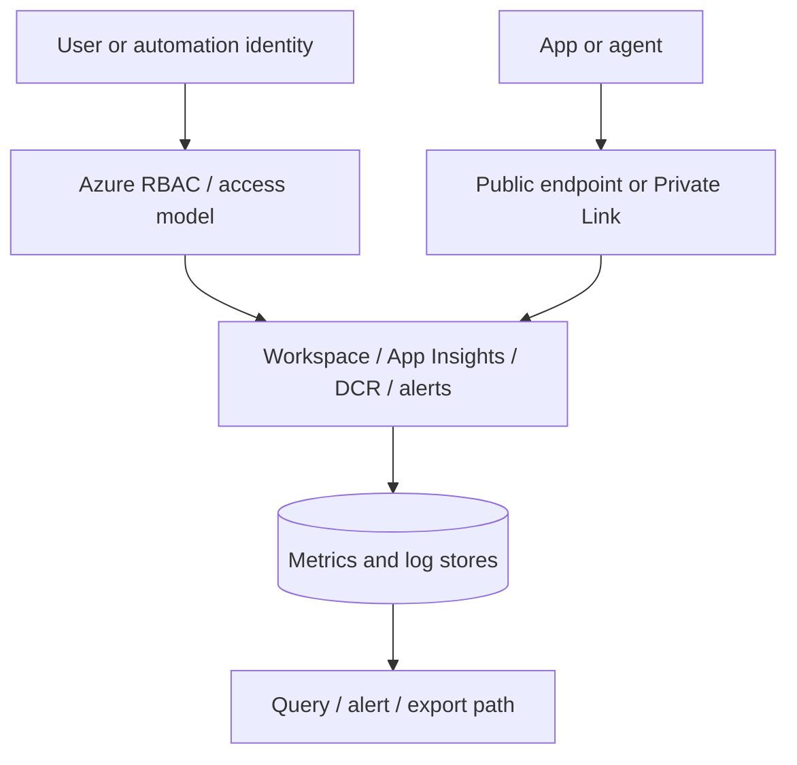
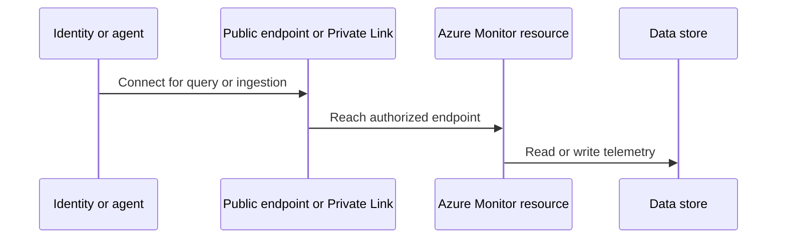

---
content_sources:
  diagrams:
    - id: architecture-overview
      type: flowchart
      source: mslearn-adapted
      based_on:
        - https://learn.microsoft.com/en-us/azure/azure-monitor/logs/private-link-security
        - https://learn.microsoft.com/en-us/azure/azure-monitor/roles-permissions-security
        - https://learn.microsoft.com/en-us/azure/azure-monitor/logs/manage-access
        - https://learn.microsoft.com/en-us/azure/azure-monitor/agents/azure-monitor-agent-overview
        - https://learn.microsoft.com/en-us/azure/azure-monitor/fundamentals/network-security-perimeter
        - https://learn.microsoft.com/en-us/azure/private-link/private-endpoint-overview
    - id: data-flow-with-private-connectivity
      type: sequenceDiagram
      source: mslearn-adapted
      based_on:
        - https://learn.microsoft.com/en-us/azure/azure-monitor/logs/private-link-security
        - https://learn.microsoft.com/en-us/azure/azure-monitor/roles-permissions-security
        - https://learn.microsoft.com/en-us/azure/azure-monitor/logs/manage-access
        - https://learn.microsoft.com/en-us/azure/azure-monitor/agents/azure-monitor-agent-overview
        - https://learn.microsoft.com/en-us/azure/azure-monitor/fundamentals/network-security-perimeter
        - https://learn.microsoft.com/en-us/azure/private-link/private-endpoint-overview
---

# Networking and Security
Azure Monitor networking and security controls determine who can ingest telemetry, who can query it, and whether those paths stay on public endpoints or traverse private connectivity.
These controls matter because observability data often includes operationally sensitive details such as infrastructure topology, request behavior, and failure evidence.

## Architecture Overview
Azure Monitor security is not one toggle.
It is the combination of identity, RBAC, workspace access mode, public network access settings, Private Link support, encryption, and resource-level configuration choices such as diagnostic settings and data collection rules.
<!-- diagram-id: architecture-overview -->

A secure Azure Monitor design should answer six questions.

1. **Who can read telemetry?**
    - Reading logs can reveal sensitive operational context.
2. **Who can change collection or alert rules?**
    - Misconfiguration can create both blind spots and data exfiltration paths.
3. **Will ingestion and query use public endpoints?**
    - Some organizations require private connectivity.
4. **How is least privilege enforced?**
    - Role assignment should follow operational need, not convenience.
5. **How is data protected at rest and in transit?**
    - Azure Monitor inherits Azure platform security controls, but your configuration still matters.
6. **How are shared workspaces governed?**
    - Shared observability platforms fail if access boundaries are unclear.

### Core security layers
| Layer | Main concern |
|---|---|
| Identity | Which user, service principal, or managed identity is acting |
| Authorization | Which operations that identity can perform |
| Network path | Whether telemetry and queries traverse public or private endpoints |
| Data protection | Encryption, retention, and export posture |
| Governance | Ownership, review cadence, and change control |

## Core Concepts

### RBAC is the primary access control model
Azure Monitor uses Azure RBAC for most resource and data access decisions.
That means a secure design starts with role assignments.

#### Common roles
- **Monitoring Reader**
    - Read monitoring data and settings.
- **Monitoring Contributor**
    - Manage monitoring settings such as alerts and action groups.
- **Log Analytics Reader**
    - Read workspace data.
- **Log Analytics Contributor**
    - Manage workspace configuration and some log-related capabilities.
Use the least privileged role that supports the operational task.

### Why least privilege matters
Monitoring data can reveal:
- Host names and service names.
- Error patterns and dependency targets.
- Operational schedules.
- Control-plane change events.
- Potentially sensitive application traces if teams log too much.
That is why broad access to observability data should be intentional.

### CLI example: review role assignments at a workspace scope
```bash
az role assignment list     --scope "$WORKSPACE_ID"     --output table
```
Example output:
```text
Principal                             Role                     Scope
------------------------------------  -----------------------  ------------------------------------------------------------
ops-platform-group                    Log Analytics Reader     /subscriptions/<subscription-id>/resourceGroups/rg-monitoring-prod/providers/Microsoft.OperationalInsights/workspaces/law-prod-observability
platform-engineering-sp               Monitoring Contributor   /subscriptions/<subscription-id>/resourceGroups/rg-monitoring-prod/providers/Microsoft.OperationalInsights/workspaces/law-prod-observability
soc-automation-mi                     Log Analytics Reader     /subscriptions/<subscription-id>/resourceGroups/rg-monitoring-prod/providers/Microsoft.OperationalInsights/workspaces/law-prod-observability
```
This review is a fast way to validate whether workspace access reflects the intended operating model.

### Public versus private access is a deliberate architecture decision
Azure Monitor supports public endpoints by default in many scenarios.
Organizations with stricter network controls can use Azure Monitor Private Link Scope and related private endpoint patterns for supported resources.

#### Why private access matters
- It keeps supported query and ingestion traffic on the Microsoft backbone.
- It reduces exposure to public endpoint access.
- It supports compliance narratives where monitoring data must stay on controlled private paths.

#### Why private access adds complexity
- DNS and endpoint configuration must be correct.
- Some traffic paths and resource types have different support models.
- Operations teams must understand the difference between ingestion and query connectivity.

### Azure Monitor Private Link Scope
Azure Monitor Private Link Scope, often shortened to AMPLS, groups supported Azure Monitor resources so they can be accessed through private endpoints.
This is the foundational private networking construct for many Azure Monitor designs.
Microsoft Learn also documents Network Security Perimeter as a separate boundary control.
It complements, but does not replace, AMPLS and private endpoint design for Azure Monitor resources.

#### AMPLS configuration sequence
In practice, teams usually implement AMPLS in four decisions rather than one deployment step.

1. Select the Azure Monitor resources that need private access.
2. Associate those resources with the private link scope.
3. Create private endpoints in the right virtual networks and subnets.
4. Validate DNS resolution for the supported query and ingestion endpoints.

Interpretation notes:
- A successful private endpoint deployment is not proof that operators can query logs; DNS and endpoint approval still decide the effective path.
- In hybrid networks, the design must account for conditional forwarding so on-premises resolvers can reach the private DNS zones.
- If different teams own networking and monitoring, publish a validation runbook because AMPLS failures are often shared-ownership failures rather than product defects.

### CLI example: inspect workspace network access settings
```bash
az monitor log-analytics workspace show     --resource-group "$RG"     --workspace-name "$WORKSPACE_NAME"     --query "{name:name,publicNetworkAccessForIngestion:publicNetworkAccessForIngestion,publicNetworkAccessForQuery:publicNetworkAccessForQuery,features:features}"     --output json
```
Example output:
```json
{
  "features": {
    "disableLocalAuth": true,
    "enableLogAccessUsingOnlyResourcePermissions": true
  },
  "name": "law-prod-observability",
  "publicNetworkAccessForIngestion": "Disabled",
  "publicNetworkAccessForQuery": "Disabled"
}
```
These settings are central to a locked-down workspace design.

### Shared workspaces require access model discipline
A shared workspace can be secure, but only if the access model is designed.

#### Secure shared workspace principles
- Prefer resource-context access when application teams should see only their resources.
- Reserve broad workspace-context access for platform, operations, or security teams that truly need it.
- Review role assignments regularly.
- Document ownership and approved query audiences.

## Data Flow
Security controls apply differently across control and data paths.

### Management path
1. An identity calls Azure Resource Manager to create or update workspaces, DCRs, alerts, or action groups.
2. Azure RBAC determines whether that identity can perform the operation.
3. The resulting configuration changes affect later data-plane behavior.

### Ingestion path
1. An app, agent, or Azure resource emits telemetry.
2. Network path rules determine whether the destination can be reached publicly or privately.
3. Azure Monitor accepts the telemetry and stores it according to the configured destination.

### Query path
1. A user or automation identity authenticates.
2. Query and workspace access controls are evaluated.
3. Network settings determine whether the endpoint is reachable.
4. Azure Monitor returns the requested logs or metrics if authorized.

### Data flow with private connectivity
<!-- diagram-id: data-flow-with-private-connectivity -->


### Network isolation patterns
The same private connectivity feature can support very different operating models.

| Pattern | When it fits | Main trade-off |
|---|---|---|
| Centralized hub virtual network with shared AMPLS | One platform team owns monitoring for many spokes | Faster reuse, but stronger need for clear RBAC and DNS ownership |
| Environment-specific private access per landing zone | Regulated dev, test, and prod boundaries | More isolation, but more private endpoints and DNS records |
| Partial isolation with private query only | Teams still allow ingestion from approved public paths | Simpler rollout, but mixed-path troubleshooting |

When reviewing one of these patterns, validate the failure mode as well as the happy path.
If a private DNS zone link breaks, who notices first, and how do operators fall back to approved emergency access?

### Security review checkpoints in the flow
| Flow stage | What to validate |
|---|---|
| Management | Correct RBAC and change control |
| Ingestion | Endpoint reachability, local auth posture, identity if applicable |
| Storage | Correct workspace or component boundary |
| Query | Reader permissions and network path |
| Export | Downstream destination security and ownership |

## Integration Points
Networking and security choices influence the whole Azure Monitor estate.

### Log Analytics workspace
Workspace networking and access settings are often the most visible control point.

### Application Insights
Workspace-based Application Insights inherits important security and networking decisions from the linked workspace while still having its own control surface.

### Data collection rules and agents
AMA and DCR-based collection rely on both identity and network reachability.
A secure design must verify that hardened endpoints still permit supported agent communication.

### Alerts and action groups
Security is not only about data access.
Action groups can call webhooks, Logic Apps, Functions, and runbooks, so they are also a security boundary and integration risk.

### Export and downstream platforms
Exporting logs to Event Hubs or Storage changes the security boundary.
The destination must be governed as carefully as the source workspace.

## Configuration Options

### Key settings to review
| Area | Typical setting | Why it matters |
|---|---|---|
| Workspace network access | Public ingestion and query enablement | Determines exposure of endpoints |
| Local authentication | Enable or disable | Identity posture and service-hardening |
| Access mode | Workspace-context or resource-context | Controls shared workspace safety |
| AMPLS | Private endpoint design | Private connectivity for supported resources |
| Action group targets | Webhook and automation endpoints | Downstream trust boundary |

### CLI example: list Azure Monitor resources linked to a private link scope
```bash
az resource list \
    --resource-group "$RG" \
    --resource-type "Microsoft.Insights/privateLinkScopes/scopedResources" \
    --query "[?contains(id, '$AMPLS_NAME')].{name:name,linkedResourceId:properties.linkedResourceId,provisioningState:properties.provisioningState}" \
    --output table
```
Example output:
```text
Name                                LinkedResourceId                                                                                                                  ProvisioningState
----------------------------------  --------------------------------------------------------------------------------------------------------------------------------  -----------------
ampls-prod-monitoring-law           /subscriptions/<subscription-id>/resourceGroups/rg-monitoring-prod/providers/Microsoft.OperationalInsights/workspaces/law-prod     Succeeded
ampls-prod-monitoring-appi          /subscriptions/<subscription-id>/resourceGroups/rg-monitoring-prod/providers/Microsoft.Insights/components/appi-prod-web           Succeeded
```
Interpretation notes:
- If the linked resource list is incomplete, private endpoint DNS may work correctly while some Azure Monitor resources still use public access paths.
- Treat scoped resource review as part of change validation whenever a workspace or Application Insights component is replaced.

### CLI example: disable public query and ingestion access
```bash
az monitor log-analytics workspace update \
    --resource-group "$RG" \
    --workspace-name "$WORKSPACE_NAME" \
    --ingestion-access "Disabled" \
    --query-access "Disabled" \
    --output json
```
Example output:
```json
{
  "name": "law-prod-observability",
  "publicNetworkAccessForIngestion": "Disabled",
  "publicNetworkAccessForQuery": "Disabled"
}
```

### CLI example: inspect private link scope resources
```bash
az resource show     --ids "$AMPLS_ID"     --query "{name:name,type:type,location:location}"     --output json
```
Example output:
```json
{
  "location": "global",
  "name": "ampls-prod-monitoring",
  "type": "microsoft.insights/privatelinkscopes"
}
```

### CLI example: inspect private endpoint connection state for the monitoring scope
```bash
az network private-endpoint-connection list \
    --id "$AMPLS_ID" \
    --output table
```
Example output:
```text
Name                                            PrivateLinkServiceConnectionState    ProvisioningState
----------------------------------------------  -----------------------------------  -----------------
ampls-prod-monitoring-pe-9f3d                   Approved                             Succeeded
```
Interpretation notes:
- `Approved` confirms the connection state, not the end-to-end query path.
- If operators still cannot query, validate DNS resolution and client routing before reopening the private endpoint request.
- Keep subnet NSG rules aligned with the approved private endpoint design; the endpoint itself is managed, but client subnets still need to reach the resolved private IPs.

### CLI example: query role-sensitive telemetry after access review
```bash
az monitor log-analytics query     --workspace "$WORKSPACE_ID"     --analytics-query "AzureActivity | where TimeGenerated > ago(1d) | summarize Events=count() by Caller, CategoryValue | top 10 by Events desc"     --output table
```
Example output:
```text
Caller                          CategoryValue     Events
------------------------------  ----------------  ------
platform-engineering-sp         Administrative       18
ops-platform-group              ServiceHealth         3
policy-automation-mi            Policy                6
```
Use queries like this carefully because control-plane data may contain sensitive operational context.

## Pricing Considerations
Security settings are not free from operational trade-offs.

### Cost-related considerations
- Private networking introduces private endpoint and DNS-related cost and management overhead.
- Over-segmented workspaces can increase duplication of ingestion and alerting artifacts.
- Excessive export can create downstream storage and processing cost.

### Cost optimization guidance
1. Apply private access where justified by policy or risk, not as an unexplained default.
2. Keep workspace topology simple unless security boundaries require more separation.
3. Review export destinations and remove unused ones.
4. Use RBAC and resource-context access before creating extra workspaces solely for visibility separation.

### Security control interactions that affect cost and operations
RBAC, network isolation, and encryption choices are often reviewed separately, but in Azure Monitor they affect each other operationally.
For example, disabling public query access without a tested private DNS path can increase incident duration, while adding extra workspaces for simple visibility separation can increase both ingestion duplication and administrative overhead.
The lowest-risk architecture is usually the one that meets the boundary requirement with the fewest moving parts.

## Limitations and Quotas
Always confirm current Microsoft Learn documentation before final design approval.

### Practical limitations
- Private Link support varies by feature and resource type.
- Query and ingestion paths may have separate network behaviors.
- Shared workspaces still require disciplined RBAC review.
- Exported data is only as secure as the destination platform.

### Firewall, NSG, and DNS requirements
Microsoft Learn guidance for private endpoints assumes that clients can resolve and reach the private endpoint addresses.
That means Azure Monitor security reviews should include the surrounding network controls, not just the monitoring resource configuration.

- NSGs on client subnets must allow traffic to the resolved private endpoint IPs.
- Route tables must not blackhole the intended private path.
- Private DNS zones or forwarded DNS rules must resolve the supported Azure Monitor private endpoints consistently.
- Firewall policies must allow the approved egress path for agents, automation, and interactive query clients.

If one of these controls is owned outside the monitoring team, document the dependency explicitly.

### Data encryption guidance
Azure Monitor data is encrypted in transit and at rest by Azure platform controls, but architecture reviews should still document what that means operationally.

- Encryption at rest protects workspace and component data in Azure-managed storage.
- TLS protects supported client and service connections in transit.
- Customer-managed key scenarios, when supported for the relevant service, add governance responsibility around key lifecycle and availability.
- Exported data inherits the encryption posture of the destination service, so the boundary review must continue after export.

Interpretation notes:
- Encryption does not replace RBAC or network isolation; it limits exposure if media is accessed outside the intended control path.
- Key-management failures can become monitoring outages, so they belong in operational risk review, not just compliance documentation.

### RBAC best practices for workspace access
Use workspace access design to reduce the number of people who need broad visibility.

1. Grant `Log Analytics Reader` or equivalent read roles to named groups instead of individual users.
2. Use resource-context access where application teams only need logs for resources they own.
3. Reserve contributor roles for the smallest possible set of platform operators.
4. Separate automation identities for data collection management, alert deployment, and investigation tooling.
5. Review inherited role assignments, not just direct assignments, during quarterly access reviews.

The practical test is simple: if an incident commander can explain why every privileged identity exists, the access model is usually understandable enough to govern.

### Design implications
| Limitation | Response |
|---|---|
| Private networking adds complexity | Document DNS, endpoint ownership, and validation steps |
| Broad reader access exposes sensitive context | Review least privilege regularly |
| Extra workspaces add cost and complexity | Split only for real boundary requirements |
| Action groups can call external systems | Review downstream trust and authentication |

### Security review checklist
- Validate role assignments at workspace and resource scopes.
- Validate whether public access is intentionally enabled or disabled.
- Validate whether local authentication should be disabled.
- Validate AMPLS and private endpoint documentation.
- Validate export destinations and webhook ownership.

### Common secure design patterns

#### Shared platform workspace with resource-context access
This pattern lets a central operations team retain broad visibility while application teams only query the data for resources they own.
It is usually preferable to creating many small workspaces only for visibility isolation.

#### Private ingestion and query pattern
This pattern disables public network access and uses Azure Monitor Private Link Scope for supported access paths.
It is common in regulated environments, but it demands stronger DNS and endpoint management.

#### Tiered response pattern
This pattern separates readers, contributors, and automation identities.
Human users get read-only access where possible.
Automation identities receive only the permissions needed for alert actions or collection management.

### Common failure modes

#### Failure mode: broad workspace reader access
Teams often grant broad reader roles “temporarily” and never remove them.
This creates unnecessary exposure of operational data.

#### Failure mode: private endpoint added without query validation
The platform may look compliant on paper while operators can no longer query logs during an incident.
Validate query paths after every network change.

#### Failure mode: export destination not reviewed
Security posture weakens if a secure workspace exports sensitive logs into a loosely governed storage account or Event Hubs namespace.

### Operational review cadence
- Review privileged role assignments monthly.
- Review webhook and automation endpoints quarterly.
- Review public network access posture after major architecture changes.
- Review workspace and export topology whenever compliance requirements change.

### Design questions for architecture reviews
1. Which identities require read access to raw logs?
2. Which identities require change access to alerts, DCRs, or workspaces?
3. Which monitoring paths must remain available during a network-isolation event?
4. Which exported data sets require the same or stronger protection as the source workspace?
5. Which teams own DNS and private endpoint validation for Azure Monitor connectivity?

### Final guidance
Secure monitoring is still monitoring.
If controls prevent timely query access or block critical telemetry ingestion without validation, the environment becomes safer on paper and less safe in operations.

### Minimum documentation to keep
- Workspace access model and owner.
- Public versus private access decision and rationale.
- Private endpoint and DNS ownership.
- Export destinations and their security owner.
- Runbook for validating query access after network changes.

### Practical reminder
The most secure design is the one your operators can still understand and validate under pressure.
That means clarity in roles, paths, and ownership is part of security architecture.

### Validation after every major security change
- Confirm agents still ingest.
- Confirm operators can still query.
- Confirm alert actions still reach their destinations.
- Confirm documentation matches the current network path.

### Security outcome to aim for
Strong protection with predictable operations.
Not one without the other.
That balance is the real design goal.
Keep it visible in every design review.
Keep it testable in production.

## See Also
- [Log Analytics Workspace](log-analytics-workspace.md)
- [Data Collection Rules](data-collection-rules.md)
- [Alerts Architecture](alerts-architecture.md)
- [How Azure Monitor Works](how-azure-monitor-works.md)

## Sources
- https://learn.microsoft.com/en-us/azure/azure-monitor/logs/private-link-security
- https://learn.microsoft.com/en-us/azure/azure-monitor/roles-permissions-security
- https://learn.microsoft.com/en-us/azure/azure-monitor/logs/manage-access
- https://learn.microsoft.com/en-us/azure/azure-monitor/agents/azure-monitor-agent-overview
- https://learn.microsoft.com/en-us/azure/azure-monitor/fundamentals/network-security-perimeter
- https://learn.microsoft.com/en-us/azure/private-link/private-endpoint-overview
