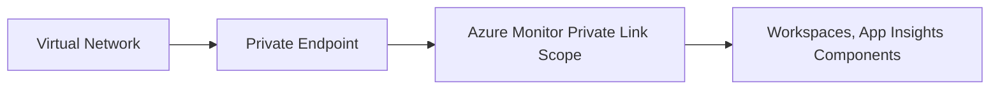

# Networking and Security

Azure Monitor provides several features to ensure the security and privacy of your monitoring data. This includes private networking and role-based access control.

### Private Link and AMPLS

Azure Private Link allows you to securely link Azure Monitor to your virtual network. An Azure Monitor Private Link Scope (AMPLS) is used to group multiple Azure Monitor resources together for access over a private endpoint.

#### Benefits of Private Link
*   **Data remains on the Microsoft backbone network** and doesn't traverse the public internet.
*   **Protection against data exfiltration** by restricting access to authorized resources.
*   **Compliance with security requirements** for private connectivity.

### RBAC for Monitoring

Azure Monitor uses Azure Role-Based Access Control (RBAC) to manage access to its resources. Common roles include:

*   **Monitoring Reader:** Can read all monitoring data and settings.
*   **Monitoring Contributor:** Can read and modify monitoring settings, including alerts and action groups.
*   **Log Analytics Reader:** Can read all log data in a workspace.
*   **Log Analytics Contributor:** Can read and modify log data settings in a workspace.

#### Least Privilege
The principle of least privilege should be followed when assigning roles. For example, a user who only needs to view dashboards should be assigned the Monitoring Reader role.

### Security and Data Privacy

Azure Monitor is built on top of the Microsoft Azure platform and benefits from its security and compliance features. This includes:

*   **Encryption at rest:** All data is encrypted using Microsoft-managed keys by default. You can also use customer-managed keys (CMK) for additional control.
*   **Encryption in transit:** All data is encrypted as it moves between your resources and Azure Monitor.
*   **Compliance:** Azure Monitor is compliant with many industry standards and regulations, such as ISO 27001, SOC 1, and SOC 2.

## See Also
*   [Log Analytics Workspace](log-analytics-workspace.md)
*   [Data Collection Rules](data-collection-rules.md)

## Sources
*   https://learn.microsoft.com/azure/azure-monitor/logs/private-link-security
*   https://learn.microsoft.com/azure/azure-monitor/roles-permissions-security
