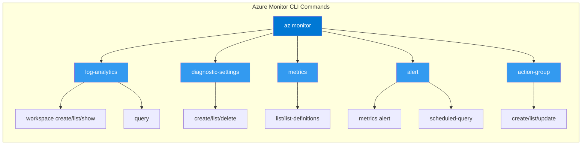

# Azure Monitor CLI Cheatsheet

Quick reference for common `az monitor` commands. All examples use long flags for clarity and script compatibility.



## Log Analytics Workspaces

### Create a Workspace
```bash
az monitor log-analytics workspace create \
    --resource-group <resource-group-name> \
    --workspace-name <workspace-name> \
    --location <location> \
    --sku PerGB2018 \
    --retention-time 30
```

### List Workspaces
```bash
az monitor log-analytics workspace list \
    --resource-group <resource-group-name>
```

### Show Workspace Details
```bash
az monitor log-analytics workspace show \
    --resource-group <resource-group-name> \
    --workspace-name <workspace-name>
```

## Diagnostic Settings

### Create Diagnostic Setting
```bash
az monitor diagnostic-settings create \
    --name <setting-name> \
    --resource <resource-id> \
    --workspace <workspace-id> \
    --logs '[{"category": "AppServiceHTTPLogs", "enabled": true}]' \
    --metrics '[{"category": "AllMetrics", "enabled": true}]'
```

### List Diagnostic Settings
```bash
az monitor diagnostic-settings list \
    --resource <resource-id>
```

## Alert Rules

### Create Metric Alert Rule
```bash
az monitor metrics alert create \
    --name <alert-name> \
    --resource-group <resource-group-name> \
    --scopes <resource-id> \
    --condition "avg Percentage CPU > 90" \
    --window-size 5m \
    --evaluation-frequency 1m \
    --description "High CPU alert"
```

### Create Scheduled Query Alert
```bash
az monitor scheduled-query create \
    --name "<alert-name>" \
    --resource-group "$RG" \
    --scopes "$WORKSPACE_ID" \
    --condition "count 'ErrorQuery' > 10" \
    --condition-query "ErrorQuery=AppServiceHTTPLogs | where ScStatus >= 500 | summarize AggregatedValue = count() by bin(TimeGenerated, 5m)" \
    --evaluation-frequency "5m" \
    --window-size "5m" \
    --severity 2 \
    --skip-query-validation true \
    --description "Trigger when App Service HTTP 5xx responses exceed the alert threshold." \
    --output json
```

## Metrics and Logs

### List Metric Definitions
```bash
az monitor metrics list-definitions \
    --resource <resource-id>
```

### Query Metrics
```bash
az monitor metrics list \
    --resource <resource-id> \
    --metric "Percentage CPU" \
    --interval 1m
```

### Query Logs (Ad-hoc)
```bash
az monitor log-analytics query \
    --workspace <workspace-id> \
    --analytics-query "AzureActivity | take 10"
```

## Action Groups

### Create Action Group
```bash
az monitor action-group create \
    --name <group-name> \
    --resource-group <resource-group-name> \
    --short-name "OpsAlert" \
    --action email admin admin@example.com
```

### List Action Groups
```bash
az monitor action-group list \
    --resource-group <resource-group-name>
```

## See Also

- [KQL Quick Reference](kql-quick-reference.md)
- [Platform Limits](platform-limits.md)
- [Operations: Alert Rule Management](../operations/alert-rule-management.md)

## Sources

- [az monitor reference](https://learn.microsoft.com/cli/azure/monitor)
- [az monitor log-analytics](https://learn.microsoft.com/cli/azure/monitor/log-analytics)
- [az monitor diagnostic-settings](https://learn.microsoft.com/cli/azure/monitor/diagnostic-settings)
- [az monitor metrics alert](https://learn.microsoft.com/cli/azure/monitor/metrics/alert)
- [az monitor action-group](https://learn.microsoft.com/cli/azure/monitor/action-group)
